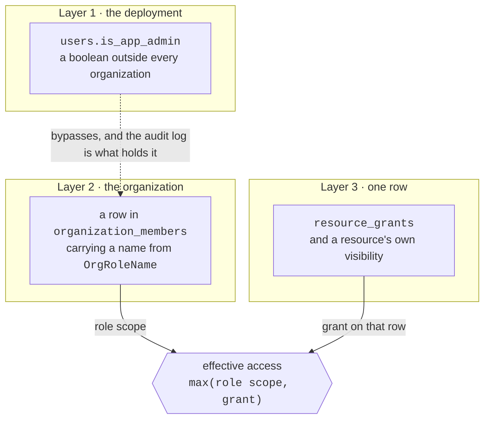
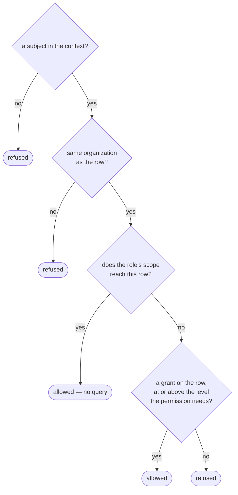

# Uprawnienia { #permissions }

Jedna zasada, której trzyma się cały kod:

!!! quote "Uprawnienia są zdefiniowane w kodzie. Role są z nich składane."

    Miejsca wywołań sprawdzają **uprawnienia**, nigdy nazwy ról — dodanie roli
    albo przemodelowanie jej nigdy nie oznacza więc edycji endpointu.

Katalogiem jest [`app/core/permissions.py`](reference/permissions.md). To jedyne
źródło prawdy, a ta strona je wyjaśnia.

!!! warning "Warstwy są trzy i są od siebie niezależne"

    Nie tworzą hierarchii i żadna nie implikuje innej. Większość nieporozumień
    wokół dostępu na tej platformie bierze się z założenia przeciwnego.

    Była kiedyś czwarta — kolumna `users.role` o wartościach `admin` | `user`,
    odziedziczona z szablonu projektu, a za nią `User.has_role()`, `RoleChecker`
    i alias `CurrentAdmin`. Została usunięta, zanim łańcuch migracji zgnieciono do
    jednej. Była trzecią odpowiedzią na pytanie, na które dwie poniższe już
    odpowiadały, i nie zgadzała się z żadną z nich: konto o nazwie
    `admin@example.com` siedziało na `role = 'user'`, co czyta się jak zepsuta
    instalacja i wysyłało ludzi do naprawiania niewłaściwej warstwy.

    Nie była całkiem bezczynna, dlatego jej usunięcie było zmianą zachowania:
    `GET /conversations/{id}` i bliźniacze `/messages` porzucały filtr
    właścicielski dla każdego, czyje `role` mówiło `admin`. Nigdzie nie ma dziś
    międzyużytkownikowego *odczytu* rozmów: przeglądarka obejmująca całe wdrożenie
    została usunięta na rzecz Activity, a `/admin/conversations?user_id=` listuje
    wątki jednego konta, nie otwierając żadnego z nich.



## Warstwa 1: `users.is_app_admin` — superadmin wdrożenia { #layer-1-usersis_app_admin-the-deployment-superadmin }

Boolean na użytkowniku, całkowicie poza organizacjami. Dwa skutki:

1. **Bramka przed routami wdrożenia.** `CurrentAppAdmin` chroni `/admin/users`,
   `/admin/stats`, `/admin/conversations` (listowanie, nigdy transkrypt),
   `/admin/ratings` oraz zbiorcze endpointy pod `/rag`.
2. **Obejście w `AuthContext.permissions`**, które zwraca każde uprawnienie na
   `Scope.ALL` — w każdej organizacji, także w tych, w których taka osoba nie ma
   żadnego członkostwa.

Obejście jest celowe, a docstring mówi dlaczego: taka osoba administruje
wdrożeniem i tak czy inaczej ma dostęp do bazy danych, więc udawanie czegoś
innego byłoby teatrem bezpieczeństwa. Tym, co ją z tego rozlicza, jest log
audytowy.

```bash
# Grant, or revoke with --revoke.
agenticos cmd create-app-admin someone@example.com
```

`agenticos cmd bootstrap` przyznaje go dodatkowo ownerowi, którego zakłada, i
robi to idempotentnie.

!!! note "Świeży klon, stara baza danych"

    Jeśli `/admin` jest odrzucane dla konta założonego przez bootstrap, baza
    niemal na pewno została zbootstrapowana, zanim to nadanie zaczęło istnieć.
    Kolumna ma wartość domyślną `false` i nic jej nie uzupełnia. Uruchom
    `create-app-admin` z góry.

## Warstwa 2: rola w organizacji { #layer-2-the-organization-role }

Wiersz w `organization_members` — jeden na organizację i użytkownika — niosący
wartość z `OrgRoleName`. To tutaj zapada zdecydowana większość decyzji.

Dwa rodzaje uprawnień, i zachowują się różnie.

**Globalne** uprawnienia są binarne i obejmują całą organizację: `members:manage`,
`roles:manage`, `org:settings`, `org:delete`, `budgets:manage`,
`approvals:decide`, `connections:view`, `connections:manage`, `mcp:manage`,
`channels:manage`, `runs:view`, `audit:read`.

!!! example "Dlaczego `connections:view` i `connections:manage` to dwa uprawnienia"

    Obserwowanie hosta sandboksa — listy jego sesji, jego logu aktywności,
    pułapów pamięci i CPU, które wymusza jego usługa — jest tym, co odpowiada na
    „dlaczego ten agent właśnie dostał 429”, czyli na pytanie, dla którego
    operatora budzi się w nocy.

    Zarejestrowanie hosta, wskazanie mu adresu i podpięcie sekretu z vaulta,
    który potrafi tam startować kontenery, to inna władza.

    Zwinięte w jedno, operator dostałby odczyt tylko wtedy, gdyby przyznano mu
    również tworzenie, edycję i usuwanie. Nic tutaj nie implikuje jednego
    uprawnienia z drugiego, więc rola, która zarządza connections, trzyma oba.

Uprawnienia **zasobowe** niosą `Scope`, ponieważ odpowiadają na drugie pytanie,
na które rola nie potrafi: nie „czy ta rola może ruszać agentów?”, lecz *których*
agentów.

### Scope { #scope }

Uporządkowany jako `NONE < OWN < SHARED < TEAM < ALL`.

| Scope | Sięga |
|---|---|
| `NONE` | niczego |
| `OWN` | wierszy, które należą do tej osoby |
| `SHARED` | jej własnych, plus wszystkiego widocznego dla organizacji |
| `TEAM` | jej własnych, plus widocznego dla zespołu i dla organizacji |
| `ALL` | każdego wiersza w organizacji |

!!! info "Dlaczego operatory porównania są przeciążone"

    `Scope` dziedziczy po `str`, więc bez nich Python porównywałby wartości
    alfabetycznie — `all < none < own`, czyli odwrotnie, niż one znaczą.
    Porównania mieszane podnoszą `TypeError`, zamiast po cichu zwracać błędną
    odpowiedź, ponieważ błędna odpowiedź w sprawdzeniu autoryzacji jest gorsza
    niż głośna.

`TEAM` nie jest dziś używany przez żadną wbudowaną rolę; istnieje dla ról
własnych.

### Wbudowane role { #the-built-in-roles }

| Rola | Zamysł | Agents | Secrets | Globalne |
|---|---|---|---|---|
| `owner` | jest właścicielem organizacji | wszystko `ALL` | `ALL` | wszystko, łącznie z `org:delete` |
| `admin` | prowadzi ją na co dzień | wszystko `ALL` | `ALL` | wszystko **poza** `org:delete` |
| `builder` | buduje i uczy się od całej organizacji | `view`/`run` `ALL`, `edit`/`publish` `SHARED` | `view` `SHARED`, `edit` `OWN` | `mcp`, `connections:view`+`connections:manage`, `runs:view` |
| `operator` | utrzymuje działający system w zdrowiu | `view`/`run` `ALL`, bez edycji | `view` `SHARED` | `approvals:decide`, `connections:view`, `runs:view` |
| `member` | codzienny użytkownik | `view`/`run` `SHARED`, `edit` `OWN` | `view` `SHARED`, `edit` `OWN` | żadne |
| `viewer` | czyta | `view` `SHARED` | żadne | żadne |

Rozróżnienie między `builder` a `admin` jest tym ciekawym: builder widzi całą
organizację, żeby się od niej uczyć, ale edytuje tylko to, co jego albo co z nim
udostępniono — więc jeden builder nie przepisze agenta drugiego.

Role nie są edytowalne przez użytkownika i nic ich nie zasiewa: nie ma tabeli ról.
Rola to string w wierszu członkostwa, a tym, co ona znaczy, jest `ROLE_PERMS` w
kodzie — dodanie roli jest więc zmianą tam, a nie migracją, i o to właśnie chodzi
w składaniu ról z uprawnień.

Kolumna nie niesie żadnego CHECK constraint, inaczej niż `resource_grants.level`.
Tym, co trzyma zmyśloną rolę na zewnątrz, jest walidator na schematach member i
invitation, a gdyby jakaś kiedykolwiek się przedostała, nieznana rola rozwiązuje
się do braku uprawnień, a nie do uprawnień kogoś innego.

### Kto może przyznać którą rolę { #who-may-hand-out-which-role }

Posiadanie `roles:manage` mówi, że członek może zmieniać role; nie mówi, *które*.
`assignable_roles` odpowiada na to z katalogu: rola może przyznać taką, której
władzę ściśle przewyższa — każde uprawnienie trzymane przez oferowaną rolę,
trzymane co najmniej tak samo szeroko przez przyznającego, plus coś, co
przyznający trzyma, a ona nie. Dwie konsekwencje, i obie są celem:

- **Nikt nie przyznaje `owner`**, bo żadna rola go nie przewyższa. Własność
  wędruje przez `POST /orgs/{id}/transfer-ownership`, które tym samym ruchem
  degraduje ustępującego ownera; zmiana roli, która tylko awansuje, zostawiłaby
  dwóch ownerów i wpis audytowy czytający `member.role_changed` (#672).
- **Nikt nie przyznaje własnego poziomu.** Admin może zrobić kogoś Builderem albo
  Viewerem, nigdy drugim Adminem — awansowanie równego sobie na własny poziom
  jest decyzją właścicielską.

Wyprowadzone z katalogu, a nie z nazwy roli, więc rola własna (Faza 2) jest
ograniczona tym, co faktycznie trzyma. Pułap, który został tym zastąpiony,
porównywał z literałem `"admin"` i takiej roli w ogóle nie widział — na ścieżkach
zaproszeń tak samo jak na `change_role`, co zamknęło #696.

!!! warning "Organizacją strony jest ta z jej adresu URL"

    `X-Organization-Id` podróżuje z każdym żądaniem, z *aktywnego* wyboru, więc
    strona działająca na organizacji ze swojej ścieżki, a czytająca uprawnienia
    dla aktywnej, rozstrzyga o członkach Acme według roli wywołującego w Globex.

Lista organizacji otwiera `/orgs/{id}/members` bez przełączania, więc ta strona
trzymała kiedyś dwa pojęcia „którego tenanta”.

Dziś są jednym. `ActiveOrgGuard` dashboardu przyjmuje organizację, którą nazywa
ścieżka, zanim strona o cokolwiek zapyta, więc to, co wywołujący może tam zrobić,
jest tym, co może zrobić *tam* (#1032).

**Zaproszenie jest linkiem, a wysyłający zawsze dostaje jego kopię.**

Dialog zaproszenia pokazuje link raz, po wysłaniu, z przyciskiem kopiowania — i
mówi, czy e-mail, który go niesie, faktycznie wyszedł. To dwa fakty, a nie jeden:
wdrożenie bez skonfigurowanego `SMTP_*` nie wysyła do nikogo, czyli każde
wdrożenie w swoim pierwszym dniu, a dialog i tak mówił „invitation sent”.

Link jest pokazywany raz, ponieważ jest poświadczeniem na okaziciela: nic go nie
cachuje, żadne listowanie go nie niesie i żadne późniejsze żądanie go nie zwraca.
Zamknięcie dialogu jest więc momentem, w którym znika — zaproszenie pozostaje
oczekujące i można je unieważnić, ale świeży link oznacza świeże zaproszenie.

**Konsola wylicza tę samą relację, zamiast dostawać ją podaną.**

Każdy wybór roli — dwa dialogi zaproszeń i tabela członków — oferuje to, co
odpowiada `assignableRoles` w `frontend/src/lib/assignable-roles.ts`, na katalogu
ról, który `GET /roles/catalog` i tak zwraca wraz z uprawnieniami każdej roli.

To arytmetyka po stronie klienta z tego samego powodu, co po stronie serwera:
wybór trzymający *listę* oferował każdą rolę poza `owner`, kimkolwiek był
pytający, więc Adminowi oferowano Admina i odrzucano go po wpisaniu adresu e-mail
(#1028).

Rola, której wywołujący nie może przyznać, jest też rolą, dla której tabela
członków nie narysuje wyboru, ponieważ przycisk wyzwalający pokazuje tekst
wybranej pozycji, a wartość nieobecna na liście renderuje się pusto.

Role własne to Faza 2 i wolno im jedynie na nowo rekombinować powyższe
uprawnienia; klienci nie mogą wymyślać nowych.

## Warstwa 3: widoczność i granty { #layer-3-visibility-and-grants }

Każdy zasób, który da się udostępnić, niesie `owner_user_id` i `visibility`
(`private` | `team` | `org`). Na to nakłada się `resource_grants`, które trzyma
jeden wiersz na udostępnienie: jeden zasób, jedna osoba, jeden poziom.

| Poziom | Pozwala |
|---|---|
| `read` | zobaczyć konfigurację |
| `use` | dodatkowo uruchomić go albo podpiąć |
| `edit` | dodatkowo go zmienić |

Tabela jest celowo generyczna — `resource_type` + `resource_id`, bez klucza obcego
do celu — ponieważ agenci, kolekcje, skille, pliki kontekstu i przechowywane
klucze dzielą te same reguły. Kosztem jest to, że baza danych nie potrafi
kaskadowo usunąć grantu, kiedy jego cel znika, więc serwisy usuwają granty razem
z zasobem.

## Jak warstwy się składają { #how-the-layers-combine }

Jeden wzór, w `app/services/access.py`:

```
effective access to one row = max(role scope, grant on that row)
```

!!! danger "Grant poszerza to, na co pozwala rola; nigdy tego nie zawęża"

    Udostępnienie jednego agenta Viewerowi działa bez awansowania go, a widok
    Buildera na całą organizację nie zostaje mu odebrany przez brak grantu.

`resolve_access`, po kolei:



Przynależność do tenanta sprawdzana jest przed czymkolwiek innym, a kontekst bez
podmiotu zostaje odrzucony, cokolwiek mówi jego rola.

### Powierzchnia, przed którą nikt nie stoi { #a-surface-with-nobody-in-front-of-it }

`publisher_context` odpowiada w tym samym module na inne pytanie: **jaką rolę
przyjmuje tura, kiedy osoby nie da się nazwać?** Widget na czyjejś stronie,
hostowana strona za linkiem, agent podpięty do kanału na Slacku — odwiedzający
jest anonimowy albo jest kontem czatowym bez użytkownika platformy za sobą, a run
i tak potrzebuje podmiotu, bo to rola rozstrzyga, do czego agent może sięgnąć.

Odpowiedzią jest **ten, kto opublikował powierzchnię**, a wartym poznania
fragmentem jest zachowanie awaryjne: `viewer`, gdy ta osoba nie jest już
członkiem, `viewer`, gdy jej konto zostało dezaktywowane, i `viewer`, gdy żaden
publikujący w ogóle nie został zapisany. Odejście nie może po cichu *poszerzyć*
tego, do czego sięga publiczna powierzchnia, a widget na stronie klienta przeżywa
osobę, która go tam wkleiła.

Dezaktywacja się liczy, bo wiersz członkostwa ją przeżywa. Bycie dezaktywowanym
jest odrzucane na każdej ścieżce, którą człowiek się loguje, więc rola czytana z
samego członkostwa zostawiała widget, hostowaną stronę i podpięcie kanału
dezaktywowanego Ownera odpowiadające z pełną władzą — konto, które nie może się
zalogować, a wciąż wydaje budżet organizacji. To jeden złączony odczyt
(`member_repo.get_active`), a nie dwa, ponieważ odpowiada się na to w każdej
turze, którą bierze publiczna powierzchnia.

To, kto **zapytał**, niesione jest osobno — `channel_identity_id`, konto czatowe,
które się odezwało. Zlanie obu w jedno sprawiłoby, że run z kanału rościłby sobie
władzę nadawcy, a właśnie tego niepowiązany nadawca nie ma.

Jedna funkcja, a nie jedna na powierzchnię, od czasu #640: była napisana dwa razy,
pod `agent_embeds.owner_user_id` i pod `agent_exposures.created_by_user_id`, a
dwie kopie decyzji autoryzacyjnej to decyzja, którą naprawia się raz.

### Listowania { #listings }

`visible_resource_ids` odpowiada na to samo pytanie dla listy i ma jedną wartą
poznania pułapkę: zwraca `None`, kiedy rola już sięga wszystkiego („nie trzeba
filtrować”), a **pustą listę** dla kontekstu bez podmiotu. To przeciwieństwa, więc
pomylenie ich poszerzyłoby listowanie do całej organizacji dokładnie w momencie, w
którym powinno zostać zawężone do niczego.

`accessible_ids` jest wsadowym odpowiednikiem `resolve_access`: dla wczytanej już
strony wierszy zwraca ten podzbiór, na którym wywołujący może skorzystać z
uprawnienia, stosując tę samą regułę `max(role scope, grant)` na każdym wierszu,
ale czytając wszystkie granty w jednym odczycie zamiast po jednym na wiersz (i
wcale, kiedy rola sięga wszystkiego). To ono wypełnia flagi możliwości przy każdym
wierszu listowania — `AgentRead.can_run`, podłogę dla zaoferowania „new trigger”
na karcie — więc Viewer z przyznanym runem na jednym agencie widzi tę kontrolkę
tam i nigdzie indziej. Kontekst bez podmiotu oraz puste wejście rozwiązują się
oba do pustego zbioru przed jakimkolwiek zapytaniem.

Listowania agentów, skilli i kb przyjmują też `?shared_with_me=true`: tylko
wiersze celowo udostępnione wywołującemu — widoczne dla organizacji albo jawnie
przyznane, i nigdy jego własne. Zawężenie stosuje się niezależnie od scope'u roli,
co wymaga jednej dbałości: rola, która sięga wszystkiego, nigdy nie sprawdza
swoich grantów przy zwykłym listowaniu, więc filtr i tak je pobiera — bez tego
„udostępnione mi” Buildera zdegenerowałoby się do „całej organizacji minus moje”.
Dla kb wyklucza dodatkowo wiersze osobiste (z konstrukcji należące do
wywołującego) i wiersze o zasięgu aplikacji (należące do wdrożenia — nigdy nikomu
nieudostępniane).

## Gdzie stoją bramki { #where-the-gates-go }

!!! danger "`require(...)` należy do routów kolekcyjnych, a nie tych per zasób"

    Listowanie, tworzenie i odczyt katalogu niosą bramkę rolową. Nic, co działa
    na *jednym* agencie, skillu albo kolekcji, nieść jej nie może.

    Bramka rolowa nie widzi grantów na wierszu, więc odrzuciłaby Viewera
    trzymającego jawny grant `edit`, zanim `resolve_access` w ogóle poszerzyłoby
    jego dostęp — co przeczy zdaniu „grant poszerza to, na co pozwala rola”.
    Routy per zasób oddają decyzję serwisowi, który woła `resolve_access`.

    `tests/api/test_platform_routes.py` egzekwuje obie połowy.

Istnieje trzecie umiejscowienie, dla route'a, w którym o pytaniu rozstrzyga jego
**parametr**.

`GET /stats/usage` i `GET /ratings/summary` obsługują dwóch pytających za jedną
ścieżką. `scope=org` czyta wiersze wszystkich i wymaga `runs:view`; `scope=own`
czyta tylko własne wiersze wywołującego i nie wymaga niczego ponad zalogowane
członkostwo.

`require(runs:view)` na poziomie route'a odrzuciłoby `scope=own` członka, zanim
parametr zostałby w ogóle odczytany. Route nie niesie więc żadnej bramki, a
decyzję podejmuje `StatsService` — ta sama zasada, co przy routach per zasób: że
decyduje ta warstwa, która widzi rozstrzygający fakt, przy czym tym faktem jest
tutaj parametr scope, a nie grant na wierszu.

Przebieg po routach rozpoznaje taki serwis tak samo, jak rozpoznaje te świadome
grantów, a
`tests/api/test_platform_routes.py::TestStatsScopeIsDecidedInTheService` dowodzi
odmów.

!!! warning "`?group_by=user` odpowiada nazwiskami, adresami e-mail i tym, ile kosztowały runy każdej osoby"

    To ta sama reguła scope'u i żadne dodatkowe uprawnienie: `runs:view` jest tym,
    co to ujawnia, co oznacza, że **widzą to builder i operator** tak samo jak
    owner i admin.

    To świadoma decyzja, a nie przeoczenie. Karta dashboardu niosąca te wiersze
    mówi o tym we własnym tekście, ponieważ uprawnienie szersze, niż spodziewają
    się jego podmioty, da się obronić tylko wtedy, gdy mogą się o tym dowiedzieć.
    Węższa odpowiedź byłaby osobnym uprawnieniem, a nie cichszym route'em.

## Delegacja nie jest granicą uprawnień { #delegation-is-not-a-privilege-boundary }

Agent może [zdelegować do innego
agenta](concepts.md#delegate-vs-inline-specialist), a model autoryzacji jest dla
tego ten sam, którym kierują się już kolekcje i połączenia MCP: **referencja
sprawdzana jest raz, w chwili publikacji rodzica, a delegat działa potem dla
każdego, kto może uruchomić rodzica.**

Konkretnie: opublikowanie agenta, który nazywa delegata, wymaga od publikującego
trzymania `AGENTS_RUN` na wierszu tego delegata — przez `resolve_access`, więc
jawny grant się liczy, a Viewer, któremu udostępniono jednego agenta, może go
przypiąć. W czasie runu nic nie jest sprawdzane ponownie: delegacja działa jako
ten sam użytkownik, w tej samej organizacji, na własnych opublikowanych
capabilities delegata.

To jest celowe, a alternatywa jest gorsza. Ponowne sprawdzanie per wywołujący
sprawiłoby, że jeden opublikowany agent działałby dla jednego kolegi, a dla
drugiego nie, na tej samej wersji, przy czym różnicy nie byłoby widać nigdzie — i
oznaczałoby, że odpowiedź agenta wsparcia zależy od tego, do których z jego
delegatów *pytający* akurat dostał grant. Pożyczyć delegata to pożyczyć to, co się
trzyma, dokładnie tak jak przy podpięciu kolekcji.

!!! note "Odmowa czyta się jako 'Agent not found'"

    Brakujący wiersz, wiersz innej organizacji i wiersz, którego ten publikujący
    nie może uruchomić, raportowane są identycznie i to celowo. Odmowa, która by
    je rozróżniała, zmapowałaby prywatnych agentów organizacji, jedno zgadnięcie
    po drugim.

    Przypięta *wersja* jest sprawdzana pod kątem przynależności do nazwanego
    agenta, a nie samego tylko istnienia: id wersji od innego agenta to odczyt
    międzytenantowy w poprawnie wyglądającym UUID.

Specjalista inline dostaje te same sprawdzenia, co własne podpięcia rodzica —
scope'y capability, własność sekretu, dostęp do kolekcji,
[dostęp do skilli](skills.md#access) oraz swój profil modelu, jeśli go nazywa —
każde raportowane z nazwą specjalisty, żeby formularz Buildera mógł wskazać
właściwe pole. Specjalista jest kuszącym miejscem, by przemycić kolekcję, której
nikt nie udostępnił, właśnie dlatego, że nikt nie myśli o nim jak o agencie.

Przełącznik obejmujący całe wdrożenie jest od tego oddzielny i jest scope'em
capability, a nie uprawnieniem: `agents:delegate`. Odpowiada na „czy agenci w tym
wdrożeniu w ogóle mogą wołać agentów”, czego nie potrafi żadne sprawdzenie per
wiersz. Zobacz [Scopes](reference/capabilities.md#scopes).

## Konteksty bez podmiotu { #contexts-with-no-subject }

`AuthContext.user_id` jest opcjonalne i jest to stwierdzenie, a nie wygoda. Każdy
run na tej platformie ma podmiot: budżety, granty, ślad audytowy i bramka
zatwierdzeń — wszystkie kluczują po nim.

- `AuthContext.anonymous()` jest jedynym konstruktorem takiego kontekstu, więc
  „skąd może się wziąć kontekst bez podmiotu” to `grep`, a nie audyt.
- Jego rolą jest string `"anonymous"`, celowo niebędący elementem `OrgRoleName`
  ani kluczem w `ROLE_PERMS`, żeby nigdy nie mógł nabrać uprawnień z późniejszej
  zmiany w którymkolwiek z nich.
- `.permissions` zwraca `{}`, kiedy nie ma podmiotu — sprawdzane na podmiocie, a
  nie na stringu roli, bo kontekst bez podmiotu zbudowany z `"owner"` sięgnąłby
  w przeciwnym razie każdego wiersza w organizacji.
- `.subject_id` podnosi `AuthorizationError`, zamiast zwrócić `None`:
  uwierzytelniona ścieżka, która zaszła tak daleko, ma człowieka, a pozwolenie,
  by ten brak podróżował dalej, zapisuje wpis nienazywający nikogo —
  nieodróżnialny od dwóch miejsc zapisu, które robią to zasadnie, a żądanie jest
  wtedy w połowie wykonane. Wywołujący, który nie ma żadnej sesji, czyta
  `.user_id` i tak właśnie mówi.

Powierzchnie otwarte na ludzi, których to wdrożenie nie potrafi nazwać, nie
używają tego konstruktora. Hostowana strona, widget i kanał prowadzą turę pod tym,
kto ją *opublikował* — właścicielem embeda albo podpięciem, które umieściło agenta
na bocie — z odwrotem do `viewer`, gdy ta osoba odeszła z organizacji albo jej
konto zostało dezaktywowane, żeby żadne z tego nie mogło po cichu poszerzyć tego,
do czego sięga publiczna powierzchnia. Podmiot jest więc prawdziwy i nie jest nim
osoba, która wpisała wiadomość.

Nadawca z kanału, który *powiązał* konto członka, działa jako ten członek — a ten
sam złączony odczyt rozstrzyga, czy nadal nim jest. Dezaktywacja zostawia na
miejscu i wiersz członkostwa, i powiązanie konta czatowego, więc rola czytana z
samego członkostwa pozwalała Ownerowi po offboardingu dalej prowadzić tury ze
Slacka jako Owner. Nadawca dezaktywowany albo taki, który odszedł, traktowany
jest zamiast tego jak niepowiązany: odrzucany w wiadomości bezpośredniej,
uruchamiany pod podpięciem w pokoju.

`AuthContext.channel_identity_id` to ten, kto to wpisał, kiedy jest to konto
czatowe, a nie członek. Nie niesie żadnej władzy — żadne uprawnienie go nie czyta
— i istnieje po to, żeby tura z kanału była przypisywalna: jest stemplowany na
`agent_runs`, a powiązanie tego konta czatowego później przypisuje te runy
człowiekowi bez przepisywania tego, jako kto zostały uruchomione. Zobacz
[Kanały](channels.md#what-every-channel-shares).

To, co takiemu runowi wolno zrobić, wynika z **ekspozycji** (exposure), która go
wpuściła, stworzonej przez kogoś, kto rolę jednak miał.

## Co czyta frontend { #what-the-frontend-reads }

| Endpoint | Odpowiada |
|---|---|
| `GET /me/permissions` | rolą wywołującego, `is_app_admin` oraz każdym uprawnieniem wraz z jego scope'em |
| `GET /roles/catalog` | całym katalogiem i tym, co pakuje w sobie każda rola |

Oba są **wygodą dla interfejsu i niczym więcej**. Serwer sprawdza każde
uprawnienie ponownie na endpoincie, który wykonuje działanie, więc klient
ignorujący te API nic na tym nie zyskuje.

## Podsumowanie { #recap }

- **Trzy warstwy, niezależne.** Flaga superadmina wdrożenia, rola w organizacji i
  grant na jednym wierszu. Żadna nie implikuje innej.
- Rola to **string w wierszu członkostwa**, a tym, co ona znaczy, jest
  `ROLE_PERMS` w kodzie. Dodanie roli jest zmianą, a nie migracją.
- Efektywny dostęp do jednego wiersza to `max(role scope, grant)`. **Grant
  poszerza; nigdy nie zawęża.**
- `require(...)` trafia na routy **kolekcyjne**. Cokolwiek działa na jednym
  wierszu, oddaje decyzję serwisowi, który woła `resolve_access`.
- Powierzchnia, przed którą nikt nie stoi, działa jako **ten, kto ją
  opublikował**, z odwrotem do `viewer`, gdy ta osoba odeszła albo została
  dezaktywowana.

## Referencja { #reference }

::: app.core.permissions.Perm

::: app.core.permissions.Scope

::: app.core.permissions.AuthContext
