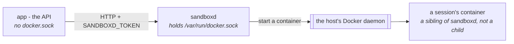

# Der Sandbox { #the-sandbox }

Ein Container, in dem ein Agent Dateien schreiben und Befehle ausführen kann.

So liest ein Run die Tabelle, die jemand angehängt hat, zeichnet etwas, klont ein
Repository oder führt Notizen zwischen Nachrichten.

!!! danger "Dies ist der eine Teil der Plattform, der Code ausführt, den niemand hier geschrieben hat"

    Deshalb verwendet diese Seite ebenso viel Zeit darauf, was einen Sandbox
    *einschließt*, wie darauf, was in einem ist.

Diese Seite ist das ganze Bild: was wo läuft, was eine Session ist, welche
Umgebungen ein Agent anfordern darf und wie man sie ändert, was eine Organisation
von einer anderen isoliert, und wie lange davon etwas überlebt.

[Konfiguration](configuration.md#the-services-own-settings) ist die Referenz
Variable für Variable.

## Was wo läuft { #what-runs-where }

Drei Prozesse, und die Anordnung ist das Sicherheitsmodell:



- **Der API-Container hält keinen Docker-Socket.** Das ist der ganze Grund, weshalb
  `sandboxd` ein eigener Service ist und kein Bibliotheksaufruf: einen Container zu
  starten erfordert den Daemon, und den Daemon zu erreichen ist gleichbedeutend mit
  root auf dem Host.
- **`sandboxd` hält den Socket und bittet den Daemon *des Hosts***, einen Container
  zu starten. Ein Sandbox ist also ein **Geschwister** von `sandboxd` und kein
  Container darin. Es gibt hier kein Docker-in-Docker, nichts ist `--privileged`,
  und es läuft kein verschachtelter Daemon.
- Deshalb wird das Workspace-Verzeichnis **auf beiden Seiten unter demselben Pfad**
  eingehängt: `sandboxd` legt es an und bittet dann den Daemon, es zu mounten, und
  der Daemon löst diesen Pfad auf dem Host auf. Ein benanntes Volume, oder ein Pfad,
  der nur innerhalb des `sandboxd`-Containers existiert, wird mit `mounts denied`
  abgelehnt.

`sandboxd` ist der Server aus [`pydantic-ai-backend`](https://github.com/vstorm-co/pydantic-ai-backend),
ausgeliefert als `ghcr.io/vstorm-co/sandboxd`; das Backend spricht über HTTP mit
ihm, mit dem Token in `SANDBOXD_TOKEN`. Die beiden anderen Sandbox-Backends, die
ein Spec benennen kann — `daytona` und `state` — sind ein gehosteter Dienst und ein
Dokument in Postgres, und keines von beiden hat mit dem oben Genannten zu tun.

!!! danger "Der Token ist root-äquivalent"

    Wer ihn hält, kann auf diesem Host Container starten. Behandeln Sie ihn wie
    den Docker-Socket, vor dem er sitzt.

`make sandbox-token` erzeugt einmalig einen in `backend/.env` und lässt ihn danach
in Ruhe, denn ihn neu zu erzeugen verwaist jeden Workspace, den der Service gerade
hält. Auch deshalb ist das eigene Dashboard des Services aus
(`SANDBOXD_UI_ENABLED: 0`): diese Seite bittet einen Menschen, den Token in einen
Browser einzufügen.

## Eine Session, und was sich eine teilt { #a-session-and-what-shares-one }

!!! abstract "Ein Container pro Session, niemals einer für alle"

    Was der Schlüssel einer Session zusammenfasst — Scope, Organisation,
    Backend-Art und Host — ist genau das, was entscheidet, welche Runs sich einen
    Container und ein Verzeichnis teilen.

Eine Session wird über einen Schlüssel identifiziert, den das Backend ableitet, und
dieser Schlüssel entscheidet, was geteilt wird:

```
xc-4f2a91c8-7b3e5d10-9c1f…      backend · scope · organization · host · subject
^^                              `x` a container service, `d` a document; `c` the conversation scope
```

Der **Scope** ist ein Feld des Specs des Agents — `run`, `conversation`, `channel`,
`user` oder `agent`. `conversation`, die übliche Wahl, bedeutet also einen Container
und ein Verzeichnis pro Chat; `agent` bedeutet, dass sich jeder Run dieses Agents
einen teilt.

Ebenfalls in den Schlüssel eingefaltet: welche **Backend-Art** und welcher **Host**
den Workspace trägt. Ein `state`-Dokument und das Volume eines Containers sind nicht
dieselbe Sache unter verschiedenen Namen, und zwei `sandboxd`-Installationen sind es
ebenso wenig — einen zweiten Host zu registrieren und ihn als Voreinstellung der
Organisation zu markieren verschob früher jeden bestehenden Workspace, ohne dass
jemand ein Spec bearbeitet hätte.

Was einen Tenant vom anderen trennt:

- ein **eigener Container** und ein **eigenes Host-Verzeichnis** pro Session;
- Session-Schlüssel sind von `uuid4` abgeleitet und daher nicht erratbar — das
  lesbare Organisationspräfix dient dem Lesen eines Dashboards, es ist **nicht** die
  Grenze;
- die Organisationsprüfung auf jeder Zeile, die diese Schlüssel erzeugt, was die
  Grenze tatsächlich ist;
- `tenant` (die Id der Organisation), gesendet beim Öffnen der Session, was der
  Service gegen `SANDBOXD_MAX_SESSIONS_PER_TENANT` (10) innerhalb eines Pools von
  `SANDBOXD_MAX_SESSIONS` (20) zählt — eine Organisation kann die Installation also
  nicht einnehmen. Über der Obergrenze lehnt der Service mit `already holds 10 of 10`
  ab.

## Welche Umgebungen ein Agent anfordern darf { #which-environments-an-agent-may-ask-for }

**Eine Runtime wird ausgeliefert, und sie ist in diesem Repository definiert** —
`backend/app/core/catalog/sandbox_runtimes.json`:

| | `workbench` — 1,93 GB, in etwa 65 s auf einem warmen Host gebaut |
|---|---|
| Gebaut auf | `python:3.12-slim` |
| Sprachen | Python 3.12; Node 24.19.0 LTS mit npm 11 und `tsx` für TypeScript |
| Werkzeuge | `git`, `curl`, `ripgrep`, `fd`, `jq`, `less`, `procps`, `unzip`, `zip`, `uv`, `pdftotext`/`pdfinfo` |
| Lesen | **liteparse** (`lit`) — PDFs und Bilder zu Text oder Markdown, OCR eingeschlossen; `poppler-utils` für den schnellen Weg über die Textebene und eine Seitenzahl |
| Dokumente | `pypdf`, `python-docx`, `openpyxl`, `python-pptx`, `reportlab`; **LibreOffice** headless für die Konvertierung und die Altformate |
| Daten | `pandas`, `duckdb`, `tabulate` |
| Diagramme und Bilder | `matplotlib` (Agg), `pillow` |
| Web | `httpx`, `requests`, `beautifulsoup4`, `lxml`, `markdownify` |
| Sonstiges | `pyyaml` |
| Speicher | 2 GiB |
| Netzwerk | ja — die einzige Runtime, die eines hat |

Eine statt acht, und der Grund ist `prewarm`: der Service baut beim Start **jeden**
Eintrag seiner Allowlist, acht Aliase sind also acht `pip install`s in einem
Startvorgang, den niemand beobachtet, acht auf dem Host zwischengespeicherte Images,
und ein Agent, der ein PDF lesen soll, bekommt denjenigen Alias, den sein Spec
zufällig benannt hat. `workbench` ist darauf gebaut, die Antwort auf *schreibe und
führe etwas Code aus, lies, was der Nutzer angehängt hat, zeichne es, hole eine
Seite* zu sein.

Bis #1040 war dieser Katalog `BUILTIN_RUNTIMES` aus der Sandbox-Bibliothek: fünfzehn
Rezepte, von denen ein von diesem Projekt gestartetes `sandboxd` drei erlaubte. Es
bedeutete außerdem, dass ein Paket zu einem Image hinzuzufügen ein Release einer
Abhängigkeit, ein Versionssprung und ein Pin war.

### Was darin ist, und was absichtlich nicht { #what-is-in-it-and-what-is-deliberately-not }

Gemessen auf `python:3.12-slim` (205 MB), arm64:

- **liteparse kommt aus `pip`, und das ist die ganze Antwort.** Das Wheel ist
  13,8 MB groß, trägt die Rust-Binary und das `lit`-CLI, hat **keine
  Python-Abhängigkeiten** und bringt OCR mit — gemessen mit 1,3 s für ein
  einseitiges PDF mit OCR und 79 ms für ein PNG. `cargo install` (eine
  Rust-Toolchain), das npm-Paket (eine zweite Kopie derselben Binary) und der
  WASM-Build (für Browser) bringen hier also nichts.
- **LibreOffice, mit +683 MB, und es ist das wert.** Es bringt drei Dinge, die
  hier sonst nichts bringt: `lit` kann die Altformate `.doc`, `.xls` und `.ppt`
  lesen, was ein Geschäftsnutzer tatsächlich anhängt; `soffice --headless
  --convert-to pdf deck.pptx` rendert ein Deck, das der Agent mit `python-pptx`
  gebaut hat, womit eine Präsentation zu etwas wird, das eine Person öffnen kann;
  und `--convert-to png` macht aus einer Folie ein Bild, das der Agent zurücklesen
  und *ansehen* kann, denn `read_file` ist hier multimodal. Etwa eine Sekunde pro
  Dokument nach dem ersten. Writer und Calc sind +135 MB von diesen 683 und aus
  einem Grund dabei: eine Office-Konvertierung, die für Präsentationen
  funktionierte und für Dokumente nicht, wäre eine Ausnahme im Produkt und eine
  Ausnahme im Prompt.
- **Es funktioniert nur, weil die Runtime *gebaut* wird.** LibreOffice legt beim
  ersten Lauf ein Benutzerprofil an, es braucht also ein echtes Konto mit einem
  beschreibbaren Home — das der Builder anlegt, wenn `SANDBOXD_SANDBOX_UID` gesetzt
  ist (`useradd --uid 10001 --create-home`). Führen Sie dasselbe Image als nackte
  uid ohne passwd-Eintrag aus, und jede Konvertierung scheitert mit
  `User installation could not be completed`. Auch deshalb kann eine fertige
  `image`-Runtime nicht einfach LibreOffice ergänzen: die beiden Entscheidungen sind
  eine Entscheidung.
- **Node von nodejs.org, nicht aus apt.** Debians `nodejs npm` ist +398 MB und
  liefert npm 9; das offizielle Tarball ist +239 MB *und* aktuell — und Node 20, auf
  das dieses Rezept zuerst gepinnt war, ist seit April 2026 End-of-Life. Die
  Architektur wird im Befehl erkannt, denn derselbe Katalog baut auf amd64 und
  arm64.
- **`poppler-utils` (+67 MB) neben liteparse, nicht statt seiner.** `lit` ist der
  bessere Leser — Layout, Tabellen, Markdown — und `pdftotext` der schnellere bei
  einem PDF, das bereits Text hat: ein 120-seitiges Buch in unter einer Sekunde.
  `pdfinfo` ist der eigentliche Grund, weshalb es hier ist, denn eine Seitenzahl in
  Millisekunden ist das, was aus „extrahiere dieses Buch" einen Plan macht.
- **OCR ist der Kostenpunkt, auf den es ankommt, und er ist gemessen.** `lit` führt
  OCR nur auf Seiten ohne Textebene aus, 120 generierte Seiten kosten also den
  Bruchteil einer Sekunde — eine *gescannte* Seite kostet aber **8,8 s**, ein
  300-seitiger Scan sind also etwa 44 Minuten gegen eine Befehlsobergrenze von 300
  Sekunden: abgebrochen, ohne etwas vorzuweisen. `--target-pages 1-40` begrenzt das
  (drei gescannte Seiten in 1,6 s), und `--no-ocr` auf einem Scan **gelingt und gibt
  179 Bytes zurück** — eine stille, nahezu leere Antwort, was das schlimmere der
  beiden Scheitern ist. Beides steht im Briefing unten, denn genau das ist die
  Anfrage, die ein Nutzer stellt: „fasse dieses Buch zusammen".
- **Kein `build-essential` (+94 MB) und kein `scikit-learn`/`scipy` (~200 MB).**
  Beides ist auf einer Runtime mit Netzwerk ein `uv pip install` entfernt. Sie
  wegzulassen kostet eine einmalige Installation; sie einzubacken bezahlt jeder Host
  bei jedem Start.
- **`requests` neben `httpx` und `tabulate` neben `pandas`**, mit einem halben
  Megabyte zusammen: ein Modell schreibt `import requests` und `df.to_markdown()`
  aus dem Muskelgedächtnis, und keines von beiden ist ein fehlgeschlagenes Skript
  und einen erneuten Versuch wert.
- **`tzdata` und `fonts-dejavu-core`** sind in der apt-Schicht, weil `python:slim`
  keines von beiden hat, `zoneinfo` also eine Exception wirft und
  `PIL.ImageDraw.text` keine Schrift laden kann — beides vorher und nachher
  verifiziert.
- **`env_vars` statt einer Gewohnheit.** `MPLBACKEND=Agg`, `PYTHONUTF8=1`,
  `PYTHONUNBUFFERED=1`, `PYTHONDONTWRITEBYTECODE=1` sind Eigenschaften des Images;
  ein Run, der sich an sie erinnern muss, ist ein Run, der es nicht tun wird.

### Das Modell erfährt all das { #the-model-is-told-all-of-this }

Ein Container nützt einem Agent nichts, der nicht weiß, was darin ist.

Vor #1040 hätte ein Agent, den man um ein Diagramm bat, `import plotly` geschrieben,
und einer, dem man ein PDF reichte, hätte seinen eigenen Extraktor neben das `lit`
geschrieben, das es liest — beide hätten es sonst gelernt, indem sie mitten in der
Anfrage von jemandem scheitern.

**Und es erfährt, wie zu arbeiten ist, nicht nur, was installiert ist.**

Die Anweisung, die ihren Platz verdient, ist die, die nichts anderes lehren kann:
*lesen Sie keine große Datei, um sie zu durchsehen*. Extrahieren Sie sie einmal in
eine Textdatei, `rg -n` für die Stellen, auf die es ankommt, `sed -n '400,460p'`, um
eine zu lesen.

Ein Buch hat Tausende von Zeilen, und eine Antwort braucht Dutzende davon. Ein
Modell, das das Ganze in seinen eigenen Kontext zieht, gibt das Budget des Runs für
Seiten aus, nach denen niemand gefragt hat. Derselbe Absatz trägt die beiden
OCR-Fallen von oben, denn ein gescanntes Buch ist der Ort, an dem beide zugleich
landen.

Jedem Run auf einer Runtime, die dieses Deployment ausliefert, wird deshalb ein
Absatz an seine Instruktionen angehängt: welche Runtime er bekommen hat, die
Paketliste, die `lit`-Zeile, was `soffice` konvertiert, die eine Lücke (kein
C-Compiler), und ob er ein Netzwerk hat.

Er ist **aus dem Katalog komponiert**, nicht daneben geschrieben.
`runtime_briefing` liest die Paketliste aus der Definition, ein zur Datei
hinzugefügtes Paket erreicht den Prompt also in derselben Bearbeitung, in der es das
Image erreicht. Nur was sich nicht ableiten lässt, ist Prosa, in der `briefing`-Liste
des Eintrags.

Zwei Konsequenzen, die man kennen sollte:

- Er wird **pro Run** angehängt, so wie der Prompt einer Channel-Bindung, denn
  welche Runtime ein Run bekommt, wird beim Start des Runs aus dem Spec, der
  Connection und dem Host aufgelöst. Das veröffentlichte Spec bleibt unangetastet.
- Ein Alias, den dieses Deployment **nicht** ausliefert, bekommt keinen Absatz. Ein
  Host, der mit einer eigenen Allowlist gestartet wurde, ist keiner, dessen Images
  wir ehrlich beschreiben können, und ein Prompt, der rät, ist schlimmer als ein
  Prompt, der schweigt.

### Ihn ändern { #changing-it }

```bash
$EDITOR backend/app/core/catalog/sandbox_runtimes.json
make sandbox-runtimes          # writes SANDBOXD_RUNTIMES into all three compose files
docker compose up -d sandboxd  # prewarm rebuilds what the list now names
```

Ein Eintrag hat eine von zwei Formen, nie beide:

```json
{
  "alias": "workbench",
  "description": "What it is for - shown in the connection dialog",
  "base_image": "python:3.12-slim",
  "setup_commands": ["apt-get update && apt-get install -y --no-install-recommends git"],
  "packages": ["pillow"],
  "mem_limit": "2g",
  "needs_network": true
}
```

| Feld | |
|---|---|
| `alias` | Was ein Spec benennt. Kleinschreibung, `[a-z][a-z0-9-]*` |
| `description` | Gezeigt unter `Default runtime` im Connection-Dialog. Sagen Sie, *wofür* sie ist |
| `image` | Ein fertiges Image. Startet in der Zeit, die ein Pull braucht, und installiert nichts |
| `base_image` | Einmal bei der ersten Nutzung gebaut und danach zwischengespeichert — die Form, die installieren kann |
| `setup_commands` | Shell zur Build-Zeit, vor den Paketen: eine apt-Schicht, ein Installer |
| `packages` | `pip`, zur Build-Zeit installiert. Braucht ein `base_image` |
| `env_vars` | In jedem Container auf dieser Runtime gesetzt — `MPLBACKEND`, `PYTHONUTF8` |
| `briefing` | Sätze, die dem Modell gesagt werden und sich nicht aus den obigen Feldern ableiten lassen |
| `mem_limit` | Dockers eigene Syntax (`2g`). Fehlt er, gilt `SANDBOXD_MEM_LIMIT` |
| `needs_network` | Ob eine **Session** darauf ein Netzwerk bekommt. Ein Build hat immer eines |

Vier Dinge, die die Datei Sie nicht falsch machen lässt, oder die zubeißen, wenn Sie
diesen Abschnitt überspringen:

- **`image` und `base_image` schließen einander aus**, und eine `packages`- oder
  `setup_commands`-Liste an einem `image`-Eintrag wird beim Import abgelehnt.
  Angenommen, wäre das eine Runtime, deren Pakete im Katalog stehen, in der
  Compose-Datei stehen und nicht im Container sind.
- **Der erste Eintrag ist die Voreinstellung** für einen Agent, dessen Spec keine
  Runtime benennt, die Reihenfolge der Datei ist also tragend.
- **`network_mode` wird nicht vererbt.** `SANDBOXD_NETWORK_MODE` gilt für den
  gesamten Service und jede ausgelieferte Compose-Datei setzt es auf `none`, ein
  Eintrag, der zur Laufzeit etwas installiert, braucht also ein eigenes Netzwerk.
  `needs_network` ist diese Entscheidung, einmal dort getroffen, wo die Pakete sind,
  statt pro Compose-Datei erinnert; übersehen, ist das Scheitern ein Agent, dessen
  `uv pip install` in einen Timeout läuft.
- **Ein fehlerhafter Eintrag stoppt das Deployment**, absichtlich — der Katalog wird
  beim Import validiert und nicht bei der ersten Nutzung, denn eine Auswahl mit einem
  Loch darin wird von einem Nutzer entdeckt.

### Warum der Wert auch in den Compose-Dateien steht { #why-the-value-is-also-in-the-compose-files }

`SANDBOXD_RUNTIMES` ist der **einzige** Kanal, auf dem der Service Runtimes annimmt.
Eine Compose-Datei kann keinen Befehl aufrufen, der Wert dort ist also eine
generierte Kopie, und die einzige Frage, die zu beantworten sich lohnt, ist, ob sie
auseinanderlaufen kann: `backend/tests/test_sandbox_runtime_catalog.py` schlägt fehl,
wenn eine das getan hat, benennt die Datei und sagt Ihnen, dass Sie
`make sandbox-runtimes` ausführen sollen.

Generiert *in* eine versionierte Datei, statt beim Start aus einer Nebendatei
gelesen zu werden, denn `docker compose up` muss funktionieren, ohne vorher etwas zu
generieren — die Alternative ist ein Deployment, das stillschweigend die eigene
Standard-Allowlist der Bibliothek übernimmt.

Und es ist kein Formular im Produkt. `PUT /policy` ändert Obergrenzen und
Lebensdauern zur Laufzeit und lehnt die *Zusammensetzung* dieser Liste absichtlich
ab, ebenso `network_mode`, `oci_runtime`, `sandbox_uid`, `work_dir` und
`persist_containers`: ein Image zu benennen ist eine Entscheidung über Isolation, und
der Service-Token wird von einer Anwendung gehalten und nicht von demjenigen, der den
Host betreibt. Die Liste zu ändern ist ein Neustart.

### Zwei Listen im Produkt, die verschiedene Fragen beantworten { #two-lists-in-the-product-answering-different-questions }

Das `Default runtime` des **Connection-Dialogs** bietet diesen Katalog an — das, was
die Compose-Dateien dem Service gegeben haben — befüllt, bevor irgendein Host gefragt
wurde, und markiert, sobald einer geantwortet hat. Das `Runtime` des **Agent
Builders** bietet an, was der Service auf dieser Connection *tatsächlich* erlaubt,
live von ihm gelesen, ein Alias, den er benennt, ist also einer, den der nächste
Tool-Aufruf annimmt. Wo die beiden uneins sind, hat die zweite recht: ein Host kann
mit einer anderen Allowlist gestartet worden sein, und ein Deployment, das eine
eigene generiert hat, ist genau der Fall, den man nicht fallen lassen sollte.

**Deshalb wird der Host gefragt, bevor die Connection gespeichert wird, und deshalb
kann der Service, den `make dev` startet, ganz ohne Schlüssel gefragt werden.**

Diesen einen hinzuzufügen ist der häufigste Weg durch den Dialog, und er benennt bis
zur Absendung keinen Vault-Schlüssel — es gab also nichts, womit man hätte testen
können, und ein veralteter lokaler Service konnte mit einer Default-Runtime
registriert werden, die sein erster Tool-Aufruf ablehnt.

!!! danger "Ein Probe-Aufruf ohne Schlüssel fällt nur bei zwei Adressen auf `SANDBOXD_TOKEN` zurück"

    Den beiden, die die eigene Compose-Datei dieses Projekts verwendet. Dieser Token
    startet Container auf jedem Host, der ihn annimmt, und ein Probe-Aufruf darf
    niemals ein Weg sein, ihn irgendwohin Neues zu schicken.

Jede andere Adresse wird mit einem Schlüssel aus dem Vault gefragt, und nur dann,
wenn ein Betreiber die Schaltfläche drückt.

## Wann ein Container erscheint { #when-a-container-appears }

**Bei der ersten Workspace-Operation, was nicht dasselbe ist wie der erste
Tool-Aufruf des Agents.** Ein Run stellt bereit, was jemand angehängt hat, und
materialisiert die Skills des Agents, *bevor* das Modell aufgerufen wird, und beides
öffnet die Session verzögert — ein Container kann also für einen Zug existieren, in
dem der Agent nie nach der Shell gegriffen hat. Gut zu wissen beim Lesen einer
Session-Liste: ein Sandbox, dessen Aktivitätslog nichts als Schreibvorgänge enthält,
ist einer, den noch nichts angefordert hat.

## Was in einem getan wurde, und wo dieser Nachweis liegt { #what-was-done-in-one-and-where-that-record-lives }

**In der eigenen Tabelle dieser Plattform, `sandbox_operations` — nicht im Service.**

Der Service führt ein eigenes Aktivitätslog, und das ist ein Ringpuffer mit 200
Einträgen im Speicher dieses Prozesses. Was er verworfen hat, konnte nicht abgefragt
werden, eine Unterhaltung, in der den ganzen Tag gearbeitet wurde, hatte ihren
Vormittag verloren, und `sandboxd` neu zu starten verlor jedes Log auf dem Host.
Nichts außerhalb dieses Prozesses hat die Einträge je gesehen (#1061).

Jeder Workspace-Aufruf geht ohnehin durch diese Anwendung — der Run ruft uns auf, wir
rufen den Service auf — der Nachweis ist also unserer.

`RecordingBackend` umhüllt das Backend, das die Tools der Capability erreichen,
weshalb ein neuntes Tool hinzuzufügen das Aufzeichnen nicht vergessen kann. Der
Wrapper zeichnet acht benannte Operationen auf (`write`, `edit`, `read`,
`read_bytes`, `ls_info`, `glob_info`, `grep_raw`, `execute`) und reicht alles andere
unangetastet weiter. `exists` und `is_alive` sind Fragen und keine Operationen, und
ein Log voll davon würde die Schreibvorgänge begraben, wegen derer jemand gekommen
ist.

Er trägt zwei Tatsachen, die der Service nie tragen konnte, und es sind die beiden,
nach denen ein Audit tatsächlich fragt: **welcher Agent, und welcher Run**. Beide
sind beim Löschen `SET NULL`, denn der Nachweis dessen, was geschehen ist, muss den
Agent überleben, der danach gelöscht wurde.

!!! warning "Ein Pfad, nie eine Nutzlast"

    `write` zeichnet den Pfad auf und dass es gelungen ist. `execute` zeichnet den
    Befehl auf und nie dessen Ausgabe — ein Exit ungleich null wird als Fehlschlag
    mit seinem numerischen Status aufgezeichnet (`exit 2`), die eine sichere
    Tatsache über einen fehlgeschlagenen Befehl. `read` zeichnet den Pfad und eine
    Byte-Anzahl auf.

    Diese Zeilen sind für jeden lesbar, der den Sandbox sehen kann, ein Log mit
    Inhalten wäre also eine Möglichkeit, die Arbeit eines Agents zu *lesen*, statt
    ein Audit darüber — dieselbe Linie, die der Service zieht, hier erneut gezogen.

    Die eine Zeile über den Ausgang wird von uns geschrieben, nie von unten zitiert:
    die Meldung einer Shell *ist* die Ausgabe des Befehls (#423).

Zeilen landen, wenn die Transaktion des Runs committet, denn sie werden in die eigene
Session des Runs geschrieben und nicht über eine Verbindung pro Tool-Aufruf. Die
Operationen eines Zuges erscheinen also gemeinsam, etwa eine Sekunde nach dem Ende
des Zuges.

Der Live-Ticker der Dashboard-Zeile liest aus genau diesem Grund weiterhin den Puffer
des Services: er antwortet mitten im Zug, wo der Nachweis eine Woche später antwortet.

`GET /api/v1/sandbox-connections/operations` blättert darin, und seine Filter grenzen
die **Abfrage** ein: die Suche des Dialogs, sein Operationsfilter und sein Schalter
für „nur fehlgeschlagene" sind Requests, ein Pager über dreihundert Operationen hat
also etwas, wohin er blättern kann.

## Wann ein Build bezahlt wird { #when-a-build-is-paid-for }

`prewarm` ist an, die Allowlist wird also **beim Start des Services** im Hintergrund
geholt und gebaut, statt in der ersten Anfrage von jemandem — ein Build sind zehn
Sekunden und mehr. Images werden zwischengespeichert, ein Host zahlt also einmal.

Was zu warten bleibt: die erste Session, die *während* eines Prewarms geöffnet wird,
und ein Host, dessen Image-Cache geleert wurde.
`SANDBOXD_PERSIST_CONTAINERS: true` beseitigt dann den größten Teil des Rests — eine
geschlossene Session behält ihren Container, die nächste Session auf diesem Workspace
startet also ohne Build und mit allem, was der Agent beim letzten Mal installiert
hat, weiterhin installiert.

## Isolation, schlicht gesagt { #isolation-plainly }

Was hält:

- der Sandbox kann den Docker-Socket nicht sehen; nur `sandboxd` kann das;
- überhaupt kein Netzwerk, sofern die Runtime nicht eines anfordert, und das tut nur
  `workbench`;
- 2 CPUs, 512 Prozesse und ein 64 MiB großes `tmpfs` unter `/tmp` pro Sandbox, dazu
  `SANDBOXD_EXECUTE_TIMEOUT` (300 s) auf jedem Befehl und `SANDBOXD_MAX_READ_BYTES`
  (8 MiB) auf jedem Lesevorgang;
- `SANDBOXD_SANDBOX_UID: 10001` — ein Sandbox läuft als unprivilegierter Nutzer und
  nicht als root, und jede Datei, die ein Agent schreibt, gehört auf dem Host dieser
  uid. Sie **muss die eigene uid des Services sein**: das Öffnen einer Session führt
  ein `chown` des Workspace auf diesen Nutzer aus, und ein unprivilegiertes
  `sandboxd` kann das nur für sich selbst tun, eine andere Nummer scheitert also bei
  der ersten Session statt beim Start. Sie gilt für eine Runtime, die dieses
  Deployment *baut* — ein fertiges Image hat kein solches Konto und kein Virtualenv,
  ein Agent darin könnte also nichts installieren.

Was bleibt, ausgesprochen statt angedeutet:

1. **Der Service-Token ist root-äquivalent.** Siehe oben.
2. **Aus dem Container auszubrechen heißt, auf den Host auszubrechen.** Gewöhnliches
   `runc`; `oci_runtime` kann ein gesandboxtes benennen (gVisors `runsc`), wo ein
   Deployment diesen Handel will.
3. **Eine Runtime mit Netzwerk kann auf dem Host veröffentlichte Ports erreichen.**
   `docker-compose.yml` veröffentlicht Postgres und Redis für die lokale Entwicklung,
   mit `postgres/postgres`; `docker-compose-prod.yml` veröffentlicht keines von
   beiden.

!!! warning "Ein Laptop-Vorbehalt, aber prüfen Sie ihn, bevor Sie die lokale Compose-Datei kopieren"

    `docker-compose.yml` veröffentlicht Postgres und Redis mit `postgres/postgres`,
    und `workbench` ist die eine Runtime mit einem Netzwerk. Auf einem geteilten
    Host ist das aus einem Sandbox heraus erreichbar; `docker-compose-prod.yml`
    veröffentlicht keines von beiden.

## Was der Dateibrowser zeigt, und was er auslässt { #what-the-file-browser-shows-and-what-it-leaves-out }

`/workspaces` listet auf, was ein Agent **für eine Person** aufbewahrt, was nicht
dieselbe Menge ist wie das, was auf dem Volume liegt. Zwei Präfixe fallen aus jeder
Auflistung, die eine Person liest - der flachen Ansicht, den eigenen Dateien eines
Workspace, dem Panel einer Unterhaltung und den Dateizahlen:

- `skills/` — der Rumpf eines Skills und seine Ressourcen, geschrieben zu Beginn
  jedes Runs, der sowohl Skills als auch einen Workspace hat. Sie werden dort
  gebraucht: eine Ressource ist ein Skript, das die Shell ausführt, und
  `collect_changes` bildet aus diesen Dateien einen Vorschlag, den jemand annimmt.
  Sie wurden einmal entfernt, weil die Auflistung größtenteils aus ihnen bestand, was
  die richtige Beschwerde über die falsche Sache war (#1064).
- das Spill-Verzeichnis — wohin die überlaufende Ausgabe eines Tools geschrieben
  wurde.

Eine Zählung muss sie ebenfalls weglassen, sonst ist ein Workspace, der vier Dateien
meldet, während eine sichtbar ist, eine Zahl, die niemand prüfen kann.

### Wessen Workspace es ist, und wer ihn sonst sehen kann { #whose-workspace-it-is-and-who-else-can-see-it }

Zwei Antworten, und die Tabelle trägt beide.

`access_label` ist der **Scope** in Worten — „jeder, der mit diesem Agent spricht",
„wer in dieser Unterhaltung ist". Es benennt niemanden, was genau die Frage ist, die
ein Betreiber zu einem agent-scoped Workspace hat, den sich sechs Personen teilen.

Die Zeile trägt deshalb auch `owner_name`: die E-Mail eines Kontos, oder die
Plattform-Id eines Owners, der über einen Channel kam und hier kein Konto hat. Es
wird als Wort gezeichnet und nie als Link, denn die Hälfte davon sind keine Konten,
auf die man verlinken könnte. Und es ist für jeden Scope außer `user` null, der als
einziger überhaupt einen Owner festhält — drei der vier haben ehrlicherweise keinen,
und die Spalte sagt das, statt den Scope zu wiederholen.

### Eine Datei sagt, wer sie dort abgelegt hat { #a-file-says-who-put-it-there }

`uploads/` ist der Ort, an dem ein Anhang landet, ein Pfad darunter ist also eine
Datei, **die eine Person angehängt hat**, und alles andere ist die eigene Arbeit des
Agents. Es wird als Filter angeboten und auf der Kachel gesagt.

Es ist das einzige verfügbare Signal: ein Host hält keinen Urheber fest, und das
State-Dokument tut es ebenso wenig. Seine Grenze folgt daraus — ein Agent, der selbst
in `uploads/` schreibt, ist von einer Person nicht zu unterscheiden, und nichts hält
ihn davon ab.

### Einen Container aufzulisten kostet Roundtrips, deshalb sind zwei Dinge begrenzt { #listing-a-container-costs-round-trips-so-two-things-are-bounded }

Das `ls` des Archivs liest ein Verzeichnis, die Auflistung läuft also: in die Breite
zuerst, höchstens sechs Ebenen tief, mit Halt bei 2.000 Einträgen — denn ein Host,
der ein `node_modules` hält, darf aus einem Workspace nicht zehntausend Zeilen
machen.

**Beide Grenzen werden gemeldet.** Die Seite eines Workspace sagt klar, dass dies
nicht jede Datei ist, denn ein Baum, der ohne Ankündigung aufhört, ist einer, den
jemand als alles liest, was der Agent aufbewahrt.

Ein Verzeichnis, das nicht antwortet, wird geloggt und übersprungen. Nur wenn die
*Wurzel* sich weigert, wird der Workspace unlesbar, denn ein Ordner, den der Agent
weg-chmodet hat, ist kein Host, den niemand lesen kann.

Und das Vorschaubild eines Bildes ist ein `read_bytes` für diese Datei: die Endung
und die Größe werden am Auflistungseintrag geprüft, bevor irgendetwas geholt wird,
und ein Request zeichnet höchstens 24. Darüber hinaus behält eine Kachel das Glyph.

Ein *gespeicherter* Workspace zahlt keines von beidem — seine Dateien und deren Bytes
sind eine Spalte der Zeile, die die Auflistung ohnehin gelesen hat.

## Wie lange irgendetwas überlebt { #how-long-anything-survives }

Dateien liegen auf dem Host, unter
`{SANDBOXD_WORKSPACE_ROOT}/{session_id}/workspace` —
`/tmp/agenticos-sandbox-workspaces` lokal, `/var/lib/agenticos/sandbox-workspaces`
auf dem Dev-Server und in der Produktion. Dieser Bind Mount ist auch das, was das
Files-Panel des Produkts möglich macht: einen Workspace zu lesen startet nie einen
Container.

| | Einstellung | Was geschieht |
|---|---|---|
| Eine untätige Session | `SANDBOXD_IDLE_TIMEOUT` 1800 s | Der Container wird geschlossen und abgeräumt. **Die Dateien bleiben** |
| Ein gestoppter Container | `SANDBOXD_CONTAINER_TTL` 86400 s | Was die Session installiert hat — der Build, die Wheels, `node_modules` — wird zurückgeholt. Der Workspace bleibt unangetastet |
| Das Workspace-Verzeichnis | `SANDBOXD_WORKSPACE_TTL` **nicht gesetzt** | **Unbegrenzt** aufbewahrt |
| Der Nachweis dessen, was getan wurde | `OPERATION_RETENTION_DAYS` 30 | Der tägliche `sandbox-log-sweep` löscht die Zeilen. Die Dateien bleiben unangetastet |

Die letzte Zeile ist die Voreinstellung der Bibliothek und sie ist Absicht — die
Notizen und Skripte sind die Arbeit, und der Nutzer eines Agents erwartet sie nächste
Woche.

!!! info "Der Plattenverbrauch wächst nur"

    Nichts räumt einen Workspace ab, dessen Unterhaltung niemand mehr öffnen wird.
    Setzen Sie `SANDBOXD_WORKSPACE_TTL` auf das, was Ihre Aufbewahrungsrichtlinie
    sagt, und die Dateien, die älter sind, verschwinden.

`/tmp` wird auf einem Laptop von einem Neustart geleert; `/var/lib` nicht.

Eine Unterhaltung zu löschen räumt ihren Workspace über das Produkt ab, hier geht es
also um das, was niemand löscht, und nicht darum, was sie tun.

## Zusammenfassung { #recap }

- Der API-Container **hält keinen Docker-Socket**. `sandboxd` tut es, und ein
  Sandbox ist sein Geschwister und kein Container darin.
- Ein **Session-Schlüssel** faltet Scope, Organisation, Backend-Art und Host
  zusammen — was genau das ist, was entscheidet, wer sich einen Container teilt.
- **Eine Runtime wird ausgeliefert**, `workbench`, und dem Modell wird gesagt, was
  darin ist, komponiert aus demselben Katalog, der sie gebaut hat.
- Der Nachweis dessen, was ein Agent getan hat, liegt in **der Tabelle dieser
  Plattform**, hält einen Pfad und nie eine Nutzlast, und überlebt den Agent.
- **Dateien werden unbegrenzt aufbewahrt**, sofern Sie `SANDBOXD_WORKSPACE_TTL` nicht
  setzen. Der Plattenverbrauch wächst nur.
