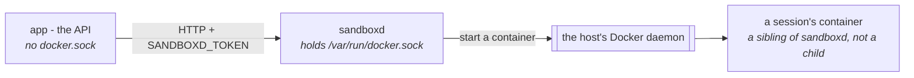

# La sandbox { #the-sandbox }

Un contenedor en el que un agent puede escribir archivos y ejecutar comandos.

Es como un run lee la hoja de cálculo que alguien adjuntó, dibuja una gráfica,
clona un repositorio o guarda notas entre mensajes.

!!! danger "Esta es la única parte de la plataforma que ejecuta código que nadie de aquí escribió"

    Por eso esta página dedica tanto espacio a lo que *contiene* una sandbox como
    a lo que hay dentro de una.

Esta página es el cuadro completo: qué se ejecuta dónde, qué es una sesión, qué
entornos puede pedir un agent y cómo cambiarlos, qué aísla una organización de
otra, y cuánto sobrevive cada cosa.

[Configuración](configuration.md#the-services-own-settings) es la referencia
variable por variable.

## Qué se ejecuta dónde { #what-runs-where }

Tres procesos, y la disposición es el modelo de seguridad:



- **El contenedor de la API no tiene ningún socket de Docker.** Esa es toda la
  razón por la que `sandboxd` es un servicio aparte y no una llamada a una
  librería: ejecutar un contenedor requiere el daemon, y alcanzar el daemon
  equivale a ser root en el host.
- **`sandboxd` tiene el socket y le pide al daemon *del host*** que arranque un
  contenedor. Así que una sandbox es un **hermano** de `sandboxd`, no un
  contenedor dentro de él. Aquí no hay Docker-in-Docker, nada es `--privileged`
  y no corre ningún daemon anidado.
- Por eso el directorio del workspace se monta con bind **en la misma ruta en
  ambos lados**: `sandboxd` lo crea, luego pide al daemon que lo monte, y el
  daemon resuelve esa ruta en el host. Un volumen con nombre, o una ruta que solo
  existe dentro del contenedor `sandboxd`, se rechaza con `mounts denied`.

`sandboxd` es el servidor de [`pydantic-ai-backend`](https://github.com/vstorm-co/pydantic-ai-backend),
distribuido como `ghcr.io/vstorm-co/sandboxd`; el backend habla con él por HTTP
con el token que hay en `SANDBOXD_TOKEN`. Los otros dos backends de sandbox que
un spec puede nombrar —`daytona` y `state`— son un servicio alojado y un
documento en Postgres, y ninguno implica nada de lo anterior.

!!! danger "El token equivale a root"

    Quien lo tenga puede arrancar contenedores en ese host. Trátalo como el
    socket de Docker delante del que está.

`make sandbox-token` genera uno en `backend/.env` una sola vez y luego lo deja en
paz, porque regenerarlo deja huérfano cada workspace que el servicio esté
guardando en ese momento. Esa es también la razón de que el dashboard propio del
servicio esté apagado (`SANDBOXD_UI_ENABLED: 0`): esa página pide a una persona
que pegue el token en un navegador.

## Una sesión, y qué comparte una { #a-session-and-what-shares-one }

!!! abstract "Un contenedor por sesión, nunca uno para todos"

    Lo que la clave de una sesión agrupa —scope, organización, tipo de backend y
    host— es exactamente lo que decide qué runs comparten un contenedor y un
    directorio.

Una sesión se identifica por una clave que deriva el backend, y esa clave es lo
que decide qué se comparte:

```
xc-4f2a91c8-7b3e5d10-9c1f…      backend · scope · organization · host · subject
^^                              `x` a container service, `d` a document; `c` the conversation scope
```

El **scope** es un campo del spec del agent: `run`, `conversation`, `channel`,
`user` o `agent`. Así que `conversation`, la elección habitual, significa un
contenedor y un directorio por chat; `agent` significa que todos los runs de ese
agent comparten uno.

También se agrupan en la clave: qué **tipo de backend** y qué **host** alojan el
workspace. Un documento `state` y el volumen de un contenedor no son la misma
cosa con distinto nombre, y tampoco lo son dos instalaciones de `sandboxd`:
registrar un segundo host y marcarlo como el predeterminado de la organización
movía antes cada workspace existente sin que nadie editara un spec.

Lo que separa un tenant de otro:

- un **contenedor propio** y un **directorio propio en el host** por sesión;
- las claves de sesión derivan de `uuid4`, así que son inadivinables: el prefijo
  legible de la organización sirve para leer un dashboard, **no** es la frontera;
- la comprobación de organización en cada fila que produce esas claves, que es lo
  que la frontera realmente es;
- el `tenant` (el id de la organización) enviado al abrir la sesión, que el
  servicio cuenta contra `SANDBOXD_MAX_SESSIONS_PER_TENANT` (10) dentro de un
  pool de `SANDBOXD_MAX_SESSIONS` (20), así que una organización no puede
  quedarse con la instalación. Por encima del techo el servicio rechaza con
  `already holds 10 of 10`.

## Qué entornos puede pedir un agent { #which-environments-an-agent-may-ask-for }

**Se distribuye un runtime, y está definido en este repositorio**:
`backend/app/core/catalog/sandbox_runtimes.json`.

| | `workbench` — 1,93 GB, construido en unos 65 s en un host caliente |
|---|---|
| Construido sobre | `python:3.12-slim` |
| Lenguajes | Python 3.12; Node 24.19.0 LTS con npm 11 y `tsx` para TypeScript |
| Herramientas | `git`, `curl`, `ripgrep`, `fd`, `jq`, `less`, `procps`, `unzip`, `zip`, `uv`, `pdftotext`/`pdfinfo` |
| Lectura | **liteparse** (`lit`) — PDFs e imágenes a texto o markdown, OCR incluido; `poppler-utils` para la vía rápida de la capa de texto y un recuento de páginas |
| Documentos | `pypdf`, `python-docx`, `openpyxl`, `python-pptx`, `reportlab`; **LibreOffice** headless para la conversión y los formatos antiguos |
| Datos | `pandas`, `duckdb`, `tabulate` |
| Gráficas e imágenes | `matplotlib` (Agg), `pillow` |
| Web | `httpx`, `requests`, `beautifulsoup4`, `lxml`, `markdownify` |
| Otros | `pyyaml` |
| Memoria | 2 GiB |
| Red | sí — el único runtime que la tiene |

Uno en lugar de ocho, y la razón es `prewarm`: el servicio construye **todas** las
entradas de su lista de permitidos al arrancar, así que ocho alias son ocho
`pip install` en un arranque que nadie mira, ocho imágenes cacheadas en el host, y
un agent al que se le pide leer un PDF recibiendo el alias que su spec resultara
nombrar. `workbench` está construido para ser la respuesta a *escribe y ejecuta
algo de código, lee lo que adjuntó el usuario, dibújalo, trae una página*.

Hasta #1040 este catálogo era `BUILTIN_RUNTIMES`, de la librería de la sandbox:
quince recetas, de las cuales un `sandboxd` arrancado por este proyecto permitía
tres. También significaba que añadir un paquete a una imagen era una publicación
de una dependencia, una subida de versión y un pin.

### Qué hay dentro, y qué deliberadamente no { #what-is-in-it-and-what-is-deliberately-not }

Medido sobre `python:3.12-slim` (205 MB), arm64:

- **liteparse viene de `pip`, y esa es toda la respuesta.** El wheel pesa 13,8 MB,
  lleva el binario de Rust y la CLI `lit`, **no tiene dependencias de Python** y
  trae OCR incorporado: medido en 1,3 s para un PDF de una página con OCR y 79 ms
  para un PNG. Así que `cargo install` (un toolchain de Rust), el paquete de npm
  (una segunda copia del mismo binario) y la build WASM (para navegadores) no
  aportan nada aquí.
- **LibreOffice, a +683 MB, y vale la pena.** Compra tres cosas que nada más de
  aquí da: `lit` puede leer los formatos antiguos `.doc`, `.xls` y `.ppt`, que es
  lo que un usuario de negocio adjunta de verdad; `soffice --headless
  --convert-to pdf deck.pptx` renderiza una presentación que el agent construyó
  con `python-pptx`, que es como una presentación se convierte en algo que una
  persona puede abrir; y `--convert-to png` convierte una diapositiva en una
  imagen que el agent puede volver a leer y *mirar*, ya que aquí `read_file` es
  multimodal. Alrededor de un segundo por documento después del primero. Writer y
  Calc son +135 MB de esos 683 y están por una razón: una conversión ofimática que
  funcionara para presentaciones y no para documentos sería una excepción en el
  producto y una excepción en el prompt.
- **Solo funciona porque el runtime se *construye*.** LibreOffice crea un perfil
  de usuario en la primera ejecución, así que necesita una cuenta real con un home
  escribible, que es la que hace el constructor cuando `SANDBOXD_SANDBOX_UID` está
  fijado (`useradd --uid 10001 --create-home`). Ejecuta la misma imagen como un
  uid pelado sin entrada en passwd y cada conversión falla con
  `User installation could not be completed`. Esa es también la razón por la que
  un runtime de tipo `image` ya hecha no puede añadir LibreOffice sin más: las dos
  decisiones son una sola decisión.
- **Node desde nodejs.org, no desde apt.** El `nodejs npm` de Debian son +398 MB y
  trae npm 9; el tarball oficial son +239 MB *y* está al día — y Node 20, que esta
  receta fijó al principio, está al final de su vida desde abril de 2026. La
  arquitectura se detecta en el comando, porque el mismo catálogo se construye en
  amd64 y en arm64.
- **`poppler-utils` (+67 MB) junto a liteparse, no en su lugar.** `lit` es el mejor
  lector —maquetación, tablas, markdown— y `pdftotext` es el más rápido en un PDF
  que ya tiene texto: un libro de 120 páginas en menos de un segundo. `pdfinfo` es
  la razón real de que esté aquí, porque un recuento de páginas en milisegundos es
  lo que convierte «extrae este libro» en un plan.
- **El OCR es el coste que importa, y está medido.** `lit` solo hace OCR de las
  páginas sin capa de texto, así que 120 páginas generadas cuestan una fracción de
  segundo; pero una página *escaneada* cuesta **8,8 s**, con lo que un escaneo de
  300 páginas son unos 44 minutos contra un techo de 300 segundos por comando:
  matado, sin nada que enseñar. `--target-pages 1-40` lo acota (tres páginas
  escaneadas en 1,6 s), y `--no-ocr` sobre un escaneo **tiene éxito y devuelve 179
  bytes**: una respuesta casi vacía y silenciosa, que es el peor de los dos
  fallos. Ambos están en el briefing de más abajo, porque esta es exactamente la
  petición que hace un usuario: «resume este libro».
- **Sin `build-essential` (+94 MB) y sin `scikit-learn`/`scipy` (~200 MB).** Ambos
  están a un `uv pip install` de distancia en un runtime que tiene red. El coste de
  dejarlos fuera es una instalación la primera vez; el coste de hornearlos dentro
  lo paga cada host en cada arranque.
- **`requests` junto a `httpx`, y `tabulate` junto a `pandas`**, medio megabyte
  entre los dos: un modelo escribe `import requests` y `df.to_markdown()` de
  memoria muscular, y ninguno merece un script fallido y un reintento.
- **`tzdata` y `fonts-dejavu-core`** están en la capa de apt porque `python:slim`
  no tiene ninguno de los dos, así que `zoneinfo` lanza una excepción y
  `PIL.ImageDraw.text` no puede cargar una fuente; ambos verificados antes y
  después.
- **`env_vars` en lugar de una costumbre.** `MPLBACKEND=Agg`, `PYTHONUTF8=1`,
  `PYTHONUNBUFFERED=1`, `PYTHONDONTWRITEBYTECODE=1` son propiedades de la imagen;
  un run que tiene que acordarse de ellas es un run que no lo hará.

### Al modelo se le cuenta todo esto { #the-model-is-told-all-of-this }

Un contenedor no le sirve de nada a un agent que no sabe qué hay dentro.

Antes de #1040, un agent al que se le pedía una gráfica hacía `import plotly`, y
uno al que le daban un PDF escribía su propio extractor junto al `lit` que lo lee,
aprendiendo cada uno por las malas dentro de la petición de alguien.

**Y se le cuenta cómo trabajar, no solo qué hay instalado.**

La instrucción que se gana su sitio es la que nada más puede enseñar: *no leas un
archivo grande para ojearlo*. Extráelo una vez a un archivo de texto, `rg -n` para
encontrar los sitios que importan, `sed -n '400,460p'` para leer uno.

Un libro son miles de líneas y una respuesta necesita decenas de ellas. Un modelo
que se lleva todo eso a su propio contexto gasta el budget del run en páginas por
las que nadie preguntó. El mismo párrafo lleva las dos trampas de OCR de arriba,
porque un libro escaneado es donde caen las dos a la vez.

Así que cada run sobre un runtime que este despliegue distribuye lleva un párrafo
añadido a sus instrucciones: qué runtime le tocó, la lista de paquetes, la línea
de `lit`, qué convierte `soffice`, la única carencia (sin compilador de C) y si
tiene red.

Está **compuesto a partir del catálogo**, no escrito al lado. `runtime_briefing`
lee la lista de paquetes de la definición, así que un paquete añadido al archivo
llega al prompt en la misma edición que llega a la imagen. Solo lo que no se puede
derivar es prosa, en la lista `briefing` de la entrada.

Dos consecuencias que vale la pena conocer:

- Se añade **por run**, igual que el prompt de un binding de canal, porque qué
  runtime recibe un run se resuelve desde el spec, la conexión y el host cuando el
  run arranca. El spec publicado se queda como está.
- Un alias que este despliegue **no** distribuye no recibe párrafo alguno. Un host
  arrancado con una lista de permitidos propia no es uno cuyas imágenes podamos
  describir honestamente, y un prompt que adivina es peor que un prompt callado.

### Cambiarlo { #changing-it }

```bash
$EDITOR backend/app/core/catalog/sandbox_runtimes.json
make sandbox-runtimes          # writes SANDBOXD_RUNTIMES into all three compose files
docker compose up -d sandboxd  # prewarm rebuilds what the list now names
```

Una entrada tiene una de dos formas, nunca las dos:

```json
{
  "alias": "workbench",
  "description": "What it is for - shown in the connection dialog",
  "base_image": "python:3.12-slim",
  "setup_commands": ["apt-get update && apt-get install -y --no-install-recommends git"],
  "packages": ["pillow"],
  "mem_limit": "2g",
  "needs_network": true
}
```

| Campo | |
|---|---|
| `alias` | Lo que nombra un spec. Minúsculas, `[a-z][a-z0-9-]*` |
| `description` | Se muestra en el `Default runtime` del diálogo de conexión. Di para qué *sirve* |
| `image` | Una imagen ya hecha. Arranca en lo que tarda un pull, y no instala nada |
| `base_image` | Se construye una vez en el primer uso y se cachea después: la forma que puede instalar |
| `setup_commands` | Shell en tiempo de build, antes de los paquetes: una capa de apt, un instalador |
| `packages` | `pip`, instalados en tiempo de build. Necesita un `base_image` |
| `env_vars` | Se fijan en cada contenedor de este runtime — `MPLBACKEND`, `PYTHONUTF8` |
| `briefing` | Frases que se le cuentan al modelo y que no se pueden derivar de los campos de arriba |
| `mem_limit` | La sintaxis propia de Docker (`2g`). Si falta, se aplica `SANDBOXD_MEM_LIMIT` |
| `needs_network` | Si una **sesión** sobre él tiene red. Una build siempre la tiene |

Cuatro cosas que el archivo no te dejará equivocar, o que te morderán si te saltas
esta sección:

- **`image` y `base_image` son excluyentes**, y una lista `packages` o
  `setup_commands` en una entrada con `image` se rechaza al importar. Aceptada,
  sería un runtime cuyos paquetes están en el catálogo, en el archivo de compose y
  no en el contenedor.
- **La primera entrada es la predeterminada** para un agent cuyo spec no nombra
  ningún runtime, así que el orden del archivo sostiene peso.
- **`network_mode` no se hereda.** `SANDBOXD_NETWORK_MODE` es de todo el servicio y
  cada archivo de compose distribuido lo pone a `none`, así que una entrada que
  instala algo en tiempo de ejecución necesita una red propia. `needs_network` es
  esa decisión, tomada una vez donde están los paquetes en lugar de recordada por
  archivo de compose; si se olvida, el fallo es un agent cuyo `uv pip install`
  agota el tiempo.
- **Una entrada malformada detiene el despliegue**, deliberadamente: el catálogo se
  valida al importar y no en el primer uso, porque un selector con un agujero lo
  descubre un usuario.

### Por qué el valor está además en los archivos de compose { #why-the-value-is-also-in-the-compose-files }

`SANDBOXD_RUNTIMES` es el **único** canal por el que el servicio acepta runtimes.
Un archivo de compose no puede llamar a un comando, así que el valor de ahí es una
copia generada, y la única pregunta que vale la pena responder es si puede
divergir: `backend/tests/test_sandbox_runtime_catalog.py` falla cuando lo ha
hecho, nombrando el archivo y diciéndote que ejecutes `make sandbox-runtimes`.

Generado *dentro de* un archivo versionado en lugar de leído de un archivo aparte
al arrancar, porque `docker compose up` tiene que funcionar sin generar nada
primero; la alternativa es un despliegue tomando calladamente la lista de
permitidos por defecto de la librería.

Y no es un formulario del producto. `PUT /policy` cambia techos y tiempos de vida
en ejecución y rechaza deliberadamente la *composición* de esta lista, junto con
`network_mode`, `oci_runtime`, `sandbox_uid`, `work_dir` y `persist_containers`:
nombrar una imagen es una decisión sobre aislamiento, y el token del servicio lo
tiene una aplicación y no quien administre el host. Cambiar la lista es un
reinicio.

### Dos listas en el producto, que responden a preguntas distintas { #two-lists-in-the-product-answering-different-questions }

El `Default runtime` **del diálogo de conexión** ofrece este catálogo —lo que los
archivos de compose le dieron al servicio—, rellenado antes de preguntar a ningún
host y marcado en cuanto uno ha respondido. El `Runtime` **del Builder del agent**
ofrece lo que el servicio de esa conexión permite *de verdad*, leído en vivo de
él, así que un alias que nombre es uno que la siguiente llamada a una tool
aceptará. Donde los dos discrepan, el segundo tiene razón: un host puede haberse
arrancado con otra lista de permitidos, y un despliegue que generó la suya es
justo el caso que no conviene dejar caer.

**Por eso se pregunta al host antes de guardar la conexión, y por eso al servicio
que arranca `make dev` se le puede preguntar sin ninguna clave.**

Añadir ese es el camino más común por el diálogo, y no nombra ninguna clave del
vault hasta el envío, así que no había nada con lo que probar y un servicio local
desactualizado podía registrarse con un runtime predeterminado que su primera
llamada a una tool rechaza.

!!! danger "Un sondeo sin clave recurre a `SANDBOXD_TOKEN` para dos direcciones y solo dos"

    Las dos que usa el propio archivo de compose de este proyecto. Ese token
    arranca contenedores en cualquier host que lo acepte, y un sondeo no debe ser
    nunca una forma de enviarlo a un sitio nuevo.

A cualquier otra dirección se le pregunta con una clave del vault, y solo cuando
un operador pulsa el botón.

## Cuándo aparece un contenedor { #when-a-container-appears }

**En la primera operación sobre el workspace, que no es lo mismo que la primera
llamada a una tool del agent.** Un run prepara lo que alguien adjuntó y
materializa los skills del agent *antes* de llamar al modelo, y cualquiera de las
dos cosas abre la sesión de forma perezosa, así que puede existir un contenedor
para un turno en el que el agent nunca tocó la shell. Vale la pena saberlo al leer
una lista de sesiones: una sandbox cuyo registro de actividad solo tiene
escrituras es una que todavía nadie ha pedido.

## Qué se hizo en una, y dónde vive ese registro { #what-was-done-in-one-and-where-that-record-lives }

**En la tabla propia de esta plataforma, `sandbox_operations`, no en el servicio.**

El servicio lleva un registro de actividad propio, y es un búfer circular de 200
entradas en la memoria de ese proceso. Lo que descartaba no se podía consultar,
una conversación trabajada durante todo el día había perdido su mañana, y
reiniciar `sandboxd` perdía todos los registros del host. Nada fuera de ese
proceso vio nunca las entradas (#1061).

Cada llamada al workspace ya pasa por esta aplicación —el run nos llama a
nosotros, nosotros llamamos al servicio—, así que el registro es nuestro.

`RecordingBackend` envuelve el backend al que llegan las tools de la capability,
que es por lo que añadir una novena tool no puede olvidarse de registrar. El
envoltorio registra ocho operaciones con nombre (`write`, `edit`, `read`,
`read_bytes`, `ls_info`, `glob_info`, `grep_raw`, `execute`) y delega todo lo
demás sin tocarlo. `exists` e `is_alive` son preguntas y no operaciones, y un
registro lleno de ellas enterraría las escrituras que alguien vino a leer.

Lleva dos hechos que el servicio nunca podría, y son los dos que una auditoría
pide de verdad: **qué agent y qué run**. Ambos son `SET NULL` al borrar, porque el
registro de lo que ocurrió tiene que sobrevivir al agent que se borró después.

!!! warning "Una ruta, nunca una carga útil"

    `write` registra la ruta y que tuvo éxito. `execute` registra el comando y
    nunca su salida: una salida distinta de cero se registra como un fallo con su
    estado numérico (`exit 2`), el único hecho seguro sobre un comando fallido.
    `read` registra la ruta y un recuento de bytes.

    Estas filas las puede leer todo el que ve la sandbox, así que un registro con
    contenidos sería una forma de *leer* el trabajo de un agent en lugar de una
    auditoría de él: la misma línea que traza el servicio, trazada otra vez aquí.

    La única línea sobre el resultado la escribimos nosotros, nunca se cita de más
    abajo: el mensaje de una shell *es* la salida del comando (#423).

Las filas caen cuando la transacción del run hace commit, porque se escriben en la
sesión del propio run y no en una conexión por llamada a una tool. Así que las
operaciones de un turno aparecen juntas, un segundo después de que el turno
termine.

El marcador en vivo de la fila del dashboard sigue leyendo el búfer del servicio
exactamente por esa razón: responde a mitad de turno, donde el registro responde
una semana después.

`GET /api/v1/sandbox-connections/operations` lo pagina, y sus filtros acotan la
**consulta**: la búsqueda del diálogo, su filtro de operación y su interruptor de
solo fallidas son peticiones, así que un paginador sobre trescientas operaciones
tiene adónde paginar.

## Cuándo se paga una build { #when-a-build-is-paid-for }

`prewarm` está activo, así que la lista de permitidos se descarga y se construye
en segundo plano **mientras el servicio arranca** en lugar de dentro de la primera
petición de alguien: una build son diez segundos para arriba. Las imágenes se
cachean, así que un host paga una vez.

Lo que queda por esperar: la primera sesión abierta *durante* un prewarm, y un
host cuya caché de imágenes se vació. `SANDBOXD_PERSIST_CONTAINERS: true` quita
entonces casi todo lo demás: una sesión cerrada conserva su contenedor, así que la
siguiente sesión sobre ese workspace arranca sin build y con lo que el agent
instalara la última vez todavía instalado.

## El aislamiento, sin rodeos { #isolation-plainly }

Lo que se sostiene:

- la sandbox no puede ver el socket de Docker; solo `sandboxd` puede;
- ninguna red en absoluto salvo que el runtime la pida, y solo `workbench` lo
  hace;
- 2 CPUs, 512 procesos y un `tmpfs` de 64 MiB en `/tmp` por sandbox, más
  `SANDBOXD_EXECUTE_TIMEOUT` (300 s) en cada comando y `SANDBOXD_MAX_READ_BYTES`
  (8 MiB) en cada lectura;
- `SANDBOXD_SANDBOX_UID: 10001` — una sandbox corre como un usuario sin
  privilegios y no como root, y cada archivo que un agent escribe pertenece a ese
  uid en el host. **Tiene que ser el uid del propio servicio**: abrir una sesión
  hace `chown` del workspace a este usuario, y un `sandboxd` sin privilegios solo
  puede hacerlo para sí mismo, así que un número distinto falla en la primera
  sesión y no al arrancar. Se aplica a un runtime que este despliegue
  *construye*: una imagen ya hecha no tiene esa cuenta ni un virtualenv, así que
  un agent dentro de una no podría instalar nada.

Lo que queda, dicho en lugar de dado por supuesto:

1. **El token del servicio equivale a root.** Ver más arriba.
2. **Escapar del contenedor es escapar al host.** `runc` normal; `oci_runtime`
   puede nombrar uno con sandbox (el `runsc` de gVisor) allí donde un despliegue
   quiera ese trato.
3. **Un runtime con red puede alcanzar los puertos publicados en el host.**
   `docker-compose.yml` publica Postgres y Redis para el desarrollo local, con
   `postgres/postgres`; `docker-compose-prod.yml` no publica ninguno.

!!! warning "Una salvedad de portátil, pero compruébala antes de copiar el archivo de compose local"

    `docker-compose.yml` publica Postgres y Redis con `postgres/postgres`, y
    `workbench` es el único runtime con red. En un host compartido eso es
    alcanzable desde dentro de una sandbox; `docker-compose-prod.yml` no publica
    ninguno.

## Qué muestra el navegador de archivos, y qué deja fuera { #what-the-file-browser-shows-and-what-it-leaves-out }

`/workspaces` lista lo que un agent guarda **para una persona**, que no es el mismo
conjunto que lo que hay en el volumen. Dos prefijos se descartan de cada listado
que lee una persona —la vista plana, los archivos propios de un workspace, el
panel de una conversación y los recuentos de archivos—:

- `skills/` — el cuerpo de un skill y sus recursos, escritos al principio de cada
  run que tiene skills y workspace. Ahí hacen falta: un recurso es un script que la
  shell ejecuta, y `collect_changes` compara estos archivos para hacer una
  propuesta que alguien acepta. Se quitaron una vez porque el listado era casi solo
  eso, que era la queja correcta sobre la cosa equivocada (#1064).
- el directorio de desbordamiento, donde se escribió la salida desbordada de una
  tool.

Un recuento también tiene que descartarlos, o un workspace que informa de cuatro
archivos donde se ve uno es un recuento que nadie puede comprobar.

### De quién es el workspace, y quién más puede verlo { #whose-workspace-it-is-and-who-else-can-see-it }

Dos respuestas, y la tabla lleva las dos.

`access_label` es el **scope** en palabras: «todo el que habla con este agent»,
«quien esté en esa conversación». No nombra a nadie, que es exactamente la
pregunta que un operador tiene sobre un workspace con scope de agent que comparten
seis personas.

Así que la fila lleva además `owner_name`: el correo de una cuenta, o el id de
plataforma de un dueño que llegó por un canal y no tiene cuenta aquí. Se dibuja
como palabras y nunca como un enlace, porque la mitad de ellos no son cuentas a
las que enlazar. Y es nulo para todos los scopes menos `user`, el único que
registra un dueño siquiera: tres de los cuatro honestamente no tienen ninguno, y
la columna lo dice en lugar de repetir el scope.

### Un archivo dice quién lo puso ahí { #a-file-says-who-put-it-there }

`uploads/` es donde cae un adjunto, así que una ruta bajo él es un archivo que
**adjuntó una persona**, y cualquier otra cosa es trabajo propio del agent. Se
ofrece como filtro y se dice en la tarjeta.

Es la única señal disponible: un host no registra autor, y el documento de estado
tampoco. Su límite viene de ahí: un agent que escribe dentro del propio `uploads/`
es indistinguible de una persona, y nada se lo impide.

### Listar un contenedor cuesta viajes de ida y vuelta, así que dos cosas están acotadas { #listing-a-container-costs-round-trips-so-two-things-are-bounded }

El `ls` del archivo lee un directorio, así que el listado camina: en anchura, seis
niveles de profundidad como mucho, parando a las 2.000 entradas, porque un host
con un `node_modules` no debe convertir un workspace en diez mil filas.

**Las dos cotas se informan.** La página de un workspace dice claramente que esto
no es todo archivo, porque un árbol que se detiene sin decirlo es uno que alguien
lee como todo lo que el agent guarda.

Un directorio que no responde se registra y se salta. Solo si se niega la *raíz*
el workspace se vuelve ilegible, porque una carpeta a la que el agent quitó los
permisos no es un host que nadie pueda leer.

Y la miniatura de una imagen es un `read_bytes` para ese archivo: el sufijo y el
tamaño se comprueban en la entrada del listado antes de traer nada, y una petición
dibuja 24 como mucho. Pasado eso una tarjeta se queda con el glifo.

Un workspace *almacenado* no paga ninguna de las dos cosas: sus archivos y sus
bytes son una columna de la fila que el listado ya leyó.

## Cuánto sobrevive cada cosa { #how-long-anything-survives }

Los archivos viven en el host, en
`{SANDBOXD_WORKSPACE_ROOT}/{session_id}/workspace` —
`/tmp/agenticos-sandbox-workspaces` en local,
`/var/lib/agenticos/sandbox-workspaces` en el servidor de desarrollo y en
producción. Ese bind mount es también lo que hace posible el panel de Files del
producto: leer un workspace nunca arranca un contenedor.

| | Ajuste | Qué ocurre |
|---|---|---|
| Una sesión inactiva | `SANDBOXD_IDLE_TIMEOUT` 1800 s | El contenedor se cierra y se recoge. **Los archivos se quedan** |
| Un contenedor parado | `SANDBOXD_CONTAINER_TTL` 86400 s | Lo que la sesión instaló —la build, los wheels, `node_modules`— se reclama. El workspace queda intacto |
| El directorio del workspace | `SANDBOXD_WORKSPACE_TTL` **sin fijar** | Se conserva **indefinidamente** |
| El registro de lo que se hizo | `OPERATION_RETENTION_DAYS` 30 | El `sandbox-log-sweep` diario borra las filas. Los archivos quedan intactos |

La última fila es el valor por defecto de la librería y es deliberado: las notas y
los scripts son el trabajo, y el usuario de un agent espera tenerlos la semana que
viene.

!!! info "El uso de disco solo crece"

    Nada barre un workspace cuya conversación nadie volverá a abrir. Pon
    `SANDBOXD_WORKSPACE_TTL` a lo que diga tu política de retención y los archivos
    más viejos que eso se van.

`/tmp` lo limpia un reinicio en un portátil; `/var/lib` no.

Borrar una conversación purga su workspace a través del producto, así que esto va
sobre lo que nadie borra y no sobre lo que sí borran.

## Resumen { #recap }

- El contenedor de la API **no tiene ningún socket de Docker**. `sandboxd` sí, y
  una sandbox es su hermano en lugar de un contenedor dentro de él.
- Una **clave de sesión** agrupa scope, organización, tipo de backend y host, que
  es precisamente lo que decide quién comparte un contenedor.
- **Se distribuye un runtime**, `workbench`, y al modelo se le cuenta qué hay
  dentro, compuesto a partir del mismo catálogo que lo construyó.
- El registro de lo que hizo un agent vive en **la tabla de esta plataforma**,
  lleva una ruta y nunca una carga útil, y sobrevive al agent.
- **Los archivos se conservan indefinidamente** salvo que fijes
  `SANDBOXD_WORKSPACE_TTL`. El uso de disco solo crece.
