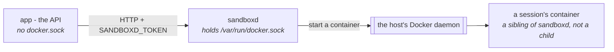

# Sandbox { #the-sandbox }

Kontener, w którym agent może zapisywać pliki i uruchamiać polecenia.

W ten sposób run czyta arkusz, który ktoś załączył, rysuje wykres, klonuje
repozytorium albo trzyma notatki pomiędzy wiadomościami.

!!! danger "To jedyna część platformy, która uruchamia kod napisany przez kogoś z zewnątrz"

    Dlatego ta strona poświęca tyle samo miejsca temu, co *otacza* sandbox, co
    temu, co jest w środku.

Ta strona to cały obraz: co gdzie działa, czym jest sesja, o jakie środowiska
agent może poprosić i jak je zmienić, co oddziela jedną organizację od drugiej
oraz jak długo cokolwiek z tego przeżywa.

[Konfiguracja](configuration.md#the-services-own-settings) to referencja zmienna
po zmiennej.

## Co gdzie działa { #what-runs-where }

Trzy procesy, a ten układ jest modelem bezpieczeństwa:



- **Kontener API nie trzyma gniazda Dockera.** To cały powód, dla którego
  `sandboxd` jest osobną usługą, a nie wywołaniem biblioteki: uruchomienie
  kontenera wymaga demona, a dostęp do demona jest równoważny rootowi na hoście.
- **`sandboxd` trzyma gniazdo i prosi demona *hosta*** o uruchomienie kontenera.
  Sandbox jest więc **rodzeństwem** `sandboxd`, a nie kontenerem w jego środku.
  Nie ma tu żadnego Docker-in-Docker, nic nie jest `--privileged` i nie działa
  żaden zagnieżdżony demon.
- Dlatego katalog workspace'u jest podmontowany **pod tą samą ścieżką po obu
  stronach**: `sandboxd` go tworzy, potem prosi demona o zamontowanie, a demon
  rozstrzyga tę ścieżkę na hoście. Wolumen nazwany albo ścieżka istniejąca tylko
  wewnątrz kontenera `sandboxd` zostaje odrzucona z `mounts denied`.

`sandboxd` to serwer z [`pydantic-ai-backend`](https://github.com/vstorm-co/pydantic-ai-backend),
dostarczany jako `ghcr.io/vstorm-co/sandboxd`; backend rozmawia z nim po HTTP,
z tokenem w `SANDBOXD_TOKEN`. Dwa pozostałe backendy sandboksa, które spec może
wskazać — `daytona` i `state` — to usługa hostowana i dokument w Postgresie
i żaden z nich nie ma nic wspólnego z powyższym.

!!! danger "Ten token jest równoważny rootowi"

    Kto go ma, może uruchamiać kontenery na tym hoście. Traktuj go jak gniazdo
    Dockera, przed którym stoi.

`make sandbox-token` generuje go raz do `backend/.env` i potem go nie rusza,
ponieważ wygenerowanie go na nowo osierocia każdy workspace, który usługa
aktualnie trzyma. To także powód, dla którego własny dashboard usługi jest
wyłączony (`SANDBOXD_UI_ENABLED: 0`): ta strona prosi człowieka o wklejenie
tokena do przeglądarki.

## Sesja i to, co ją współdzieli { #a-session-and-what-shares-one }

!!! abstract "Jeden kontener na sesję, nigdy jeden dla wszystkich"

    To, co klucz sesji w sobie zawiera — zasięg, organizacja, rodzaj backendu
    i host — jest dokładnie tym, co decyduje, które runy dzielą kontener
    i katalog.

Sesja jest identyfikowana przez klucz wyprowadzany przez backend, a ten klucz
decyduje o tym, co jest współdzielone:

```
xc-4f2a91c8-7b3e5d10-9c1f…      backend · scope · organization · host · subject
^^                              `x` a container service, `d` a document; `c` the conversation scope
```

**Zasięg** jest polem speca agenta — `run`, `conversation`, `channel`, `user`
albo `agent`. Zatem `conversation`, czyli zwykły wybór, oznacza jeden kontener
i jeden katalog na czat; `agent` oznacza, że każdy run tego agenta dzieli jeden.

W klucz wpisane jest też, **jakiego rodzaju backend** i **jaki host** trzyma
workspace. Dokument `state` i wolumen kontenera to nie ta sama rzecz pod różnymi
nazwami, i tak samo nie są nią dwie instalacje `sandboxd` — rejestracja drugiego
hosta i ustawienie go jako domyślnego dla organizacji przenosiło kiedyś każdy
istniejący workspace, bez czyjejkolwiek edycji speca.

Co oddziela jednego tenanta od drugiego:

- **własny kontener** i **własny katalog na hoście** dla każdej sesji;
- klucze sesji są wyprowadzane z `uuid4`, więc są nie do odgadnięcia — czytelny
  prefiks organizacji służy do czytania dashboardu, a **nie** jest granicą;
- sprawdzenie organizacji przy każdym wierszu, który produkuje te klucze — i to
  ono jest faktyczną granicą;
- `tenant` (id organizacji) wysyłany przy otwarciu sesji, który usługa zlicza
  względem `SANDBOXD_MAX_SESSIONS_PER_TENANT` (10) w puli
  `SANDBOXD_MAX_SESSIONS` (20) — więc jedna organizacja nie zajmie całej
  instalacji. Powyżej pułapu usługa odrzuca z `already holds 10 of 10`.

## O jakie środowiska agent może poprosić { #which-environments-an-agent-may-ask-for }

**Dostarczany jest jeden runtime i jest on zdefiniowany w tym repozytorium** —
`backend/app/core/catalog/sandbox_runtimes.json`:

| | `workbench` — 1,93 GB, budowany w około 65 s na rozgrzanym hoście |
|---|---|
| Zbudowany na | `python:3.12-slim` |
| Języki | Python 3.12; Node 24.19.0 LTS z npm 11 oraz `tsx` dla TypeScriptu |
| Narzędzia | `git`, `curl`, `ripgrep`, `fd`, `jq`, `less`, `procps`, `unzip`, `zip`, `uv`, `pdftotext`/`pdfinfo` |
| Czytanie | **liteparse** (`lit`) — PDF-y i obrazy do tekstu lub markdownu, z OCR-em włącznie; `poppler-utils` dla szybkiej ścieżki po warstwie tekstowej i dla liczby stron |
| Dokumenty | `pypdf`, `python-docx`, `openpyxl`, `python-pptx`, `reportlab`; **LibreOffice** headless do konwersji i do starszych formatów |
| Dane | `pandas`, `duckdb`, `tabulate` |
| Wykresy i obrazy | `matplotlib` (Agg), `pillow` |
| Web | `httpx`, `requests`, `beautifulsoup4`, `lxml`, `markdownify` |
| Inne | `pyyaml` |
| Pamięć | 2 GiB |
| Sieć | tak — jedyny runtime, który ją ma |

Jeden zamiast ośmiu, a powodem jest `prewarm`: usługa buduje przy starcie
**każdy** wpis swojej listy dozwolonych, więc osiem aliasów to osiem instalacji
`pip` w starcie, któremu nikt się nie przygląda, osiem obrazów w cache hosta
i agent poproszony o przeczytanie PDF-a dostający ten alias, który akurat wskazał
jego spec. `workbench` jest zbudowany tak, by być odpowiedzią na *napisz
i uruchom trochę kodu, przeczytaj to, co załączył użytkownik, narysuj wykres,
pobierz stronę*.

Do #1040 tym katalogiem było `BUILTIN_RUNTIMES` z biblioteki sandboksa:
piętnaście receptur, z których `sandboxd` uruchomiony przez ten projekt
dopuszczał trzy. Oznaczało to również, że dodanie pakietu do jednego obrazu było
wydaniem zależności, podbiciem wersji i przypięciem.

### Co w nim jest, a czego celowo nie ma { #what-is-in-it-and-what-is-deliberately-not }

Zmierzone na `python:3.12-slim` (205 MB), arm64:

- **liteparse pochodzi z `pip` i to cała odpowiedź.** Wheel ma 13,8 MB, niesie
  binarkę w Ruście i CLI `lit`, **nie ma żadnych zależności pythonowych**
  i dowozi OCR — zmierzony na 1,3 s dla jednostronicowego PDF-a z OCR-em i 79 ms
  dla PNG. Zatem `cargo install` (toolchain Rusta), paczka npm (druga kopia tej
  samej binarki) i build WASM (dla przeglądarek) nie dają tu nic.
- **LibreOffice, za +683 MB, i jest tego wart.** Kupuje trzy rzeczy, których nic
  innego tutaj nie daje: `lit` potrafi czytać starsze formaty `.doc`, `.xls`
  i `.ppt`, czyli to, co biznesowy użytkownik naprawdę załącza; `soffice
  --headless --convert-to pdf deck.pptx` renderuje prezentację, którą agent
  zbudował przez `python-pptx`, czyli tak prezentacja staje się czymś, co człowiek
  może otworzyć; a `--convert-to png` zamienia slajd w obraz, który agent może
  odczytać z powrotem i *obejrzeć*, bo `read_file` jest tu multimodalne. Około
  sekundy na dokument po pierwszym. Writer i Calc to +135 MB z tych 683 i są tu
  z jednego powodu: konwersja biurowa, która działa dla prezentacji, a nie dla
  dokumentów, byłaby wyjątkiem w produkcie i wyjątkiem w promptcie.
- **Działa to tylko dlatego, że runtime jest *budowany*.** LibreOffice tworzy przy
  pierwszym uruchomieniu profil użytkownika, więc potrzebuje prawdziwego konta
  z zapisywalnym katalogiem domowym — a takie tworzy builder, gdy ustawione jest
  `SANDBOXD_SANDBOX_UID` (`useradd --uid 10001 --create-home`). Uruchom ten sam
  obraz jako goły uid bez wpisu w passwd, a każda konwersja kończy się błędem
  `User installation could not be completed`. To także powód, dla którego gotowy
  runtime typu `image` nie może po prostu dołożyć LibreOffice'a: te dwie decyzje
  są jedną decyzją.
- **Node z nodejs.org, a nie z apt.** Debianowe `nodejs npm` to +398 MB i npm
  w wersji 9; oficjalny tarball to +239 MB *i* jest aktualny — a Node 20, który ta
  receptura przypięła jako pierwszy, jest po końcu wsparcia od kwietnia 2026.
  Architektura jest wykrywana w poleceniu, bo ten sam katalog buduje się na amd64
  i na arm64.
- **`poppler-utils` (+67 MB) obok liteparse, a nie zamiast niego.** `lit` jest
  lepszym czytnikiem — układ, tabele, markdown — a `pdftotext` jest szybszy na
  PDF-ie, który ma już tekst: studwudziestostronicowa książka w niecałą sekundę.
  `pdfinfo` jest prawdziwym powodem jego obecności, bo liczba stron w
  milisekundach jest tym, co zamienia „wyciągnij tę książkę” w plan.
- **OCR jest kosztem, który ma znaczenie, i jest zmierzony.** `lit` OCR-uje tylko
  strony bez warstwy tekstowej, więc 120 wygenerowanych stron kosztuje ułamek
  sekundy — ale strona *skanowana* kosztuje **8,8 s**, więc skan liczący 300 stron
  to około 44 minut wobec 300-sekundowego pułapu polecenia: zabity, bez niczego do
  pokazania. `--target-pages 1-40` to ogranicza (trzy skanowane strony w 1,6 s),
  a `--no-ocr` na skanie **kończy się powodzeniem i zwraca 179 bajtów** — cicha,
  niemal pusta odpowiedź, czyli gorsza z tych dwóch porażek. Obie są w briefingu
  poniżej, bo to jest dokładnie ta prośba, którą użytkownik zgłasza:
  „streść tę książkę”.
- **Brak `build-essential` (+94 MB) i brak `scikit-learn`/`scipy` (~200 MB).** Oba
  są o jedno `uv pip install` stąd na runtimie, który ma sieć. Kosztem pominięcia
  ich jest jednorazowa instalacja; koszt wpieczenia ich płaci każdy host przy
  każdym starcie.
- **`requests` obok `httpx` i `tabulate` obok `pandas`**, za pół megabajta na
  spółkę: model pisze `import requests` i `df.to_markdown()` z pamięci mięśniowej,
  a żadne z nich nie jest warte nieudanego skryptu i ponownej próby.
- **`tzdata` i `fonts-dejavu-core`** są w warstwie apt, bo `python:slim` nie ma
  żadnego z nich, więc `zoneinfo` rzuca wyjątek, a `PIL.ImageDraw.text` nie
  potrafi wczytać fontu — jedno i drugie sprawdzone przed i po.
- **`env_vars`, a nie nawyk.** `MPLBACKEND=Agg`, `PYTHONUTF8=1`,
  `PYTHONUNBUFFERED=1`, `PYTHONDONTWRITEBYTECODE=1` są własnościami obrazu; run,
  który musi o nich pamiętać, to run, który nie zapamięta.

### Model jest o tym wszystkim informowany { #the-model-is-told-all-of-this }

Kontener jest bezużyteczny dla agenta, który nie wie, co jest w środku.

Przed #1040 agent poproszony o wykres robił `import plotly`, a ten, któremu podano
PDF-a, pisał własny ekstraktor obok `lit`, które go czyta — i każdy z nich uczył
się inaczej, przez porażkę w środku czyjejś prośby.

**I jest informowany o tym, jak pracować, a nie tylko o tym, co jest
zainstalowane.**

Instrukcja, która zasługuje na swoje miejsce, to ta, której nic innego nie
nauczy: *nie czytaj dużego pliku po to, żeby go przejrzeć*. Wyciągnij go raz do
pliku tekstowego, `rg -n` po miejsca, które mają znaczenie, `sed -n '400,460p'`,
żeby przeczytać jedno.

Książka to tysiące linii, a odpowiedź potrzebuje ich dziesiątek. Model, który
wciąga całość do własnego kontekstu, wydaje budżet runa na strony, o które nikt
nie pytał. Ten sam akapit niesie obie powyższe pułapki OCR-u, bo skanowana
książka jest miejscem, w którym obie lądują naraz.

Dlatego każdy run na runtimie, który to wdrożenie dostarcza, ma dopisany do swoich
instrukcji akapit: jaki runtime dostał, listę pakietów, linijkę o `lit`, co
konwertuje `soffice`, tę jedną lukę (brak kompilatora C) oraz to, czy ma sieć.

Jest on **składany z katalogu**, a nie pisany obok niego. `runtime_briefing`
odczytuje listę pakietów z definicji, więc pakiet dodany do pliku trafia do
promptu tą samą edycją, którą trafia do obrazu. Prozą jest tylko to, czego nie da
się wyprowadzić — w liście `briefing` danego wpisu.

Dwie konsekwencje, o których warto wiedzieć:

- Jest dopisywany **na run**, tak jak prompt powiązania kanału, bo to, jaki
  runtime dostaje run, jest rozstrzygane ze speca, z połączenia i z hosta w chwili
  startu runa. Opublikowany spec pozostaje nietknięty.
- Alias, którego to wdrożenie **nie** dostarcza, nie dostaje akapitu. Host
  uruchomiony z własną listą dozwolonych nie jest hostem, którego obrazy możemy
  uczciwie opisać, a prompt, który zgaduje, jest gorszy niż prompt, który milczy.

### Jak to zmienić { #changing-it }

```bash
$EDITOR backend/app/core/catalog/sandbox_runtimes.json
make sandbox-runtimes          # writes SANDBOXD_RUNTIMES into all three compose files
docker compose up -d sandboxd  # prewarm rebuilds what the list now names
```

Wpis ma jeden z dwóch kształtów, nigdy oba naraz:

```json
{
  "alias": "workbench",
  "description": "What it is for - shown in the connection dialog",
  "base_image": "python:3.12-slim",
  "setup_commands": ["apt-get update && apt-get install -y --no-install-recommends git"],
  "packages": ["pillow"],
  "mem_limit": "2g",
  "needs_network": true
}
```

| Pole | |
|---|---|
| `alias` | To, co wskazuje spec. Małe litery, `[a-z][a-z0-9-]*` |
| `description` | Pokazywane w polu `Default runtime` w dialogu połączenia. Powiedz, *do czego* służy |
| `image` | Gotowy obraz. Startuje w czasie, jaki zajmuje pobranie, i nic nie instaluje |
| `base_image` | Budowany raz, przy pierwszym użyciu, i potem cache'owany — kształt, który potrafi instalować |
| `setup_commands` | Powłoka w czasie budowania, przed pakietami: warstwa apt, instalator |
| `packages` | `pip`, instalowane w czasie budowania. Wymaga `base_image` |
| `env_vars` | Ustawiane w każdym kontenerze na tym runtimie — `MPLBACKEND`, `PYTHONUTF8` |
| `briefing` | Zdania przekazywane modelowi, których nie da się wyprowadzić z powyższych pól |
| `mem_limit` | Własna składnia Dockera (`2g`). Przy braku obowiązuje `SANDBOXD_MEM_LIMIT` |
| `needs_network` | Czy **sesja** na nim dostaje sieć. Budowanie ma ją zawsze |

Cztery rzeczy, których plik nie pozwoli ci pomylić albo które ugryzą, jeśli
pominiesz tę sekcję:

- **`image` i `base_image` wykluczają się**, a lista `packages` lub
  `setup_commands` we wpisie z `image` zostaje odrzucona przy imporcie. Przyjęta,
  dawałaby runtime, którego pakiety są w katalogu, są w pliku compose, a nie ma
  ich w kontenerze.
- **Pierwszy wpis jest domyślny** dla agenta, którego spec nie wskazuje żadnego
  runtime'u, więc kolejność w pliku ma znaczenie.
- **`network_mode` nie jest dziedziczone.** `SANDBOXD_NETWORK_MODE` obowiązuje
  całą usługę i każdy dostarczany plik compose ustawia je na `none`, więc wpis,
  który instaluje cokolwiek w czasie działania, potrzebuje własnej sieci.
  `needs_network` jest tą decyzją, podejmowaną raz tam, gdzie są pakiety, zamiast
  pamiętaną osobno w każdym pliku compose; pominięta, objawia się agentem,
  któremu `uv pip install` wchodzi w timeout.
- **Zniekształcony wpis zatrzymuje wdrożenie**, celowo — katalog jest walidowany
  przy imporcie, a nie przy pierwszym użyciu, bo listę wyboru z dziurą odkrywa
  użytkownik.

### Dlaczego ta wartość jest też w plikach compose { #why-the-value-is-also-in-the-compose-files }

`SANDBOXD_RUNTIMES` to **jedyny** kanał, którym usługa przyjmuje runtime'y. Plik
compose nie umie wywołać polecenia, więc wartość tam jest wygenerowaną kopią,
a jedyne pytanie warte odpowiedzi brzmi, czy może się rozjechać:
`backend/tests/test_sandbox_runtime_catalog.py` zawodzi, gdy tak się stało,
nazywając plik i mówiąc ci, żeby uruchomić `make sandbox-runtimes`.

Generowana *do* śledzonego pliku, a nie czytana przy starcie z pliku obok,
ponieważ `docker compose up` musi działać bez wcześniejszego generowania
czegokolwiek — alternatywą jest wdrożenie po cichu biorące własną domyślną listę
dozwolonych biblioteki.

I nie jest to formularz w produkcie. `PUT /policy` zmienia pułapy i czasy życia
w czasie działania i celowo odrzuca *skład* tej listy, wraz z `network_mode`,
`oci_runtime`, `sandbox_uid`, `work_dir` i `persist_containers`: wskazanie obrazu
jest decyzją o izolacji, a token usługi trzyma aplikacja, a nie ten, kto prowadzi
hosta. Zmiana listy to restart.

### Dwie listy w produkcie, odpowiadające na różne pytania { #two-lists-in-the-product-answering-different-questions }

Pole `Default runtime` w **dialogu połączenia** oferuje ten katalog — to, co pliki
compose dały usłudze — wypełnione, zanim jakikolwiek host został o cokolwiek
zapytany, i oznaczone, gdy któryś już odpowiedział. Pole `Runtime` w **Builderze
agenta** oferuje to, na co usługa na tym połączeniu *faktycznie* pozwala, czytane
z niej na żywo, więc alias, który wskazuje, jest aliasem, który następne wywołanie
narzędzia przyjmie. Tam, gdzie te dwie się nie zgadzają, rację ma druga: host
mógł zostać uruchomiony z inną listą dozwolonych, a wdrożenie, które wygenerowało
własną, jest właśnie tym przypadkiem, którego nie warto zgubić.

**Dlatego host jest pytany, zanim połączenie zostanie zapisane, i dlatego usługę,
którą uruchamia `make dev`, można zapytać w ogóle bez klucza.**

Dodanie właśnie jej jest najczęstszą drogą przez ten dialog i aż do zatwierdzenia
nie wskazuje ona żadnego klucza z vaultu — więc nie było czym testować,
a nieaktualną lokalną usługę można było zarejestrować z domyślnym runtimem, który
jej pierwsze wywołanie narzędzia odrzuca.

!!! danger "Sonda bez klucza sięga po `SANDBOXD_TOKEN` tylko dla dwóch adresów"

    Tych dwóch, których używa własny plik compose tego projektu. Ten token
    uruchamia kontenery na każdym hoście, który go przyjmie, a sonda nigdy nie
    może być sposobem na wysłanie go gdzieś nowo.

Każdy inny adres jest pytany kluczem z vaultu i tylko wtedy, gdy operator naciśnie
przycisk.

## Kiedy pojawia się kontener { #when-a-container-appears }

**Przy pierwszej operacji na workspasie, co nie jest tym samym co pierwsze
wywołanie narzędzia przez agenta.** Run przygotowuje to, co ktoś załączył,
i materializuje skille agenta *przed* wywołaniem modelu, a jedno i drugie otwiera
sesję leniwie — więc kontener może istnieć w turze, w której agent nigdy nie
sięgnął po powłokę. Warto o tym wiedzieć przy czytaniu listy sesji: sandbox,
którego log aktywności nie zawiera nic poza zapisami, to sandbox, o który nic
jeszcze nie poprosiło.

## Co w nim zrobiono i gdzie żyje ten zapis { #what-was-done-in-one-and-where-that-record-lives }

**We własnej tabeli tej platformy, `sandbox_operations` — nie w usłudze.**

Usługa prowadzi własny log aktywności i jest on 200-elementowym buforem cyklicznym
w pamięci tamtego procesu. O to, co wyrzucił, nie dało się zapytać, rozmowa, nad
którą pracowano cały dzień, traciła swój poranek, a restart `sandboxd` gubił każdy
log na hoście. Nic poza tamtym procesem nigdy tych wpisów nie widziało (#1061).

Każde wywołanie workspace'u i tak przechodzi przez tę aplikację — run woła nas, my
wołamy usługę — więc to nasz zapis do zrobienia.

`RecordingBackend` opakowuje backend, do którego sięgają narzędzia tej capability,
i dlatego dodanie dziewiątego narzędzia nie może zapomnieć o zapisaniu. Wrapper
zapisuje osiem nazwanych operacji (`write`, `edit`, `read`, `read_bytes`,
`ls_info`, `glob_info`, `grep_raw`, `execute`), a wszystko inne deleguje
nietknięte. `exists` i `is_alive` są pytaniami, a nie operacjami, a log pełen ich
przykryłby zapisy, po które ktoś przyszedł.

Niesie dwa fakty, których usługa nigdy nie mogła, i są to dokładnie te dwa,
o które pyta audyt: **który agent i który run**. Oba są `SET NULL` przy usunięciu,
bo zapis tego, co się stało, musi przeżyć agenta, którego usunięto później.

!!! warning "Ścieżka, nigdy zawartość"

    `write` zapisuje ścieżkę i to, że się udało. `execute` zapisuje polecenie
    i nigdy jego wyjścia — niezerowy kod wyjścia jest zapisywany jako porażka
    z jego liczbowym statusem (`exit 2`), czyli jedynym bezpiecznym faktem
    o nieudanym poleceniu. `read` zapisuje ścieżkę i liczbę bajtów.

    Te wiersze są czytelne dla każdego, kto widzi sandbox, więc log niosący
    zawartość byłby sposobem na *czytanie* pracy agenta, a nie jej audytem — ta
    sama linia, którą rysuje usługa, narysowana tu ponownie.

    Ta jedna linijka o wyniku jest pisana przez nas, nigdy cytowana z dołu:
    komunikat powłoki *jest* wyjściem polecenia (#423).

Wiersze lądują, gdy commituje się transakcja runa, ponieważ są pisane w jego
własnej sesji, a nie po jednym połączeniu na wywołanie narzędzia. Operacje z jednej
tury pojawiają się więc razem, jakąś sekundę po jej zakończeniu.

Żywy licznik w wierszu dashboardu wciąż czyta bufor usługi dokładnie z tego
powodu: on odpowiada w trakcie tury, a zapis odpowiada tydzień później.

`GET /api/v1/sandbox-connections/operations` stronicuje go, a jego filtry zawężają
**zapytanie**: wyszukiwarka w dialogu, jego filtr operacji i przełącznik „tylko
nieudane” są żądaniami, więc pager nad trzystoma operacjami ma po czym stronicować.

## Kiedy płaci się za budowanie { #when-a-build-is-paid-for }

`prewarm` jest włączony, więc lista dozwolonych jest pobierana i budowana w tle
**w czasie startu usługi**, a nie w środku czyjegoś pierwszego żądania —
budowanie to dziesięć sekund i więcej. Obrazy są cache'owane, więc host płaci raz.

Co zostaje do czekania: pierwsza sesja otwarta *w trakcie* prewarmu oraz host,
któremu wyczyszczono cache obrazów. `SANDBOXD_PERSIST_CONTAINERS: true` usuwa
wtedy większość reszty — zamknięta sesja zachowuje swój kontener, więc następna
sesja na tym workspasie startuje bez budowania i z tym, co agent zainstalował
ostatnim razem, nadal zainstalowanym.

## Izolacja, wprost { #isolation-plainly }

Co się trzyma:

- sandbox nie widzi gniazda Dockera; widzi je tylko `sandboxd`;
- żadnej sieci, chyba że runtime o nią prosi, a robi to tylko `workbench`;
- 2 CPU, 512 procesów i 64 MiB `tmpfs` pod `/tmp` na sandbox, plus
  `SANDBOXD_EXECUTE_TIMEOUT` (300 s) na każde polecenie oraz
  `SANDBOXD_MAX_READ_BYTES` (8 MiB) na każdy odczyt;
- `SANDBOXD_SANDBOX_UID: 10001` — sandbox działa jako użytkownik
  nieuprzywilejowany, a nie jako root, i każdy plik zapisany przez agenta należy
  na hoście do tego uid. **Musi to być własny uid usługi**: otwarcie sesji robi
  `chown` workspace'u na tego użytkownika, a nieuprzywilejowany `sandboxd` potrafi
  to zrobić tylko dla siebie, więc inny numer zawodzi przy pierwszej sesji, a nie
  przy starcie. Dotyczy to runtime'u, który to wdrożenie *buduje* — gotowy obraz
  nie ma takiego konta ani virtualenva, więc agent w jego środku nie mógłby nic
  zainstalować.

Co pozostaje, powiedziane wprost, a nie tylko zasugerowane:

1. **Token usługi jest równoważny rootowi.** Patrz wyżej.
2. **Ucieczka z kontenera jest ucieczką na hosta.** Zwykły `runc`; `oci_runtime`
   może wskazać sandboksowany (`runsc` z gVisora) tam, gdzie wdrożenie chce
   takiego kompromisu.
3. **Runtime z siecią może dosięgnąć portów opublikowanych na hoście.**
   `docker-compose.yml` publikuje Postgresa i Redisa na potrzeby lokalnego
   rozwoju, z `postgres/postgres`; `docker-compose-prod.yml` nie publikuje
   żadnego z nich.

!!! warning "Zastrzeżenie dla laptopa, ale sprawdź je, zanim skopiujesz lokalny plik compose"

    `docker-compose.yml` publikuje Postgresa i Redisa z `postgres/postgres`,
    a `workbench` jest jedynym runtimem z siecią. Na współdzielonym hoście jest to
    osiągalne z wnętrza sandboksa; `docker-compose-prod.yml` nie publikuje żadnego
    z nich.

## Co pokazuje przeglądarka plików, a co pomija { #what-the-file-browser-shows-and-what-it-leaves-out }

`/workspaces` wypisuje to, co agent trzyma **dla człowieka**, a nie jest to ten
sam zbiór co to, co leży na wolumenie. Dwa prefiksy są pomijane w każdym
zestawieniu, które czyta człowiek — w widoku płaskim, we własnych plikach
workspace'u, w panelu rozmowy i w liczbach plików:

- `skills/` — treść skilla i jego zasoby, zapisywane na starcie każdego runa,
  który ma i skille, i workspace. Są tam potrzebne: zasób to skrypt, który
  uruchamia powłoka, a `collect_changes` porównuje te pliki do propozycji, którą
  ktoś przyjmuje. Usunięto je raz, bo zestawienie składało się głównie z nich, co
  było słuszną pretensją o niewłaściwą rzecz (#1064).
- katalog przelewowy — tam, gdzie zapisano nadmiarowe wyjście narzędzia.

Liczba plików też musi je pominąć, bo workspace raportujący cztery pliki, z których
widać jeden, to liczba, której nikt nie sprawdzi.

### Czyj to workspace i kto jeszcze go widzi { #whose-workspace-it-is-and-who-else-can-see-it }

Dwie odpowiedzi, a tabela niesie obie.

`access_label` to **zasięg** wyrażony słowami — „każdy, kto rozmawia z tym
agentem”, „ktokolwiek jest w tej rozmowie”. Nie nazywa nikogo, co jest dokładnie
tym pytaniem, które operator ma o workspace w zasięgu agenta, dzielony przez sześć
osób.

Dlatego wiersz niesie też `owner_name`: e-mail konta albo id platformowe
właściciela, który przyszedł przez kanał i nie ma tu konta. Jest rysowane jako
słowa, a nigdy jako link, bo połowa z nich nie jest kontami, do których dałoby się
linkować. I jest puste dla każdego zasięgu poza `user`, jedynym, który w ogóle
zapisuje właściciela — trzy z czterech uczciwie żadnego nie mają, a kolumna to
mówi, zamiast powtarzać zasięg.

### Plik mówi, kto go tam położył { #a-file-says-who-put-it-there }

`uploads/` to miejsce, w którym ląduje załącznik, więc ścieżka pod nim to plik
**załączony przez człowieka**, a wszystko inne jest własną pracą agenta. Jest to
oferowane jako filtr i powiedziane na kafelku.

To jedyny dostępny sygnał: host nie zapisuje autora i nie robi tego również
dokument stanu. Wynika stąd ograniczenie — agent piszący sam do `uploads/` jest
nie do odróżnienia od człowieka i nic go przed tym nie powstrzymuje.

### Wypisanie zawartości kontenera kosztuje obiegi, więc dwie rzeczy są ograniczone { #listing-a-container-costs-round-trips-so-two-things-are-bounded }

`ls` z archiwum czyta jeden katalog, więc zestawienie chodzi po drzewie: wszerz,
najwyżej na sześć poziomów w głąb, zatrzymując się na 2000 wpisach — bo host
trzymający `node_modules` nie może zamienić jednego workspace'u w dziesięć tysięcy
wierszy.

**Oba ograniczenia są raportowane.** Strona workspace'u mówi wprost, że to nie są
wszystkie pliki, bo drzewo, które zatrzymuje się bez uprzedzenia, ktoś przeczyta
jako wszystko, co agent trzyma.

Katalog, który nie chce odpowiedzieć, jest logowany i pomijany. Dopiero odmowa
*korzenia* czyni workspace nieczytelnym, bo jeden folder, któremu agent zabrał
prawa, to nie jest host, którego nikt nie potrafi odczytać.

A miniatura obrazu to `read_bytes` dla tego pliku: rozszerzenie i rozmiar są
sprawdzane we wpisie zestawienia, zanim cokolwiek zostanie pobrane, a jedno żądanie
rysuje najwyżej 24. Powyżej tego kafelek zostaje przy znaku.

Workspace *przechowywany* nie płaci żadnego z tych kosztów — jego pliki i ich
bajty są kolumną wiersza, który zestawienie już odczytało.

## Jak długo cokolwiek przeżywa { #how-long-anything-survives }

Pliki żyją na hoście, pod `{SANDBOXD_WORKSPACE_ROOT}/{session_id}/workspace` —
`/tmp/agenticos-sandbox-workspaces` lokalnie,
`/var/lib/agenticos/sandbox-workspaces` na serwerze deweloperskim i na produkcji.
Ten bind mount jest też tym, co umożliwia panel Files w produkcie: odczyt
workspace'u nigdy nie uruchamia kontenera.

| | Ustawienie | Co się dzieje |
|---|---|---|
| Bezczynna sesja | `SANDBOXD_IDLE_TIMEOUT` 1800 s | Kontener jest zamykany i sprzątany. **Pliki zostają** |
| Zatrzymany kontener | `SANDBOXD_CONTAINER_TTL` 86400 s | To, co zainstalowała sesja — build, wheele, `node_modules` — jest odzyskiwane. Workspace pozostaje nietknięty |
| Katalog workspace'u | `SANDBOXD_WORKSPACE_TTL` **nieustawione** | Trzymany **bezterminowo** |
| Zapis tego, co zrobiono | `OPERATION_RETENTION_DAYS` 30 | Codzienny `sandbox-log-sweep` kasuje te wiersze. Pliki pozostają nietknięte |

Ostatni wiersz to domyślna wartość biblioteki i jest celowa — notatki i skrypty są
tą pracą, a użytkownik agenta oczekuje ich w przyszłym tygodniu.

!!! info "Zużycie dysku tylko rośnie"

    Nic nie sprząta workspace'u, którego rozmowy nikt już nie otworzy. Ustaw
    `SANDBOXD_WORKSPACE_TTL` na to, co mówi twoja polityka retencji, a pliki
    starsze niż ona znikną.

`/tmp` jest czyszczone przez restart na laptopie; `/var/lib` nie.

Usunięcie rozmowy czyści jej workspace poprzez produkt, więc rzecz dotyczy tego,
czego nikt nie usuwa, a nie tego, co ludzie robią.

## Podsumowanie { #recap }

- Kontener API **nie trzyma gniazda Dockera**. Trzyma je `sandboxd`, a sandbox
  jest jego rodzeństwem, a nie kontenerem w jego środku.
- **Klucz sesji** zawiera w sobie zasięg, organizację, rodzaj backendu i host —
  czyli dokładnie to, co decyduje, kto dzieli kontener.
- **Dostarczany jest jeden runtime**, `workbench`, a model jest informowany o tym,
  co w nim jest, składanym z tego samego katalogu, który go zbudował.
- Zapis tego, co zrobił agent, żyje w **tabeli tej platformy**, trzyma ścieżkę,
  a nigdy zawartości, i przeżywa agenta.
- **Pliki są trzymane bezterminowo**, chyba że ustawisz `SANDBOXD_WORKSPACE_TTL`.
  Zużycie dysku tylko rośnie.
