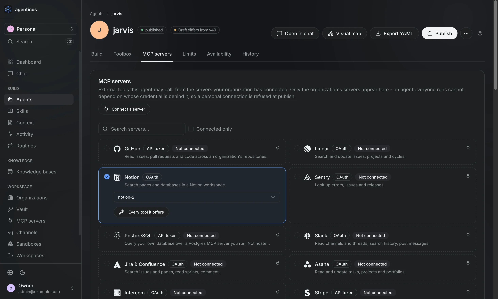
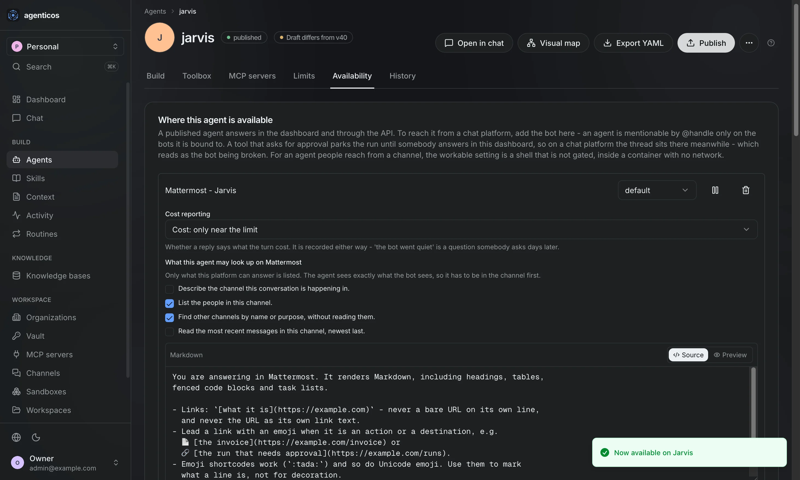
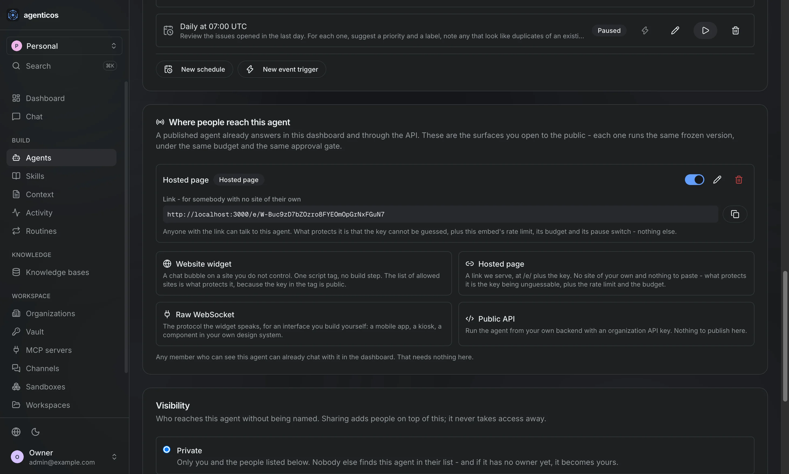

# Jeder Bildschirm in der Konsole { #every-screen-in-the-console }

Eine Seite, jedes Modul, beschrieben. Die Screenshots folgen dem Theme, in dem
Sie die Website lesen - schalten Sie es mit dem Umschalter im Kopfbereich um, und
jedes Bild auf dieser Seite schaltet mit.

Aufgenommen am 01.09.2026 aus einem laufenden Deployment: 35 Bildschirme, 27
davon in beiden Themes unter `docs/assets/screens/`, in `light/` und `dark/`
gleich benannt. Die acht Builder-Bildschirme gibt es nur in dunkel, und sie sagen
das dort, wo sie erscheinen.

## Der Chat, in zwanzig Sekunden { #the-chat-in-twenty-seconds }

Eine CSV in die Unterhaltung gezogen, ein Satz Anweisung, und der Agent schreibt
Python, führt es in einer Sandbox aus und antwortet mit Diagrammen, die er aus
den Daten gezeichnet hat. Nichts davon wurde für genau diese Datei konfiguriert.

<video src="../assets/screens/chat-live-demo.mp4" poster="../assets/screens/chat-live-demo-poster.webp" controls muted loop playsinline style="width:100%"></video>

## Wo Sie landen { #where-you-land }

### Dashboard { #dashboard }

Anordenbare Widgets, zuerst das ganze Deployment und dann diese Organisation. Runs, Ausgaben, Dienstzustand und Antwortqualität; jede Karte ist an der Permission gemessen, die ihre eigenen Daten verlangen, sodass eine Karte, deren primären Lesezugriff Sie nicht machen dürfen, Ihnen gar nicht angeboten wird.

### Chat, mitten im Run { #chat-mid-run }

Der Agent beim Denken, dann die Shell-Befehle, die er in der Sandbox tatsächlich ausgeführt hat, jeder davon aufklappbar. Transparenz ist hier das Produkt: Was ein Tool getan hat, steht auf dem Bildschirm und nicht in einem Log, das jemand anderes lesen kann.

## Einen Agent bauen { #building-an-agent }

### Agents { #agents }

Der Katalog. Jeder Agent trägt die Version, die live ist, wer ihn erreichen darf und ob ein Entwurf wartet. Ein Agent ist Konfiguration, kein Code - deshalb ist diese Liste für alle bearbeitbar, die die Antwort kennen.

### Agent templates { #agent-templates }

Templates nach Branche, über dem Katalog. Eines zu installieren erzeugt einen Entwurf, den Sie fertigstellen und veröffentlichen; bis dahin läuft nichts.

### Skills { #skills }

Einmal aufgeschriebenes Know-how, das jeder daran gebundene Agent teilt - wie Rückerstattungen gehandhabt werden, was der Hausstil ist. Bearbeiten Sie es hier, und jeder gebundene Agent ist beim nächsten Run auf dem aktuellen Stand.

### Skill gallery { #skill-gallery }

Skills nach Branche. Beim Installieren wird einer in Ihre Organisation kopiert, wo Sie ihn bearbeiten können - eine Kopie, damit die Quelle nicht ändern kann, was Ihre Agents sagen.

### Ein Skill { #one-skill }

Zum Bearbeiten geöffnet, mit seiner Kategorie. Der Name, auf den sich das Modell bezieht, steht beim Anlegen fest und kann sich nicht ändern; alles andere hier schon.

### Context { #context }

Stehender Kontext, aus dem jeder Agent schöpfen kann - ein Glossar, eine Richtlinie, eine Markenstimme. In den Prompt eingespielt oder bei Bedarf gelesen, und aktuell in dem Moment, in dem Sie ihn bearbeiten.

## In einem Agent { #inside-one-agent }

Der Builder, Tab für Tab. Diese acht gibt es **nur in dunkel** - die helle
Hälfte wurde nicht aufgenommen, daher folgen sie anders als jeder andere
Bildschirm auf dieser Seite nicht Ihrer Palette.

### Build { #build }

Instruktionen, Modell und Endpunkt. Das Verhalten wohnt hier statt im Code, in Markdown, das das Modell als Struktur liest - und der Kopfbereich trägt `published` neben `Draft differs from v40`, was der ganze Punkt ist: Bearbeiten geht nicht live.

### Toolbox { #toolbox }

Jede Capability als Schalter - Wissenssuche, ein Browser, Python in einer Sandbox, Diagramme, Delegation - und daneben jeweils das Approval-Gate pro Tool. Konfiguration erreicht nur, was Code registriert hat.

### MCP servers { #mcp-servers }

Welche Verbindungen dieser Agent erreichen darf und welche ihrer Tools. Die Liste der Organisation begrenzt ihn weiterhin; ein Agent kann darin enger werden und nicht darüber hinausreichen.

### Limits { #limits }

Eine Monatsobergrenze und eine Schrittgrenze. Die Obergrenze wird vor jeder Modellanfrage geprüft, und die Schrittgrenze fängt die andere Entgleisung ab - eine Tool-Schleife, die pro Aufruf billig ist und nie endet.

### Availability { #availability }

Wo dieser Agent antwortet: das Dashboard und die API immer, dazu jeder Chat-Bot, der hier gebunden ist. Ein Agent ist per `@handle` nur auf den Bots erwähnbar, an die er gebunden ist.

### Routines, am Agent { #routines-on-the-agent }

Was er tut, wenn niemand tippt, auf demselben Tab - ein Zeitplan, der sich pausieren lässt, oder ein Event-Trigger.

### History { #history }

Jede Version, die dieser Agent hatte. Die, die im März live war, ist immer noch lesbar, und das macht ein Zurückrollen zu einer Entscheidung statt zu einem Ausgrabungsprojekt.

### Visual map { #visual-map }

Derselbe Agent als Graph: was ihn erreicht und wonach er greift. Ein gestrichelter Kasten ist etwas, an dem nichts hängt - ein Budget ohne eigene Obergrenze liest sich als Lücke statt als Default.

## Knowledge { #knowledge }

### Knowledge bases { #knowledge-bases }

Collections. Fassen Sie zusammengehörige Dokumente zu einer zusammen und wählen Sie dann im Chat, welche Collections ein Agent durchsuchen darf.

### Eine Collection { #a-collection }

Ihre Dokumente, deren Chunk-Zahlen und alles, was bei der Ingestion mit Begründung gescheitert ist. Chunk-Grenzen sind das, wogegen eine Suche abgleicht, also wird ein nach einer Einstellungsänderung erneut hochgeladenes Dokument neu gechunkt.

### Parsing, pro Upload { #parsing-per-upload }

Die Wahl, die sonst niemand offenlegt: **PyMuPDF**, **LiteParse** oder **LlamaParse**, die Chunking-Strategie, Chunk-Größe und Überlappung, OCR und dessen Sprache. An der Collection gesetzt und bei der nächsten Datei überschreibbar - denn eine eingescannte Preisliste und ein Markdown-Runbook wollen nicht denselben Parser, und der falsche ist der Unterschied zwischen einer Antwort und einer Absage.

## Was passiert ist, und was wartet { #what-happened-and-what-is-waiting }

### Runs { #runs }

Jeder Run, den diese Organisation gemacht hat, mit Status, Oberfläche, Modell, Person und Kosten. Ein Run ist der Prozess: Er startet, er lässt sich stoppen, und er hinterlässt einen Eintrag.

### Ein Run, geöffnet { #one-run-opened }

Token hinein und hinaus, Kosten auf vier Nachkommastellen, wie lange es gedauert hat, und die Zeitleiste jedes Zuges und Tool-Aufrufs. Der Chat, in dem es passiert ist, ist einen Klick entfernt.

### Approvals { #approvals }

Alles, was auf einen Menschen wartet, mit dem, was der Agent vorhat. Eine Approval wird genau einmal entschieden - eine zweite Entscheidung über eine erledigte wird abgelehnt, und dieses Detail macht das Gate erst wertvoll.

### Spend { #spend }

Was tatsächlich ausgegeben wurde, nach Zeitraum. Ein Budget wird *vor* der Modellanfrage geprüft statt hinterher zusammengezählt, also stoppt ein Run, der eines reißt, mitten in der Antwort und verzeichnet seine Kosten trotzdem.

### Routines { #routines }

Was Agents tun, wenn niemand tippt - nach Zeitplan oder wenn ein Ereignis eintrifft. Diese Runs sind budgetiert, freigegeben und auditiert wie alle anderen.

### Ein neuer Event-Trigger { #a-new-event-trigger }

Das Ereignis benennen, das einen Run startet, über der Liste der Routines.

## Die Organisation { #the-organization }

### Organizations { #organizations }

Zwischen ihnen wechseln, Mitglieder verwalten und neue anlegen. Autorität innerhalb einer Organisation ist eine Mitgliedschaftszeile plus der Permission-Katalog - es gibt keine Rollenspalte an einem Nutzer.

### Vault { #vault }

Jeder Schlüssel, den diese Organisation gespeichert hat, pro Mandant versiegelt. Ersetzbar, nie wieder lesbar; und eine Rotation ist für einen veröffentlichten Agent unsichtbar, weil er das Secret referenziert und nicht dessen Wert.

### MCP servers { #mcp-servers_1 }

Verbinden Sie jeden MCP-Server per URL, und seine Tools werden zu Schaltern im Builder. Verbinden Sie ihn für die Organisation, und jeder Agent darf ihn nutzen; verbinden Sie ihn für sich selbst, und er bleibt in Ihrem eigenen Chat.

### Channels { #channels }

Die Chat-Plattformen, auf denen diese Organisation antwortet - Slack, Telegram, Mattermost. Ein Bot bedient jeden an ihn gebundenen Agent, und die Bindung wird auf dem Availability-Tab dieses Agents gemacht.

### Sandboxes { #sandboxes }

Wo die Agents dieser Organisation Shell-Befehle ausführen und Dateien behalten. Ein Agent benennt eine Verbindung per id, also ist der Umzug auf einen anderen Host eine Änderung hier statt einer Neuveröffentlichung jedes Agents.

### Workspaces { #workspaces }

Die Dateien, die Agents für Sie aufbewahren. Ein Workspace ist Ablagefläche - er wird mit der Unterhaltung gelöscht, zu der er gehört, und ist kein Ort für irgendetwas Dauerhaftes.

## Deployment-Verwaltung { #deployment-administration }

### Users { #users }

Alle, die sich an diesem Deployment anmelden können, und das App-Admin-Kennzeichen, das von jeder Organisationsrolle getrennt ist.

### All organizations { #all-organizations }

Jeder Mandant auf diesem Deployment, mit Owner, Mitgliedern und Agents.

### System { #system }

Datenbank, Redis, der Vektorspeicher und der Modellzugriff - dieselben Prüfungen, die `agenticos cmd doctor` ausführt, auf einer Seite.

### Deployment { #deployment }

Die eigene Identität und Richtlinie dieses Deployments: Registrierung, Einladungen, Hinweise und das, was eine Besucherin beim ersten Mal antrifft.

## Was hier noch fehlt { #what-is-not-here-yet }

- **Die helle Hälfte des Builders** - die acht Aufnahmen oben gibt es nur in
  dunkel.
- **Anmeldung und Onboarding**, also das, was eine Besucherin beim ersten Mal
  tatsächlich antrifft.

## Fazit { #recap }

- 27 Module liegen in beiden Themes in `docs/assets/screens/`, unter demselben
  Namen; die acht Builder-Bildschirme gibt es nur in dunkel.
- Auf dieser Website wird ein Bild zweimal geschrieben, mit `#only-light` und
  `#only-dark`; Material zeigt das, was zur Palette der Leserin passt.
- In der README steht dasselbe Paar in einem `<picture>` mit
  `media="(prefers-color-scheme: dark)"`, so wie GitHub es macht.
- Parsing ist die Einstellung, die zu kennen sich lohnt, bevor Sie irgendetwas
  hochladen: Der Parser und die Chunk-Größe entscheiden, ob eine Tabelle
  überhaupt beantwortet werden kann.
