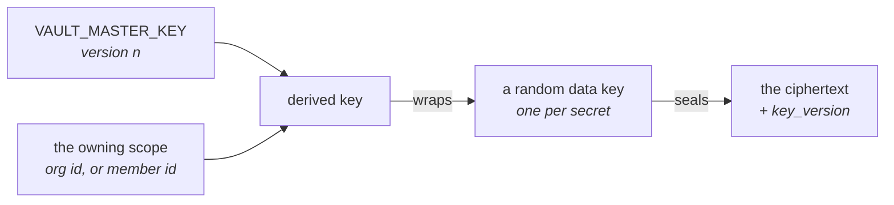

# Secrets und der Vault { #secrets-and-the-vault }

!!! abstract "Ein Modul, und bewusst kein zweiter Mechanismus"

    Jeder Provider-Key, jedes Bot-Token eines Channels, alle MCP-Zugangsdaten und
    jeder API-Key eines Drittanbieters in dieser Plattform läuft durch
    `app/core/vault.py`. Einen zweiten Weg hinzuzufügen, Zugangsdaten im
    Ruhezustand zu halten, ist genau der Defekt, den zwei Migrationen entfernt
    haben.

## Envelope-Verschlüsselung { #envelope-encryption }

Jedes Secret wird mit einem eigenen zufälligen Datenschlüssel versiegelt. Dieser
Datenschlüssel wird mit einem Schlüssel versiegelt, der aus dem Masterschlüssel
**und dem Scope, dem das Secret gehört**, abgeleitet ist — einer Organisation
oder dem Mitglied, zu dem eine persönliche Verbindung gehört.



Daraus folgen zwei Eigenschaften, und beide sind der Grund für diese Form:

!!! success "Ein Chiffrat kann nicht zwischen Eigentümern verschoben werden"

    Selbst mit vollem Datenbankzugriff lässt sich eine Zeile, die von
    Organisation A nach Organisation B kopiert wurde, nicht entpacken. Die
    Mandantentrennung ist hier kryptografisch und keine `WHERE`-Klausel, die
    jemand vergessen könnte.

**Der Masterschlüssel ist rotierbar.** Er verschlüsselt nie direkt eine Nutzlast,
nur Datenschlüssel, sodass eine Rotation pro Secret einen kleinen Blob neu
umhüllt, statt jeden Wert neu zu verschlüsseln. Jeder Envelope verzeichnet die
`key_version`, die ihn versiegelt hat, und genau das macht eine gestufte Rotation
überhaupt erst möglich.

Der Vault entscheidet nichts darüber, *wer* ein Secret lesen darf — das ist die
[Berechtigungsebene](permissions.md). Er garantiert nur, dass ein Secret im
Ruhezustand ohne den Masterschlüssel unlesbar und außerhalb des Scopes, für den
es versiegelt wurde, unbrauchbar ist.

## Wie daraus ein einziger Mechanismus wurde { #how-it-became-one-mechanism }

Der Satz ganz oben brauchte zwei Runden, um wahr zu werden, und die Geschichte
ist eine Minute wert, weil sie die Form des Fehlers zeigt.

**Früher hielten drei Mechanismen Secrets im Ruhezustand, und nur einer band ein
Chiffrat an seinen Eigentümer.** Provider-Keys liefen durch den Vault, Bot-Token
von Channels durch einen einzigen deploymentweiten Fernet-Key, MCP-Token durch
einen weiteren. Ein Slack-Token ließ sich aus der Zeile einer Organisation in die
einer anderen kopieren, und es entschlüsselte. Eine Migration entfernte diese
beiden, bevor die Kette zu `0001_baseline` zusammengequetscht wurde.

**Ein vierter überlebte das und überdauerte den Satz darüber um einige Monate.**
`app/core/crypto.py` hielt einen deploymentweiten Fernet-Key über den
Zugangsdatenfeldern von `sync_sources.config` — das JSON des Google-Service-Accounts
und das AWS-Schlüsselpaar, mit dem sich ein RAG-Sync-Connector authentifiziert.

Es war in seinem eigenen Docstring ehrlich über sich, und es war trotzdem ein
zweiter Mechanismus, sodass ein Leser, der "es gibt keinen zweiten Mechanismus"
glaubte, sich bei einer Tabelle irrte.

Am Leben hielt es ein Reihenfolgeproblem, keine Meinungsverschiedenheit: ein
Envelope wird aus der ID seines Eigentümers abgeleitet, und
`sync_sources.organization_id` war nullable, weil die CLI Zeilen ohne eine
solche anlegte.
[#707](https://github.com/vstorm-co/agenticos/issues/707) gab `rag-source-add`
eine Organisation, `0042_sync_source_secret_id` ließ die Spalte das sagen, und
[#937](https://github.com/vstorm-co/agenticos/issues/937) löschte das Modul.

**Eine Sync-Source referenziert jetzt ein Secret im Vault über seine ID**, so wie
`ModelProfile.secret_id` und `CapabilityBindingSpec.secret_id` es tun, und ihr
`config` hält nur noch das, was ein Connector braucht, um die Dokumente zu
*finden*.

Zwei Folgen jenseits der Kryptografie, und es sind die, die ein Betreiber merkt:
Zugangsdaten werden einmal hinterlegt und von jeder Source wiederverwendet,
die sie braucht, statt pro Source eingefügt und an ebenso vielen Stellen rotiert
zu werden; und sie erscheinen wie alles andere auf der Vault-Seite, sodass "hält
diese Organisation Google-Zugangsdaten" eine Antwort hat.

## Arten { #kinds }

Ein Secret ist nicht immer eine Zeichenkette, und alle Zugangsdaten in ein
einziges Feld "API key" zu pressen ergibt ein Formular, das jemand korrekt
ausfüllt und am Ende doch Zugangsdaten hat, die beim ersten Run scheitern.
Also hat ein Secret eine **Art**, und die Art entscheidet, welche Felder
existieren.

| Art | Felder |
|---|---|
| `api_key` | Ein undurchsichtiges Token |
| `azure_openai` | Key, Endpunkt, festgelegte API-Version |
| `aws_credentials` | Access Key ID, Secret Access Key, Region, optionales Session-Token |
| `gcp_service_account` | Das JSON des Service-Accounts, beim Hineingeben validiert |
| `github_oauth_app` | Die öffentliche Client-ID einer GitHub OAuth App und deren Secret |
| `none` | Kein Secret — die Markierung für einen Endpunkt, der keine Zugangsdaten braucht |

`github_oauth_app` wird von der Plattform ausgegeben und nicht von einer Person
ausgewählt — der GitHub-Verbindungsablauf liest es serverseitig, um den
Token-Austausch durchzuführen — also muss es **für die Organisation sichtbar
sein, und es darf genau eines geben**: die privaten Zugangsdaten eines Mitglieds
werden nie stillschweigend für die Verbindung der ganzen Organisation verwendet,
und bei zwei gespeicherten org-sichtbaren Apps wird die Verbindung abgelehnt
(unter Nennung beider), statt an denjenigen Namen gebunden zu werden, der zuerst
sortiert.

`aws_credentials` ist der klarste Fall dafür, dass es Arten überhaupt gibt: die
Access Key ID ist nicht geheim und der Secret Access Key ist es, und ein einzelnes
Feld kann das nicht ausdrücken. `gcp_service_account` wird beim Einfügen
validiert, weil ein fehlerhaftes JSON sonst Stunden später als
Authentifizierungsfehler auffällt, ohne dass irgendetwas auf das Einfügen
zurückweist, das ihn verursacht hat.

`none` ist das, was Sie für Ollama auf localhost hinterlegen. Es ist eine Art und
keine leere Zeichenkette, damit der Resolver über eine vollständige Menge
verzweigen kann — und weil der Vault es ablehnt, einen leeren Wert zu versiegeln.
Nur die Laufzeit kann `none` halten; niemand kann eines speichern, und das hält
"ein Secret ohne Wert" aus dem API-Schema heraus.

Jedes Feld, das authentifiziert — ein API-Schlüssel, ein Secret Access Key, ein
Client Secret — muss mindestens acht Zeichen lang sein. Die Liste zeigt als
Hinweis die letzten vier Zeichen der Zugangsdaten, ein kürzerer Wert würde also
durch seinen eigenen Hinweis vollständig veröffentlicht; die Untergrenze fängt
außerdem eine abgeschnittene Einfügung ab, solange das Formular noch offen ist.

## Wo sie verwendet werden { #where-they-are-used }

**Model-Provider.** Benannt von einem [Model-Profil](models.md). Ausgaben werden
dem Secret zugerechnet, auf das der Run aufgelöst hat, und so bekommt "welcher
Key kostet am meisten" eine Antwort.

**Capabilities.** Eine Capability erklärt, dass sie Zugangsdaten einer
bestimmten *Art* braucht — nie eine Instanz. Der Code sagt "ich brauche einen API
Key"; die `secret_id` eines Bindings sagt, welchen. Siehe
[den Capability-Katalog](reference/capabilities.md#what-a-binding-may-change).

**MCP-Verbindungen.** Bearer-Token und OAuth-Nutzlasten, versiegelt an die
Organisation oder an das Mitglied. Siehe [MCP](mcp.md#authentication).

**Channel-Bots.** Alle Zugangsdaten auf der Zeile, versiegelt an die Organisation
des Bots unter einer gemeinsamen `key_version`: das Bot-Token, das Signing Secret
und das App-Token einer Slack-App sowie das gemeinsame Secret, gegen das ein
eingehender Webhook authentifiziert wird — Telegrams
`X-Telegram-Bot-Api-Secret-Token`, das Token eines ausgehenden
Mattermost-Webhooks. Siehe [Channels](channels.md).

**Event-Trigger.** Das Secret, gegen das der eingehende Webhook eines
Event-Triggers verifiziert wird - GitHubs HMAC-Key oder das Signing Secret, das
ein Mail- oder API-Relay sendet - versiegelt an die Organisation und inline auf
der Trigger-Zeile gespeichert, mitsamt der `key_version`, die es versiegelt hat,
in derselben Form wie das Signing Secret eines Channel-Bots. Es wird nie im
Klartext zurückgegeben oder geloggt; die Verifikation entsiegelt es, vergleicht in
konstanter Zeit, und eine Zustellung, die scheitert, ist ein 403. Siehe
[Konzepte](concepts.md#trigger).

**Embeds.** Ein `jwt`-Widget verifiziert Besucher-Token gegen ein
HS256-Signing-Secret, das das Backend des Kunden hält. Es ist an die Organisation
des Agents versiegelt und verzeichnet seine `key_version` wie jede andere
versiegelte Zeile, sodass eine Rotation des Masterschlüssels es per `rewrap`
umhüllen kann und das Widget weiter verifiziert — während ein Embed, das seine
Version nicht verzeichnet hätte, nach einer Rotation nie wieder zu öffnen wäre.

Eine Zeile mit mehreren Chiffratspalten — die vier eines Channel-Bots, die eine
eines Embeds — versiegelt sie über `vault.seal_fields`, das jedes Feld unter einer
Version versiegelt und diese Version zum Speichern zurückgibt: der eine Weg, eine
solche Zeile zu schreiben, sodass "keine Versionsspalte" und "ein Feld auf v1
zurücksetzen" gar nicht erst von Hand schreibbar sind.

**Dienste von Drittanbietern.** Ein kleiner Katalog von Diensten, für die eine
Organisation ihren eigenen Key mitbringen darf:

| Dienst | Verwendet von |
|---|---|
| Tavily | [`web_research`](reference/capabilities.md#web-search) |
| Brave Search | `web_research` |
| Exa | `web_research` |
| Logfire | [Observability](reference/spec.md#observability) pro Agent — Traces in ein eigenes Projekt |
| LlamaParse | PDF-Parsing, abgerechnet auf den eigenen Key der Organisation |
| mem0 | [`memory_mem0`](reference/capabilities.md#memory-mem0) — die ganze Capability, die die semantischen Erinnerungen eines Agents in einem mem0-Dienst hält (Cloud oder selbst gehostet) statt hier. In diesem Deployment wird nichts gespeichert, also rechnet mem0 sein eigenes Embedding außerhalb ab, und Erinnerungen in die Cloud von mem0 zu senden ist eine Entscheidung über Datenresidenz, die der Builder benennt. Eine selbst gehostete `base_url` muss https sein und auf der Erlaubnisliste `MEM0_ALLOWED_HOSTS` stehen, sodass der Vault-Key nie an einen vom Agent kontrollierten Origin gesendet wird. Für diese Erinnerungen gibt es keine Betreiberkonsole: mem0 hat seinen eigenen Speicher, seine eigene Auflistung und sein eigenes Löschen. |

## Was nie passiert { #what-never-happens }

!!! success "Vier Garantien, festgehalten durch Tests statt durch Konvention"

    Kein Klartext in einer Antwort, in einer Logzeile, in einem Audit-Eintrag
    oder in einem exportierten Spec - und eine Capability erfährt nie, woher ihre
    Zugangsdaten kamen.

- **Keine API-Antwort gibt einen Klartext zurück.** Es gibt keinen Endpunkt
  dafür. Der Service, dem die Secrets einer Organisation gehören, hat zwei Leser,
  die einen liefern, und keiner von beiden reicht ihn an einen Aufrufer weiter:
  der des Runners, während er einen Agent baut, und der des Model-Katalogs, der
  ein Bearer-Token für eine einzige ausgehende Anfrage an einen Provider ausgibt
  und die zurückgekommenen Modellnamen liefert. Nichts außerhalb dieses Service
  öffnet ein Secret — die Route für die Modellauflistung tat das früher, und das
  war der Schichtungsdefekt.
- **Keine Logzeile und kein Audit-Eintrag enthält einen.** Jedes Feld, das ein
  Secret trägt, ist ein Pydantic-`SecretStr`, sodass die Dataclasses mit
  Zugangsdaten sich in einer Repr selbst maskieren — und das ist der Weg, auf dem
  ein Klartext-Key normalerweise entkommt.
- **Kein Spec trägt einen.** Ein exportiertes Agent-Spec referenziert Secrets über
  IDs. Genau das macht es sicher, es in das Git-Repository eines Kunden zu
  committen.
- **Eine Capability erfährt nie, woher ihre Zugangsdaten kamen**, und das Model
  sieht sie überhaupt nicht.

Diese vier sind durch Tests festgehalten, nicht durch Konvention.

## Zugriff { #access }

| Berechtigung | Gewährt |
|---|---|
| `secrets:view` | Sehen, dass ein Secret existiert, welche Art es hat, wie es beschriftet ist |
| `secrets:edit` | Anlegen, rotieren, löschen |
| `mcp:manage` | MCP-Verbindungen der Organisation und deren Zugangsdaten |
| `connections:manage` | Organisationsweite Zugangsdaten: Verbindungen zu Model-Providern und Integrationen von Sync-Sources |

Die Reichweite unterscheidet sich nach Rolle — ein Owner bearbeitet jedes Secret
der Organisation, ein Member nur seine eigenen. Ein Secret kann außerdem über
einen Resource Grant an ein bestimmtes Mitglied oder einen bestimmten Agent
freigegeben werden, was den Zugriff auf genau diese eine Zeile erweitert, ohne
jemanden zu befördern. Siehe [Berechtigungen](permissions.md).

## Betrieb { #operations }

Der Masterschlüssel ist `VAULT_MASTER_KEY`. Er fällt auf `SECRET_KEY` zurück,
damit ein frischer Checkout ohne zusätzliche Einrichtung läuft, und die
Konfiguration lehnt einen nicht gesetzten Schlüssel überall außer in
`local`/`development` ab — Staging ist ein vollwertiges Deployment und hält
regelmäßig echte Provider-Keys, also bekommt es dieselbe Ablehnung wie
Produktion.

!!! danger "Jeden konfigurierten Schlüssel zu verlieren heißt, alle gespeicherten Zugangsdaten sind weg"

    Es gibt keinen Wiederherstellungsweg und keine Escrow-Kopie: jedes Secret muss
    von Hand neu eingegeben werden. Sichern Sie den Schlüssel an einem Ort, an dem
    das Datenbank-Backup nicht liegt.

Rotieren ist eine gestufte Operation, und `VAULT_MASTER_KEYS` ist die gestufte
Form: eine JSON-Abbildung jeder noch genutzten Version. Die höchste Version
versiegelt neue Secrets; die älteren halten bestehende Zeilen lesbar, bis sie neu
umhüllt sind. `key_version` auf jeder versiegelten Zeile verzeichnet, welche
Version sie umhüllt hat, und nach einer Version zu fragen, für die kein Schlüssel
konfiguriert ist, scheitert unter Nennung des fehlenden Eintrags statt als
allgemeiner Entschlüsselungsfehler.

```bash
# 1. Configure both keys — the old one as the version that sealed today's rows,
#    the new one above it — and unset the single VAULT_MASTER_KEY.
#    VAULT_MASTER_KEYS={"1": "<old>", "2": "<new>"}
# 2. Prove every stored envelope opens before anything moves:
uv run agenticos cmd vault-rotate --dry-run
# 3. Re-wrap every sealed row to the new version:
uv run agenticos cmd vault-rotate
# 4. Once it reports zero failures, drop version 1 from VAULT_MASTER_KEYS.
```

!!! warning "Entfernen Sie den alten Schlüssel nicht, bevor `vault-rotate` null Fehlschläge meldet"

    Eine Zeile, die scheitert, wird benannt und bleibt, wie sie war, und der
    Befehl endet mit einem Exit-Code ungleich null - Version 1 bei einer
    unvollständigen Rotation zu entfernen macht diese Zeilen unlesbar.

`vault-rotate` läuft über jede Tabelle, die Envelopes hält, und verschiebt die
Chiffrate einer Zeile gemeinsam mit deren Versionsspalte, oder gar nicht. Eine
Zeile, die keinen Envelope hält, aber eine Version nennt — eine Verbindung, deren
Zugangsdaten geleert wurden —, bekommt diese Angabe ebenfalls auf die aktuelle
Version verschoben, sodass das nächste dort hinein versiegelte Secret auf einem
Schlüssel landet, den es noch gibt. Nur der umhüllte Datenschlüssel wird neu
versiegelt — die Nutzlasten bleiben unberührt, und das macht die Rotation
günstig.

```bash
uv run agenticos cmd doctor    # reports whether a vault key is configured at all
```

`make platform-bootstrap BOOTSTRAP_API_KEY=sk-...` hinterlegt den ersten
Provider-Key für Sie. Siehe [Konfiguration](configuration.md) für die Umgebung
und die [Produktionscheckliste](configuration.md#production-checklist), bevor Sie
mit einem generierten Standardwert live gehen.

## Zusammenfassung { #recap }

- **Ein Modul**, `app/core/vault.py`. Es gibt keinen zweiten Mechanismus, und
  einen hinzuzufügen ist der Defekt, den zwei Migrationen entfernt haben.
- Ein Secret wird mit einem eigenen Datenschlüssel versiegelt, umhüllt von einem
  Schlüssel, der aus dem Masterschlüssel **und dem besitzenden Scope** abgeleitet
  ist — ein Chiffrat kann sich also nicht zwischen Eigentümern bewegen.
- Ein Secret hat eine **Art**, weil `aws_credentials` vier Felder sind und eines
  davon nicht geheim ist.
- Vier Garantien, durch Tests festgehalten: kein Klartext in einer Antwort, einem
  Log, einem Audit-Eintrag oder einem exportierten Spec.
- Die Rotation ist **gestuft** — beide Versionen konfigurieren,
  `vault-rotate --dry-run`, rotieren, dann den alten Schlüssel entfernen, sobald
  null Fehlschläge gemeldet werden.
