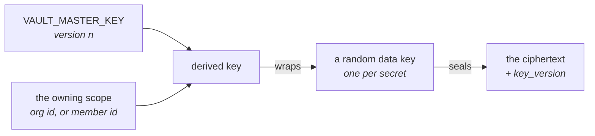

# Secretos y el vault { #secrets-and-the-vault }

!!! abstract "Un módulo, y deliberadamente ningún segundo mecanismo"

    Toda clave de provider, todo token de bot de canal, toda credencial MCP y
    toda clave de API de terceros de esta plataforma pasa por
    `app/core/vault.py`. Añadir una segunda forma de guardar una credencial en
    reposo es el defecto que dos migraciones eliminaron.

## Cifrado de sobre { #envelope-encryption }

Cada secreto se sella con su propia clave de datos aleatoria. Esa clave de datos
se sella con una clave derivada de la clave maestra **y del scope al que
pertenece el secreto** — una organización, o el miembro al que pertenece una
conexión personal.



De ahí se siguen dos propiedades, y ambas son la razón de esta forma:

!!! success "Un texto cifrado no se puede mover entre propietarios"

    Incluso con acceso completo a la base de datos, una fila copiada de la
    organización A a la organización B no se puede desenvolver. Aquí el
    aislamiento entre inquilinos es criptográfico, no una cláusula `WHERE` que
    alguien podría olvidar.

**La clave maestra es rotable.** Nunca cifra directamente una carga útil, solo
claves de datos, de modo que rotarla vuelve a envolver un blob pequeño por
secreto en lugar de volver a cifrar cada valor. Cada sobre registra la
`key_version` que lo selló, y eso es lo que hace posible una rotación por etapas.

El vault no decide nada sobre *quién* puede leer un secreto — de eso se encarga
la [capa de permisos](permissions.md). Solo garantiza que un secreto en reposo
es ilegible sin la clave maestra e inservible fuera del scope para el que fue
sellado.

## Cómo llegó a ser un único mecanismo { #how-it-became-one-mechanism }

Esa frase de arriba necesitó dos rondas para volverse cierta, y la historia
merece un minuto porque es la forma misma del error.

**Antes eran tres los mecanismos que guardaban secretos en reposo, y solo uno
ataba un texto cifrado a su propietario.** Las claves de provider pasaban por el
vault, los tokens de bot de canal por una única clave Fernet común a todo el
despliegue, y los tokens MCP por otra. Un token de Slack se podía copiar de la
fila de una organización a la de otra y descifraba. Una migración eliminó esos
dos, antes de que la cadena se aplastara en `0001_baseline`.

**Un cuarto sobrevivió a aquello, y le sobrevivió unos meses a la frase que tenía
encima.** `app/core/crypto.py` mantenía una única clave Fernet común a todo el
despliegue sobre los campos de credenciales de `sync_sources.config` — el JSON de
la cuenta de servicio de Google y el par de claves de AWS con el que se autentica
un conector de sincronización de RAG.

Era honesto consigo mismo en su propio docstring, y aun así era un segundo
mecanismo, de modo que quien leyera «no hay un segundo mecanismo» se equivocaba
respecto a una tabla.

Lo que lo mantuvo vivo fue un problema de orden, no un desacuerdo: un sobre se
deriva del id de su propietario, y `sync_sources.organization_id` era nullable
porque la CLI creaba filas sin ella.
[#707](https://github.com/vstorm-co/agenticos/issues/707) le dio una organización
a `rag-source-add`, `0042_sync_source_secret_id` hizo que la columna lo dijera, y
[#937](https://github.com/vstorm-co/agenticos/issues/937) borró el módulo.

**Una fuente de sincronización ahora referencia por id un secreto del vault**, tal
como hacen `ModelProfile.secret_id` y `CapabilityBindingSpec.secret_id`, y su
`config` solo guarda lo que un conector necesita para *encontrar* los documentos.

Dos consecuencias más allá de la criptografía, y son las que nota quien opera la
plataforma: una credencial se añade una vez y la reutiliza cada fuente que la
necesita, en lugar de pegarse en cada fuente y rotarse en otros tantos sitios; y
aparece en la página Vault como todo lo demás, así que «¿tiene esta organización
una credencial de Google?» tiene respuesta.

## Los kinds { #kinds }

Un secreto no siempre es una cadena, y meter a la fuerza toda credencial en un
único campo «API key» produce un formulario que alguien rellena correctamente y
del que sale igualmente una credencial que falla en el primer run. Por eso un
secreto tiene un **kind**, y el kind decide qué campos existen.

| Kind | Campos |
|---|---|
| `api_key` | Un token opaco |
| `azure_openai` | Clave, endpoint, versión de API fijada |
| `aws_credentials` | Access key id, secret access key, región, session token opcional |
| `gcp_service_account` | El JSON de la cuenta de servicio, validado al entrar |
| `github_oauth_app` | El client id público de una GitHub OAuth App y su secreto |
| `none` | No es un secreto — la marca para un endpoint que no necesita credencial |

`github_oauth_app` lo gasta la plataforma en lugar de elegirlo una persona — el
flujo de conexión con GitHub lo lee en el servidor para ejecutar el intercambio de
tokens —, así que tiene que ser **visible para la organización, y tiene que haber
exactamente uno**: la credencial privada de un miembro nunca se usa en silencio
para la conexión de toda la organización, y con dos apps visibles para la
organización guardadas la conexión se rechaza (nombrando ambas) en lugar de
quedar atada al nombre que ordene primero.

`aws_credentials` es el caso más claro de por qué existen los kinds: el access key
id no es secreto y el secret access key sí lo es, y un único campo no puede
expresar eso. `gcp_service_account` se valida al pegarlo porque el modo de fallo
de uno malformado es un error de autenticación horas después, sin nada que apunte
de vuelta al pegado que lo causó.

`none` es lo que guardas para Ollama en localhost. Es un kind y no una cadena
vacía para que el resolver pueda decidir sobre un conjunto total — y porque el
vault se niega a sellar un valor vacío. Solo el runtime puede contener `none`;
nadie puede guardar uno, y eso es lo que mantiene «un secreto sin valor» fuera del
schema de la API.

Todo campo que autentica — una clave de API, un secret access key, un client
secret — debe tener al menos ocho caracteres. El listado muestra los últimos
cuatro caracteres de una credencial como pista, así que un valor más corto
quedaría publicado entero por su propia pista; el mínimo también atrapa un pegado
truncado mientras el formulario sigue abierto.

## Dónde se usan { #where-they-are-used }

**Providers de modelos.** Los nombra un [perfil de modelo](models.md). El gasto se
atribuye al secreto al que resolvió el run, y así «qué clave está costando más»
tiene respuesta.

**Capabilities.** Una capability declara que necesita una credencial de un *kind*
dado — nunca una instancia. El código dice «necesito una clave de API»; la
`secret_id` de un binding dice cuál. Mira
[el catálogo de capabilities](reference/capabilities.md#what-a-binding-may-change).

**Conexiones MCP.** Bearer tokens y cargas útiles de OAuth, selladas a la
organización o al miembro. Mira [MCP](mcp.md#authentication).

**Bots de canal.** Todas las credenciales de la fila, selladas a la organización
del bot bajo una misma `key_version`: el token del bot, el signing secret y el app
token de una app de Slack, y el secreto compartido contra el que se autentica un
webhook entrante — el `X-Telegram-Bot-Api-Secret-Token` de Telegram, el token de
un webhook saliente de Mattermost. Mira [Canales](channels.md).

**Triggers de eventos.** El secreto contra el que se verifica el webhook entrante
de un trigger de evento - la clave HMAC de GitHub, o el signing secret que envía
un relay de correo o de API - sellado a la organización y guardado en línea en la
fila del trigger junto con la `key_version` que lo selló, con la misma forma que el
signing secret de un bot de canal. Nunca se devuelve ni se registra en claro; la
verificación lo desella, compara en tiempo constante, y una entrega que falla es un
403. Mira [Conceptos](concepts.md#trigger).

**Embeds.** Un widget `jwt` verifica los tokens de visitante contra un signing
secret HS256 que guarda el backend del cliente. Está sellado a la organización del
agent y registra su `key_version` como cualquier otra fila sellada, de modo que una
rotación de la clave maestra puede hacerle `rewrap` y el widget sigue verificando —
mientras que un embed que no hubiera registrado su versión no se podría volver a
abrir nunca tras una rotación.

Una fila con varias columnas de texto cifrado — las cuatro de un bot de canal, la
única de un embed — las sella mediante `vault.seal_fields`, que sella cada campo con
una misma versión y devuelve esa versión para guardarla: la única forma de escribir
una fila así, de manera que «sin columna de versión» y «devolver un campo a v1» ni
siquiera se puedan escribir a mano.

**Servicios de terceros.** Un pequeño catálogo de servicios para los que una
organización puede traer su propia clave:

| Servicio | Lo usa |
|---|---|
| Tavily | [`web_research`](reference/capabilities.md#web-search) |
| Brave Search | `web_research` |
| Exa | `web_research` |
| Logfire | [Observabilidad](reference/spec.md#observability) por agent — trazas a un proyecto propio |
| LlamaParse | Parseo de PDF, facturado a la clave propia de la organización |
| mem0 | [`memory_mem0`](reference/capabilities.md#memory-mem0) — la capability entera, que guarda las memorias semánticas de un agent en un servicio mem0 (en la nube o autoalojado) en vez de aquí. En este despliegue no se guarda nada, así que mem0 factura su propio embedding por fuera y enviar memorias a la nube de mem0 es una decisión de residencia de datos que nombra el Builder. Una `base_url` autoalojada tiene que ser https y estar en la lista de permitidos `MEM0_ALLOWED_HOSTS`, para que la clave del vault nunca se envíe a un origen controlado por el agent. No hay consola de operador para estas memorias: mem0 tiene su propio almacén, su propio listado y su propio borrado. |

## Lo que nunca ocurre { #what-never-happens }

!!! success "Cuatro garantías, fijadas por tests y no por convención"

    Nada en claro en una respuesta, en una línea de log, en una entrada de
    auditoría ni en un spec exportado - y una capability nunca llega a saber de
    dónde salió su credencial.

- **Ninguna respuesta de la API devuelve un texto en claro.** No hay endpoint para
  ello. El servicio dueño de los secretos de la organización tiene dos lectores que
  producen uno, y ninguno de los dos se lo entrega a quien llama: el del runner,
  mientras construye un agent, y el del catálogo de modelos, que gasta un bearer
  token en una única petición saliente a un provider y devuelve los nombres de
  modelo que llegaron. Nada fuera de ese servicio abre un secreto — la ruta del
  listado de modelos lo hacía antes, y ese era el defecto de capas.
- **Ninguna línea de log ni entrada de auditoría contiene uno.** Todo campo que
  lleva un secreto es un `SecretStr` de Pydantic, de modo que las dataclasses que
  transportan credenciales se enmascaran a sí mismas en un repr — que es la vía por
  la que suele escaparse una clave en claro.
- **Ningún spec lleva uno.** Un spec de agent exportado referencia los secretos por
  id. Eso es lo que hace seguro subirlo al repositorio de git de un cliente.
- **Una capability nunca llega a saber de dónde salió su credencial**, y el modelo
  no la ve en absoluto.

Esas cuatro están fijadas por tests, no por convención.

## Acceso { #access }

| Permiso | Concede |
|---|---|
| `secrets:view` | Ver que un secreto existe, su kind, su etiqueta |
| `secrets:edit` | Crear, rotar, borrar |
| `mcp:manage` | Las conexiones MCP de la organización y sus credenciales |
| `connections:manage` | Credenciales de toda la organización: conexiones a providers de modelos e integraciones de fuentes de sincronización |

Los scopes difieren según el rol — un Owner edita cualquier secreto de la
organización, un Member solo los suyos. Un secreto también se puede compartir con
un miembro o un agent concretos mediante una concesión sobre el recurso, que
amplía el acceso a esa única fila sin ascender a nadie. Mira
[Permisos](permissions.md).

## Operaciones { #operations }

La clave maestra es `VAULT_MASTER_KEY`. Recae en `SECRET_KEY` para que un checkout
recién hecho funcione sin configuración adicional, y la configuración rechaza una
clave sin fijar en todas partes salvo en `local`/`development` — staging es un
despliegue de pleno derecho y guarda habitualmente claves de provider reales, así
que recibe el mismo rechazo que producción.

!!! danger "Perder todas las claves configuradas significa que todas las credenciales guardadas se han perdido"

    No hay camino de recuperación ni copia en custodia: cada secreto hay que
    volver a introducirlo a mano. Respalda la clave en un sitio donde no esté el
    respaldo de la base de datos.

Rotar es una operación por etapas, y `VAULT_MASTER_KEYS` es la forma por etapas:
un mapa JSON de todas las versiones todavía en uso. La versión más alta sella los
secretos nuevos; las anteriores mantienen legibles las filas existentes hasta que
se vuelven a envolver. La `key_version` de cada fila sellada registra qué versión
la envolvió, y pedir una versión sin clave configurada falla nombrando la entrada
que falta, en lugar de como un error de descifrado genérico.

```bash
# 1. Configure both keys — the old one as the version that sealed today's rows,
#    the new one above it — and unset the single VAULT_MASTER_KEY.
#    VAULT_MASTER_KEYS={"1": "<old>", "2": "<new>"}
# 2. Prove every stored envelope opens before anything moves:
uv run agenticos cmd vault-rotate --dry-run
# 3. Re-wrap every sealed row to the new version:
uv run agenticos cmd vault-rotate
# 4. Once it reports zero failures, drop version 1 from VAULT_MASTER_KEYS.
```

!!! warning "No elimines la clave antigua hasta que `vault-rotate` informe de cero fallos"

    Una fila que falla queda nombrada y tal como estaba, y el comando termina con
    un código distinto de cero - eliminar la versión 1 en una rotación parcial
    deja esas filas ilegibles.

`vault-rotate` recorre todas las tablas que guardan sobres y mueve los textos
cifrados de cada fila junto con su columna de versión, o no los mueve en absoluto.
Una fila que no guarda ningún sobre pero nombra una versión — una conexión cuyas
credenciales se vaciaron — también ve esa declaración movida a la versión actual,
para que el siguiente secreto sellado en ella caiga sobre una clave que todavía
existe. Solo se vuelve a sellar la clave de datos envuelta — las cargas útiles
quedan intactas, y eso es lo que hace barata la rotación.

```bash
uv run agenticos cmd doctor    # reports whether a vault key is configured at all
```

`make platform-bootstrap BOOTSTRAP_API_KEY=sk-...` guarda por ti la primera clave
de provider. Mira [Configuración](configuration.md) para el entorno, y la
[lista de comprobación para producción](configuration.md#production-checklist) antes
de salir a producción con un valor por defecto generado.

## Resumen { #recap }

- **Un módulo**, `app/core/vault.py`. No hay un segundo mecanismo, y añadir uno es
  el defecto que dos migraciones eliminaron.
- Un secreto se sella con su propia clave de datos, envuelta por una clave derivada
  de la clave maestra **y del scope propietario** — así un texto cifrado no puede
  moverse entre propietarios.
- Un secreto tiene un **kind**, porque `aws_credentials` son cuatro campos y uno de
  ellos no es secreto.
- Cuatro garantías, fijadas por tests: nada en claro en una respuesta, un log, una
  entrada de auditoría o un spec exportado.
- La rotación es **por etapas** — configura ambas versiones,
  `vault-rotate --dry-run`, rota, y luego elimina la clave antigua cuando informe
  de cero fallos.
