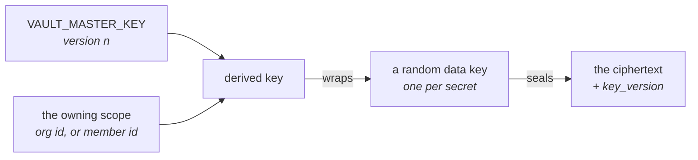

# Sekrety i vault { #secrets-and-the-vault }

!!! abstract "Jeden moduł i celowo żadnego drugiego mechanizmu"

    Każdy klucz providera, każdy token bota kanału, każde poświadczenie MCP
    i każdy klucz API strony trzeciej na tej platformie przechodzi przez
    `app/core/vault.py`. Dodanie drugiego sposobu przechowywania poświadczenia
    w spoczynku to defekt, który usunęły dwie migracje.

## Szyfrowanie kopertowe { #envelope-encryption }

Każdy sekret jest pieczętowany własnym losowym kluczem danych. Ten klucz danych
jest pieczętowany kluczem wyprowadzonym z klucza głównego **oraz ze scope'u,
który jest właścicielem sekretu** — organizacji albo członka, do którego należy
osobiste połączenie.



Wynikają z tego dwie własności i obie są powodem takiego kształtu:

!!! success "Szyfrogramu nie da się przenieść między właścicielami"

    Nawet przy pełnym dostępie do bazy danych wiersz skopiowany z organizacji A
    do organizacji B nie da się odpieczętować. Izolacja tenantów jest tu
    kryptograficzna, a nie klauzulą `WHERE`, o której ktoś może zapomnieć.

**Klucz główny da się rotować.** Nigdy nie szyfruje ładunku bezpośrednio, tylko
klucze danych, więc rotacja opakowuje na nowo jeden mały blob na sekret, zamiast
przeszyfrowywać każdą wartość. Każda koperta zapisuje `key_version`, którym
została zapieczętowana, i to właśnie czyni etapową rotację w ogóle możliwą.

Vault nie decyduje o tym, *kto* może przeczytać sekret — od tego jest
[warstwa uprawnień](permissions.md). Gwarantuje wyłącznie, że sekret w spoczynku
jest nieczytelny bez klucza głównego i bezużyteczny poza scope'em, dla którego
został zapieczętowany.

## Jak stało się to jednym mechanizmem { #how-it-became-one-mechanism }

To zdanie na górze potrzebowało dwóch rund, żeby stać się prawdą, a ta historia
jest warta minuty, bo pokazuje kształt tego błędu.

**Kiedyś sekrety w spoczynku trzymały trzy mechanizmy i tylko jeden wiązał
szyfrogram z jego właścicielem.** Klucze providerów szły przez vault, tokeny
botów kanałów przez pojedynczy klucz Fernet obowiązujący dla całego wdrożenia,
a tokeny MCP przez jeszcze inny. Token Slacka dało się skopiować z wiersza jednej
organizacji do wiersza innej i dawał się odszyfrować. Jedna migracja usunęła te
dwa, zanim łańcuch został spłaszczony do `0001_baseline`.

**Czwarty to przeżył i przeżył też zdanie nad sobą o dobrych kilka miesięcy.**
`app/core/crypto.py` trzymał jeden klucz Fernet obowiązujący dla całego wdrożenia
nad polami poświadczeń w `sync_sources.config` — JSON-em konta serwisowego Google
i parą kluczy AWS, którymi uwierzytelnia się konektor synchronizacji RAG.

Był wobec siebie uczciwy we własnym docstringu i mimo to był drugim mechanizmem,
więc czytelnik, który wierzył, że „nie ma drugiego mechanizmu", nie miał racji co
do jednej tabeli.

Przy życiu trzymał go problem kolejności, a nie różnica zdań: koperta jest
wyprowadzana z identyfikatora właściciela, a `sync_sources.organization_id` była
nullowalna, bo CLI tworzyło wiersze bez niej.
[#707](https://github.com/vstorm-co/agenticos/issues/707) dało `rag-source-add`
organizację, `0042_sync_source_secret_id` sprawiło, że kolumna to odzwierciedla,
a [#937](https://github.com/vstorm-co/agenticos/issues/937) usunęło moduł.

**Źródło synchronizacji odwołuje się teraz do sekretu w vault po id**, tak jak
robią to `ModelProfile.secret_id` i `CapabilityBindingSpec.secret_id`, a jego
`config` trzyma tylko to, czego konektor potrzebuje, żeby *znaleźć* dokumenty.

Dwie konsekwencje poza samą kryptografią, i to je zauważa operator:
poświadczenie dodaje się raz i używa go każde źródło, które go potrzebuje,
zamiast wklejać je osobno przy każdym źródle i rotować w tylu miejscach; oraz
pojawia się na stronie Vault jak wszystko inne, więc pytanie „czy ta organizacja
ma poświadczenie Google" ma odpowiedź.

## Rodzaje { #kinds }

Sekret nie zawsze jest łańcuchem znaków, a wtłaczanie każdego poświadczenia
w jedno pole „API key" daje formularz, który ktoś wypełnia poprawnie i i tak
kończy z poświadczeniem, które zawodzi przy pierwszym runie. Sekret ma więc
**rodzaj**, a rodzaj decyduje o tym, jakie pola istnieją.

| Rodzaj | Pola |
|---|---|
| `api_key` | Jeden nieprzezroczysty token |
| `azure_openai` | Klucz, endpoint, przypięta wersja API |
| `aws_credentials` | Access key id, secret access key, region, opcjonalny token sesji |
| `gcp_service_account` | JSON konta serwisowego, walidowany przy wprowadzaniu |
| `github_oauth_app` | Publiczny client id aplikacji GitHub OAuth App i jej sekret |
| `none` | Nie jest sekretem — znacznik endpointu, który nie potrzebuje poświadczenia |

`github_oauth_app` jest zużywany przez platformę, a nie wybierany przez
człowieka — proces łączenia z GitHubem czyta go po stronie serwera, żeby
przeprowadzić wymianę tokenów — musi więc być **widoczny dla organizacji i musi
być dokładnie jeden**: prywatne poświadczenie członka nigdy nie zostaje po cichu
użyte dla połączenia całej organizacji, a przy dwóch zapisanych aplikacjach
widocznych dla organizacji łączenie zostaje odrzucone (z nazwaniem obu), zamiast
zostać przypisane do tej, której nazwa sortuje się pierwsza.

`aws_credentials` to najczytelniejszy argument za tym, żeby rodzaje w ogóle
istniały: access key id nie jest tajny, a secret access key jest, i jedno pole
nie potrafi tego wyrazić. `gcp_service_account` jest walidowany w momencie
wklejenia, bo tryb awarii źle sformowanego JSON-a to błąd uwierzytelnienia wiele
godzin później, przy którym nic nie wskazuje z powrotem na wklejenie, które go
spowodowało.

`none` to jest to, co zapisujesz dla Ollamy na localhoście. Jest rodzajem, a nie
pustym łańcuchem znaków, żeby resolver mógł przełączać się po pełnym zbiorze —
i dlatego, że vault odmawia zapieczętowania pustej wartości. Tylko runtime może
trzymać `none`; nikt nie może takiego zapisać, i to właśnie trzyma „sekret bez
wartości" poza schematem API.

Każde pole, które uwierzytelnia — klucz API, secret access key, client secret —
musi mieć co najmniej osiem znaków. Lista pokazuje jako podpowiedź cztery ostatnie
znaki poświadczenia, więc krótsza wartość zostałaby opublikowana w całości przez
własną podpowiedź; ta dolna granica wyłapuje też ucięte wklejenie, póki formularz
jest jeszcze otwarty.

## Gdzie są używane { #where-they-are-used }

**Providerzy modeli.** Nazywani przez [profil modelu](models.md). Wydatek jest
przypisywany do sekretu, do którego rozwiązał się dany run, i tak właśnie pytanie
„który klucz kosztuje najwięcej" dostaje odpowiedź.

**Capabilities.** Capability deklaruje, że potrzebuje poświadczenia danego
*rodzaju* — nigdy konkretnej instancji. Kod mówi „potrzebuję klucza API";
`secret_id` w bindingu mówi, którego. Zobacz
[katalog capabilities](reference/capabilities.md#what-a-binding-may-change).

**Połączenia MCP.** Tokeny bearer i ładunki OAuth, pieczętowane dla organizacji
albo dla członka. Zobacz [MCP](mcp.md#authentication).

**Boty kanałów.** Każde poświadczenie w wierszu, zapieczętowane dla organizacji
bota jednym wspólnym `key_version`: token bota, signing secret i app token
aplikacji Slacka oraz wspólny sekret, wobec którego uwierzytelniany jest
przychodzący webhook — `X-Telegram-Bot-Api-Secret-Token` Telegrama, token
wychodzącego webhooka Mattermosta. Zobacz [Kanały](channels.md).

**Wyzwalacze zdarzeń.** Sekret, wobec którego weryfikowany jest przychodzący
webhook wyzwalacza zdarzeń — klucz HMAC GitHuba albo signing secret wysyłany
przez przekaźnik pocztowy lub API — zapieczętowany dla organizacji i zapisany
bezpośrednio w wierszu wyzwalacza razem z `key_version`, który go zapieczętował,
w tym samym kształcie co signing secret bota kanału. Nigdy nie jest zwracany ani
logowany jawnie; weryfikacja odpieczętowuje go, porównuje w stałym czasie,
a dostarczenie, które się nie powiedzie, to 403. Zobacz
[Pojęcia](concepts.md#trigger).

**Embedy.** Widget `jwt` weryfikuje tokeny odwiedzających wobec signing secretu
HS256, który trzyma backend klienta. Jest zapieczętowany dla organizacji agenta
i zapisuje swój `key_version` jak każdy inny zapieczętowany wiersz, więc rotacja
klucza głównego może go przepakować przez `rewrap`, a widget dalej weryfikuje —
podczas gdy embed, który nie zapisałby swojej wersji, nie dałby się już nigdy
otworzyć po rotacji.

Wiersz z kilkoma kolumnami szyfrogramów — cztery u bota kanału, jedna u embeda —
pieczętuje je przez `vault.seal_fields`, które pieczętuje każde pole jedną wersją
i zwraca tę wersję do zapisania: to jedyny sposób zapisania takiego wiersza, więc
„brak kolumny z wersją" i „zresetuj jedno pole do v1" nie dają się napisać
ręcznie.

**Usługi stron trzecich.** Niewielki katalog usług, do których organizacja może
przynieść własny klucz:

| Usługa | Używana przez |
|---|---|
| Tavily | [`web_research`](reference/capabilities.md#web-search) |
| Brave Search | `web_research` |
| Exa | `web_research` |
| Logfire | [Obserwowalność](reference/spec.md#observability) per agent — ślady do osobnego projektu |
| LlamaParse | Parsowanie PDF-ów, rozliczane na własny klucz organizacji |
| mem0 | [`memory_mem0`](reference/capabilities.md#memory-mem0) — cała capability, która trzyma semantyczne wspomnienia agenta w usłudze mem0 (chmurowej albo self-hosted), a nie tutaj. Nic nie jest zapisywane w tym wdrożeniu, więc mem0 rozlicza własny embedding poza pasmem, a wysyłanie wspomnień do chmury mem0 jest decyzją o rezydencji danych, którą podejmuje Builder. Self-hostowany `base_url` musi być https i musi być na liście dozwolonych `MEM0_ALLOWED_HOSTS`, więc klucz z vault nigdy nie trafia do originu kontrolowanego przez agenta. Dla tych wspomnień nie ma konsoli operatora: mem0 ma własny magazyn, własne listowanie i własne usuwanie. |

## Co nigdy się nie zdarza { #what-never-happens }

!!! success "Cztery gwarancje, przypięte testami, a nie konwencją"

    Żadnego tekstu jawnego w odpowiedzi, w linii logu, we wpisie audytu ani
    w wyeksportowanym specu — a capability nigdy nie dowiaduje się, skąd wzięło
    się jej poświadczenie.

- **Żadna odpowiedź API nie zwraca tekstu jawnego.** Nie ma na to endpointu.
  Serwis, który jest właścicielem sekretów organizacji, ma dwóch czytelników,
  którzy go wydobywają, i żaden nie oddaje go wołającemu: czytelnik runnera,
  w trakcie budowania agenta, oraz czytelnik katalogu modeli, który zużywa token
  bearer na jedno wychodzące żądanie do providera i zwraca nazwy modeli, które
  wróciły. Nic poza tym serwisem nie otwiera sekretu — kiedyś robił to route
  listujący modele i to był właśnie defekt warstwowania.
- **Żadna linia logu ani wpis audytu nie zawiera tekstu jawnego.** Każde pole
  niosące sekret jest Pydanticowym `SecretStr`, więc dataclassy niosące
  poświadczenia maskują się same w reprze — a to jest droga, którą jawny klucz
  zwykle ucieka.
- **Żaden spec go nie niesie.** Wyeksportowany spec agenta odwołuje się do
  sekretów po id. To właśnie sprawia, że można go bezpiecznie zacommitować do
  repozytorium git klienta.
- **Capability nigdy nie dowiaduje się, skąd wzięło się jej poświadczenie**,
  a model nie widzi go w ogóle.

Te cztery są przypięte testami, a nie konwencją.

## Dostęp { #access }

| Uprawnienie | Daje |
|---|---|
| `secrets:view` | Zobaczenie, że sekret istnieje, jego rodzaju i etykiety |
| `secrets:edit` | Tworzenie, rotowanie, usuwanie |
| `mcp:manage` | Połączenia MCP organizacji i ich poświadczenia |
| `connections:manage` | Poświadczenia całej organizacji: połączenia do providerów modeli i integracje źródeł synchronizacji |

Zakresy różnią się w zależności od roli — Owner edytuje dowolny sekret
w organizacji, Member edytuje tylko własne. Sekret można też udostępnić
konkretnemu członkowi albo agentowi przez resource grant, który poszerza dostęp
do tego jednego wiersza, nie awansując nikogo. Zobacz
[Uprawnienia](permissions.md).

## Operacje { #operations }

Kluczem głównym jest `VAULT_MASTER_KEY`. Spada z powrotem na `SECRET_KEY`, żeby
świeży checkout działał bez dodatkowej konfiguracji, a konfiguracja odrzuca
nieustawiony klucz wszędzie poza `local`/`development` — staging jest
pełnoprawnym wdrożeniem i rutynowo trzyma prawdziwe klucze providerów, więc
dostaje tę samą odmowę co produkcja.

!!! danger "Utrata każdego skonfigurowanego klucza oznacza, że każde zapisane poświadczenie przepadło"

    Nie ma ścieżki odzyskiwania ani kopii w depozycie: każdy sekret trzeba
    wprowadzić ręcznie od nowa. Zrób kopię zapasową klucza w miejscu, w którym
    nie leży kopia zapasowa bazy danych.

Rotacja jest operacją etapową, a `VAULT_MASTER_KEYS` jest formą etapową: mapą
JSON każdej wersji, która wciąż jest w użyciu. Najwyższa wersja pieczętuje nowe
sekrety; starsze utrzymują istniejące wiersze czytelnymi, dopóki nie zostaną
przepakowane. `key_version` w każdym zapieczętowanym wierszu zapisuje, która
wersja go opakowała, a poproszenie o wersję bez skonfigurowanego klucza kończy
się błędem nazywającym brakujący wpis, a nie ogólnym błędem odszyfrowania.

```bash
# 1. Configure both keys — the old one as the version that sealed today's rows,
#    the new one above it — and unset the single VAULT_MASTER_KEY.
#    VAULT_MASTER_KEYS={"1": "<old>", "2": "<new>"}
# 2. Prove every stored envelope opens before anything moves:
uv run agenticos cmd vault-rotate --dry-run
# 3. Re-wrap every sealed row to the new version:
uv run agenticos cmd vault-rotate
# 4. Once it reports zero failures, drop version 1 from VAULT_MASTER_KEYS.
```

!!! warning "Nie usuwaj starego klucza, dopóki `vault-rotate` nie zgłosi zera niepowodzeń"

    Wiersz, który zawiedzie, zostaje nazwany i zostawiony taki, jaki był,
    a komenda kończy się kodem niezerowym — usunięcie wersji 1 przy częściowej
    rotacji czyni te wiersze nieczytelnymi.

`vault-rotate` przechodzi po każdej tabeli trzymającej koperty i przesuwa
szyfrogramy wiersza razem z jego kolumną wersji albo nie przesuwa ich wcale.
Wiersz, który nie trzyma żadnej koperty, ale nazywa wersję — połączenie, którego
poświadczenia wyczyszczono — ma to wskazanie przesunięte na bieżącą wersję
również, więc następny zapieczętowany w nim sekret ląduje na kluczu, który
wciąż istnieje. Przepieczętowywany jest tylko opakowany klucz danych — ładunki
pozostają nietknięte i to właśnie czyni rotację tanią.

```bash
uv run agenticos cmd doctor    # reports whether a vault key is configured at all
```

`make platform-bootstrap BOOTSTRAP_API_KEY=sk-...` zapisuje za ciebie pierwszy
klucz providera. Zobacz [Konfigurację](configuration.md), żeby poznać zmienne
środowiskowe, oraz [listę kontrolną produkcji](configuration.md#production-checklist),
zanim wejdziesz na żywo z wygenerowaną wartością domyślną.

## Podsumowanie { #recap }

- **Jeden moduł**, `app/core/vault.py`. Nie ma drugiego mechanizmu, a dodanie go
  to defekt, który usunęły dwie migracje.
- Sekret jest pieczętowany własnym kluczem danych, opakowanym kluczem
  wyprowadzonym z klucza głównego **i ze scope'u właściciela** — więc szyfrogram
  nie może przenieść się między właścicielami.
- Sekret ma **rodzaj**, bo `aws_credentials` to cztery pola, z których jedno nie
  jest tajne.
- Cztery gwarancje, przypięte testami: żadnego tekstu jawnego w odpowiedzi,
  w logu, we wpisie audytu ani w wyeksportowanym specu.
- Rotacja jest **etapowa** — skonfiguruj obie wersje, `vault-rotate --dry-run`,
  zrotuj, a potem usuń stary klucz, gdy komenda zgłosi zero niepowodzeń.
