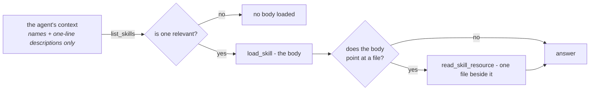

# Skills { #skills }

Ein Skill ist Wissen, das einmal geschrieben und an viele Agents gebunden wird:
wie Rückerstattungen behandelt werden, was der Hausstil ist, welche Prüfungen ein
Bericht bestehen muss, bevor er herausgeht.

Ersetzt wird damit ein Instruktionsfeld, das immer weiter wächst.

Zwanzig Verfahren in einem Prompt bedeuten, dass jeder Run für alle zwanzig
bezahlt, und das einundzwanzigste schiebt die Unterhaltung aus dem Fenster.
Skills drehen das um:



Zwanzig Skills kosten ungefähr zwanzig *Beschreibungen* statt zwanzig
*Verfahren*.

!!! note "Discovery ist günstig, nicht kostenlos"

    `list_skills` antwortet mit Name und Beschreibung jedes gebundenen Skills, und
    dieses Ergebnis geht in die nächste Modellanfrage ein — jeder Skill, an den ein
    Agent gebunden ist, kostet also Tokens in einer Runde, in der Discovery läuft.

    Es ist eine Zeile pro Skill gegen einen Textkörper pro Skill, und deshalb geht
    die Rechnung auf. Es ist kein Grund, einen unbegrenzten Katalog zu binden.

Die andere Hälfte des Punktes ist, **wer sie schreibt**. Ein Skill ist eine Zeile
in der Datenbank, in der UI bearbeitbar, sodass eine Support-Leitung die
Rückerstattungsregel an einem Dienstagnachmittag korrigieren kann. Kein Deploy,
kein Pull Request, keine Entwicklerin.

!!! info "Skill, Context-Datei oder Knowledge-Collection?"

    Ein **Skill** ist ein Verfahren, das das Modell lädt, wenn es entscheidet, dass
    die Aufgabe angekommen ist. Eine [Context-Datei](context.md) ist ständiges
    Wissen — kurz, immer relevant, eingefügt oder bei Bedarf gelesen. Eine
    [Knowledge-Collection](file-processing.md) ist ein Korpus, der zu groß zum
    Lesen ist und über Suche erreicht wird.

## Die Form { #the-shape }

```markdown
---
name: refund-policy
description: When a refund is given without asking, when it needs approval, and how to say no.
category: support
---

# Refunds

Most refund questions are decided by the order date and one exception. Check
those before escalating anything.

## Decide without asking
...
```

!!! tip "`description` ist das Feld, das darüber entscheidet, ob der Skill je geladen wird"

    Es ist der einzige Teil, den das Modell umsonst sieht. Schreiben Sie es als
    **wann man danach greift**, nicht als Titel.

Ein Skill kann **Ressourcen** mitbringen — weitere Dateien daneben, die bei
Bedarf geladen werden. `refund-policy` liefert eine `exceptions.md` mit, und der
Textkörper sagt, wann sie zu konsultieren ist.

Das ist dieselbe schrittweise Offenlegung eine Ebene tiefer: Details, die nur
manche Unterhaltungen brauchen, müssen nicht in dem Textkörper stehen, den jede
relevante Unterhaltung lädt.

`category` ist einer von zwanzig Vorschlägen (`support`, `engineering`,
`finance`, `legal`, `security`, `marketing`, …) und steuert den Filter in der
Skill-Liste. Auf das, was der Agent sieht, hat sie keine Wirkung — das Modell
wählt über `description`, nie über die Kategorie.

## Wie ein Agent einen liest { #how-an-agent-reads-one }

Über die [Capability `skills`](reference/capabilities.md#skills), die drei Tools
beisteuert:

| Tool | Was es tut |
|---|---|
| `list_skills` | Namen und einzeilige Beschreibungen von allem, was an diesen Agent gebunden ist |
| `load_skill` | Der vollständige Textkörper eines Skills |
| `read_skill_resource` | Eine Datei neben einem Skill |

Ein Spec bindet Skills über ihre Id in `skill_ids`, sodass ein Agent genau die
sieht, die ihm gegeben wurden, und sonst nichts.

Die Capability ohne gebundene Skills zu aktivieren ist nutzlos — geben Sie dem
Agent Skills, oder lassen Sie die Capability aus.

## In einem Workspace ist ein Skill auch Dateien { #in-a-workspace-a-skill-is-also-files }

Ein Agent, der sowohl Skills als auch einen
[Workspace](reference/capabilities.md#files-shell) hat, bekommt jeden Skill
zusätzlich dort hineingeschrieben:

```
/skills/<name>/SKILL.md      the body, with its name and description
/skills/<name>/<resource>    each resource, beside it
```

Das ist es, was das Skript eines Skills nützlich macht. Ein Skill, dessen
Ressource `reconcile.py` ist, wurde dem Modell bisher als Text übergeben, den es
zitieren, aber nicht ausführen konnte, während derselbe Agent `execute` einen
einzigen Tool-Aufruf entfernt hatte. Auf der Platte läuft es.

!!! note "Es gibt kein `run_skill_script`"

    Das `execute` des Sandbox trägt die Berechtigungsregeln des Workspace und die
    Obergrenzen des Betreibers bereits mit sich. Ein zweiter Weg, Dinge
    auszuführen, wäre ein zweiter Satz Regeln, den man falsch machen kann.

## Ein Agent kann eine Änderung vorschlagen; vornehmen tut sie ein Mensch { #an-agent-can-propose-a-change-a-person-makes-it }

Diese Dateien sind beschreibbar, und was der Agent schreibt, wird **nicht**
übernommen.

Ein Skill ist eine Anweisung, der jeder daran gebundene Agent in jedem Run folgt.
Ein Agent, der einen direkt bearbeiten könnte, könnte umschreiben, was ein
anderer Agent tut, innerhalb einer Unterhaltung, die niemand prüft, und der
nächste Leser hätte keine Möglichkeit, eine durchdachte Verbesserung von einer
halluzinierten zu unterscheiden.

Ein Schreibvorgang wird deshalb zu einem **Vorschlag**, und dieser erscheint über
der Liste auf der Seite Skills für jeden, der `skills:edit` hält:

- **Apply** schreibt den Skill neu und erhöht seine Version, was jeden gebundenen
  Agent bei seinem nächsten Run erreicht.
- **Discard** behält den Eintrag. Ein Agent, der wiederholt dieselbe Änderung
  vorschlägt, sagt jemandem etwas über den Skill, und eine gelöschte Zeile macht
  das unsichtbar.

!!! warning "Eine Entscheidung über einen Vorschlag ist endgültig"

    Zweimal anzuwenden würde eine Version gegen einen bereits gespeicherten
    Textkörper erhöhen, und etwas Angewendetes zu verwerfen würde einem Leser
    sagen, es sei nie gelandet.

Der Vorschlag trägt den **ganzen Textkörper** statt eines Diffs, sodass jemand,
der Wochen später prüft, zwei vollständige Versionen vergleicht, statt einen
Patch dort anzuwenden, wohin er nie gehörte.

Zwei Dinge werden abgelehnt statt geraten: ein vom Agent angelegtes Verzeichnis
ohne `SKILL.md` darin, und eines, dessen Frontmatter er verstümmelt hat. Und eine
*gelöschte* Ressource ist bewusst keine Änderung, denn eine Datei, die das Modell
nie angefasst hat, und eine, die es löschen wollte, hinterlassen dieselbe
Abwesenheit.

Drei Runden einer Unterhaltung, die denselben Skill verfeinern, hinterlassen
**einen** Vorschlag, nicht drei. Wer dreimal dieselbe Frage gestellt bekommt, hat
mehr Arbeit bekommen statt mehr Information.

## Skills in eine Organisation bekommen { #getting-skills-into-an-organization }

**Schreiben Sie einen.** Skills → New, in der UI. Das ist der normale Weg.

**Die mitgelieferten sind schon da.** Das Repository liefert drei als
ausgearbeitete Beispiele — `refund-policy`, `code-review` und `incident-report` —
und jede Organisation startet mit ihnen. Das Anlegen einer Organisation kopiert
die gesamte mitgelieferte Bibliothek als gewöhnliche Skills hinein, im Besitz des
Owners der Organisation und für die Organisation sichtbar.

Die Skill-Seite zeigt eine Liste, mit einem `built-in`-Abzeichen an allem, dessen
Name zur mitgelieferten Bibliothek passt. Diese drei werden nicht gewählt — sie
kommen an.

**Und sie bleiben da.** Der Katalog wächst mit den Deploys, deshalb füllt sich
die Liste selbst auf: ein mitgelieferter Skill, den die Organisation noch nicht
hat, wird beim nächsten Öffnen der Seite hineinkopiert, über den Namen
zugeordnet, sodass eine bearbeitete Kopie genau so bleibt, wie sie ist.

Eine Organisation, die angelegt wurde, bevor ein Deployment einen neuen
mitgelieferten Skill bekam, sieht ihn bei ihrem nächsten Besuch, statt nie.

!!! warning "Ein gelöschter Built-in kommt bei der nächsten Auflistung zurück"

    Die Auffüllung behandelt einen fehlenden mitgelieferten Namen als Lücke, die
    zu schließen ist. **Deaktivieren** Sie einen, um ihn außer Dienst zu stellen.

Der Seed-Befehl tut dasselbe vom Terminal aus, für skriptgesteuerte Installationen:

```bash
uv run agenticos cmd seed-skills                    # every organization
uv run agenticos cmd seed-skills --org <org-id>     # one
uv run agenticos cmd seed-skills --dry-run          # say what would happen, do nothing
```

Er ist über den Namen idempotent — ein Skill, den die Organisation bereits hat,
bleibt genau so, wie er ist, sodass eine bearbeitete Rückerstattungsregel ein
erneutes Seeding überlebt.

`e2e/seed.setup.ts` legt ebenfalls einen über die UI an, und genau dagegen prüft
die E2E-Suite.

### Die Gallery — siebzig weitere, und keiner kommt ungebeten { #the-gallery-seventy-more-and-none-of-them-arrive-uninvited }

**Skills → Skill gallery** öffnet einen Katalog fertiger Skills, gruppiert nach
Branche: Gesundheitswesen, Finanzen und Versicherung, E-Commerce und Print on
Demand, Softwareteams, öffentlicher Sektor und Versorger, Recht und
professionelle Dienstleistungen, Fertigung und Logistik. Jeweils zehn.

Wählen Sie eine Branche, dann installieren Sie einen Skill oder das ganze Regal.
Von diesem Moment an ist es ein gewöhnlicher Skill, den die Organisation besitzt
und bearbeitet, genau wie ein mitgelieferter.

!!! info "Die Gallery ist opt-in, und das ist der ganze Unterschied"

    Die mitgelieferten drei liegen in `app/core/catalog/skills/` und werden
    automatisch in **jede** Organisation kopiert. Die Gallery liegt in
    `app/core/catalog/skill_gallery/` und wird in **keine** kopiert — sie wird vom
    selben Parser gelesen, aus einem zweiten Verzeichnis, und nie geseedet.

    Siebzig Branchen-Skills im ersten Verzeichnis wären siebzig Zeilen gewesen, um
    die niemand gebeten hat, in jedem Tenant, beim nächsten Deploy.

Ein Regal zu installieren, von dem Sie einen Skill bereits haben, installiert den
Rest und lässt diesen einen in Ruhe: ein vorhandener Name wird übersprungen statt
überschrieben, und die Anfrage antwortet damit, was sie installiert hat, was sie
übersprungen hat, und welchen Schlüssel dieses Deployment nicht mitliefert.

Etwas zur Gallery hinzuzufügen ist dasselbe wie einen mitgelieferten Skill
hinzuzufügen — ein Ordner mit einer `SKILL.md`, unter der Branche, zu der er
gehört — mit einer zusätzlichen Regel: **sein Name darf weder mit einem
mitgelieferten Skill noch mit einem anderen Gallery-Skill kollidieren.** Die
Installation gleicht über den Namen ab, eine Kollision würde also für immer
stillschweigend übersprungen. Ein Test liest alle siebzig und schlägt bei einer
fehl.

### Kopien beim Seeding { #seeding-copies }

Ein geseedeter Skill ist ein gewöhnlicher Skill im Besitz der Organisation, vom
Moment ihrer Existenz an bearbeitbar. Er ist eine **Kopie**, keine Verknüpfung.

Das ist Absicht. Der Sinn eines Skills ist, dass eine Support-Leitung die
Rückerstattungsregel ohne Deploy korrigieren kann, und eine lebende Verknüpfung
zurück zur Kopie im Repository würde genau das wegnehmen — die Organisation würde
eine Datei lesen, die nur eine Entwicklerin ändern kann.

Bearbeiten ist auf gewöhnliche Weise endgültig. Löschen ist es nicht, denn die
Auffüllung der Liste behandelt einen fehlenden mitgelieferten Namen als Lücke,
die zu schließen ist; ein Built-in, den die Organisation nicht will, wird deshalb
**deaktiviert** — was jeder Agent respektiert und nichts überschreibt.

### Warum die Bibliothek mitgeliefert und nicht geholt wird { #why-the-library-is-bundled-and-not-fetched }

Einen Skill zur mitgelieferten Bibliothek oder zur Gallery hinzuzufügen ist ein
Deploy.

Die Alternative — der Import von einer Git-URL — kostet ausgehenden
Netzwerkverkehr vom Backend, einen Parser, der auf fremde Repositories gerichtet
ist, und ein Versprechen über Inhalte, die hier niemand gelesen hat. Jeder Ordner
in `app/core/catalog/skills/` und `app/core/catalog/skill_gallery/` ist dasselbe
kleine Versprechen, das auch der [MCP-Katalog](mcp.md#the-catalog) gibt: jemand
hat es sich angesehen.

## Skills oder Knowledge? { #skills-or-knowledge }

Sie beantworten verschiedene Fragen, und der Unterschied zählt, wenn ein Agent
das Falsche bekommt.

|  | Skills | [Knowledge](file-processing.md) |
|---|---|---|
| Enthält | Verfahren — wie wir das machen | Dokumente — was wir wissen |
| Geschrieben von | Einem Menschen, absichtlich | In großer Zahl eingelesen |
| Gefunden über | Das Modell, das einen Namen wählt | Semantische Suche über Chunks |
| Zitiert | Nichts; er *ist* die Anweisung | Die Passage und ihre Quelle |
| Größenordnung | Zehner | Tausende von Dokumenten |

!!! example "Was ist was"

    "Rückerstattungen über 500 £ brauchen eine Freigabe durch die Leitung" ist ein
    **Skill**. Der unterschriebene Vertrag, der das sagt, ist **Knowledge**.

    Ein Agent, der Rückerstattungen bearbeitet, will meist beides, und die zwei
    Capabilities lassen sich kombinieren — `skills` für das Verfahren, `knowledge`
    für den Beleg.

## Zugriff { #access }

Skills sind Ressourcen im Umfang einer Organisation und werden wie Agents und
Collections geregelt: Sichtbarkeit plus zeilenweise Grants über der Rolle hinaus.
Siehe [Berechtigungen](permissions.md#layer-3-visibility-and-grants).

!!! important "Einen Skill zu binden heißt, ihn zu verleihen"

    Jeder Run des Agents liest den Textkörper und die Dateien, wer ihn auch
    gestartet hat — deshalb verlangt das Veröffentlichen, dass die **Person, die
    veröffentlicht**, `skills:view` auf dieser Zeile hält.

Diese Prüfung geht durch `resolve_access`, ein Grant zählt also: ein Mitglied,
dem ein Skill geteilt wurde, kann ihn binden, ohne befördert zu werden.

Ein Skill, den sie nicht erreichen können, wird als `Skill not found: <id>`
abgelehnt, wortgleich mit einer Id, die es nicht gibt. Skills werden über UUID
gebunden, aus der API und aus einem handbearbeiteten Entwurf, nicht nur aus der
Liste des Builders gewählt, und eine Ablehnung, die sich anders liest, würde die
privaten Skills der Organisation Rateversuch für Rateversuch kartieren.

Dieselbe Prüfung läuft auf den `skill_ids` eines
[Inline-Spezialisten](concepts.md#delegate-vs-inline-specialist) und wird mit dem
Namen des Spezialisten gemeldet.

Zur Laufzeit wird nichts erneut geprüft. Die Skills des eingefrorenen Specs
werden innerhalb der Organisation des Runs aufgelöst und dem Agent übergeben —
nach der Regel, der Collections und Delegates bereits folgen, dass
[die Referenz einmal geprüft wird, beim Veröffentlichen](permissions.md#delegation-is-not-a-privilege-boundary).

Die Alternative ist auf zwei konkrete Weisen schlechter:

- Jeder Kontext ohne Subjekt — ein API-Key, ein eingebettetes Widget, eine
  Kanalnachricht — wird von `resolve_access` konstruktionsbedingt abgelehnt, eine
  Prüfung pro Runner würde also genau diesen Oberflächen jeden Skill entziehen.
- Wo es *doch* ein Subjekt gibt, würde ein und dieselbe veröffentlichte Version
  einem Mitglied — dessen Rolle nur geteilte Skills erreicht — dünnere Anweisungen
  geben als einer bauenden Person, und der Unterschied wäre nirgends sichtbar.

Ein nach dem Veröffentlichen gelöschter oder deaktivierter Skill wird mit einer
Warnung übersprungen, statt den Run scheitern zu lassen. Der Agent kann weniger,
er ist nicht kaputt.

## Zusammenfassung { #recap }

- Ein Skill ist ein **Verfahren**, von einem Menschen geschrieben, und wird nur
  geladen, wenn das Modell entscheidet, dass seine *description* relevant ist —
  Discovery kostet eine Zeile pro Skill, und der Textkörper kostet nichts, bis er
  geöffnet wird.
- In einem Workspace ist ein Skill auch **Dateien**, und das macht seine Skripte
  ausführbar.
- Ein Agent **schlägt** eine Änderung vor; ein Mensch wendet sie an, einmal, und
  die Entscheidung ist endgültig.
- Einen Skill zu binden heißt, ihn zu **verleihen**, die veröffentlichende Person
  muss ihn also sehen können — und zur Laufzeit wird nichts erneut geprüft.
- Die **Gallery** sind siebzig fertige Skills nach Branche, auf Anfrage
  installiert — anders als die mitgelieferten drei, die von allein ankommen.
