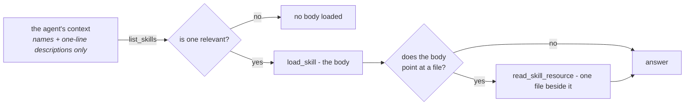

# Skills { #skills }

Un skill es saber hacer algo, escrito una vez y adjuntado a muchos agents: cómo
se gestionan los reembolsos, cuál es el estilo de la casa, qué comprobaciones
tiene que pasar un informe antes de salir.

Lo que sustituye es un campo de instrucciones que no para de crecer.

Veinte procedimientos en un solo prompt significa que cada run paga por los
veinte, y el vigesimoprimero empuja la conversación fuera de la ventana. Los
skills le dan la vuelta a eso:



Veinte skills cuestan aproximadamente veinte *descripciones* en lugar de veinte
*procedimientos*.

!!! note "Descubrir es barato, no gratis"

    `list_skills` responde con el nombre y la descripción de cada skill
    adjuntado, y ese resultado entra en la siguiente petición al modelo — así que
    cada skill al que está vinculado un agent sí cuesta tokens en un turno en el
    que se ejecuta el descubrimiento.

    Es una línea por skill frente a un cuerpo por skill, y por eso salen las
    cuentas. No es motivo para vincular un catálogo sin límite.

La otra mitad de la cuestión es **quién los escribe**. Un skill es una fila en
la base de datos, editable en la UI, así que un responsable de soporte puede
arreglar la política de reembolsos un martes por la tarde. Sin deploy, sin pull
request, sin ingeniero.

!!! info "¿Skill, archivo de contexto o colección de conocimiento?"

    Un **skill** es un procedimiento que el modelo carga cuando decide que la
    tarea ha llegado. Un [archivo de contexto](context.md) es conocimiento
    permanente — corto, siempre relevante, inyectado o leído bajo demanda. Una
    [colección de conocimiento](file-processing.md) es un corpus demasiado
    grande para leerlo, al que se llega por búsqueda.

## La forma { #the-shape }

```markdown
---
name: refund-policy
description: When a refund is given without asking, when it needs approval, and how to say no.
category: support
---

# Refunds

Most refund questions are decided by the order date and one exception. Check
those before escalating anything.

## Decide without asking
...
```

!!! tip "`description` es el campo que decide si el skill llega a cargarse alguna vez"

    Es la única parte que el modelo ve gratis. Escríbela como **cuándo recurrir
    a esto**, no como un título.

Un skill puede llevar **recursos** — más archivos a su lado, cargados bajo
demanda. `refund-policy` incluye un `exceptions.md`, y el cuerpo dice cuándo
consultarlo.

Eso es la misma revelación progresiva un nivel más abajo: el detalle que solo
algunas conversaciones necesitan no tiene por qué estar en el cuerpo que carga
cada conversación relevante.

`category` es una de veinte sugerencias (`support`, `engineering`, `finance`,
`legal`, `security`, `marketing`, …) y alimenta el filtro del listado de skills.
No tiene ningún efecto sobre lo que ve el agent — el modelo elige por
`description`, nunca por categoría.

## Cómo lee uno un agent { #how-an-agent-reads-one }

A través de la [capability `skills`](reference/capabilities.md#skills), que
aporta tres herramientas:

| Herramienta | Qué hace |
|---|---|
| `list_skills` | Nombres y descripciones de una línea de todo lo vinculado a este agent |
| `load_skill` | El cuerpo completo de un skill |
| `read_skill_resource` | Un archivo al lado de un skill |

Un spec vincula skills por id en `skill_ids`, así que un agent ve los que se le
dieron y nada más.

Habilitar la capability sin ningún skill vinculado no sirve de nada — dale skills
al agent, o deja la capability apagada.

## En un workspace, un skill también son archivos { #in-a-workspace-a-skill-is-also-files }

Un agent que tiene a la vez skills y un
[workspace](reference/capabilities.md#files-shell) recibe además cada skill
escrito dentro de él:

```
/skills/<name>/SKILL.md      the body, with its name and description
/skills/<name>/<resource>    each resource, beside it
```

Esto es lo que hace útil el script de un skill. Un skill cuyo recurso era
`reconcile.py` antes se le entregaba al modelo como texto que podía citar y no
ejecutar, mientras el mismo agent tenía `execute` a una llamada de herramienta
de distancia. En disco, se ejecuta.

!!! note "No existe `run_skill_script`"

    El propio `execute` de la sandbox ya lleva las reglas de permisos del
    workspace y los techos que fija el operador. Una segunda forma de ejecutar
    cosas sería un segundo conjunto de reglas que equivocar.

## Un agent puede proponer un cambio; una persona lo hace { #an-agent-can-propose-a-change-a-person-makes-it }

Esos archivos se pueden escribir, y lo que el agent escribe **no** se aplica.

Un skill son instrucciones que sigue en cada run todo agent vinculado a él. Un
agent que pudiera editar uno directamente podría reescribir lo que hace otro
agent, dentro de una conversación que nadie está revisando, y el siguiente
lector no tendría forma de distinguir una mejora meditada de una alucinada.

Así que una escritura se convierte en una **propuesta**, y aparece encima de la
lista en la página Skills para cualquiera que tenga `skills:edit`:

- **Apply** reescribe el skill y sube su versión, lo que alcanza a cada agent
  vinculado en su siguiente run.
- **Discard** conserva el registro. Un agent que propone la misma edición una y
  otra vez le está diciendo algo a alguien sobre ese skill, y una fila borrada
  lo vuelve invisible.

!!! warning "Una decisión sobre una propuesta es definitiva"

    Aplicar dos veces subiría una versión contra un cuerpo ya almacenado, y
    descartar algo aplicado le diría a un lector que nunca llegó a entrar.

La propuesta lleva el **cuerpo entero** en lugar de un diff, así que un revisor
semanas después está comparando dos versiones completas en vez de aplicando un
parche en un sitio al que nunca estuvo destinado.

Dos cosas se rechazan en lugar de adivinarse: un directorio que el agent creó
sin ningún `SKILL.md` dentro, y uno cuyo frontmatter destrozó. Y un recurso
*borrado* deliberadamente no es un cambio, porque un archivo que el modelo nunca
tocó y uno que quiso borrar dejan la misma ausencia.

Tres turnos de una conversación refinando el mismo skill dejan **una** propuesta,
no tres. A un revisor al que se le hace la misma pregunta tres veces se le ha
dado más trabajo, no más información.

## Cómo llegan los skills a una organización { #getting-skills-into-an-organization }

**Escribe uno.** Skills → New, en la UI. Este es el camino normal.

**Los incluidos ya están ahí.** El repositorio trae tres como ejemplos
trabajados — `refund-policy`, `code-review` e `incident-report` — y toda
organización empieza con ellos. Crear una organización copia dentro la biblioteca
entera que se distribuye, como skills normales, cuyo dueño es el owner de la
organización y visibles para la organización.

La página de skills muestra una sola lista, con una insignia `built-in` sobre
cualquiera cuyo nombre coincida con la biblioteca distribuida. Esos tres no se
eligen — llegan solos.

**Y ahí se quedan.** El catálogo crece con los deploys, así que el listado se
rellena solo: un skill incluido que la organización aún no tiene se copia dentro
la próxima vez que alguien abra la página, emparejado por nombre, de modo que
una copia editada se deja exactamente como está.

Una organización creada antes de que un deployment ganara un nuevo skill
incluido lo ve en su siguiente visita, en lugar de nunca.

!!! warning "Borrar un built-in lo devuelve en el siguiente listado"

    El rellenado trata un nombre incluido que falta como un hueco que cerrar.
    **Disable** uno para retirarlo.

El comando de seed hace lo mismo desde un terminal, para instalaciones con
scripts:

```bash
uv run agenticos cmd seed-skills                    # every organization
uv run agenticos cmd seed-skills --org <org-id>     # one
uv run agenticos cmd seed-skills --dry-run          # say what would happen, do nothing
```

Es idempotente por nombre — un skill que la organización ya tiene se deja
exactamente como está, así que una política de reembolsos editada sobrevive a un
reseed.

`e2e/seed.setup.ts` también crea uno a través de la UI, que es contra lo que
afirma la suite E2E.

### La galería — setenta más, y ninguno llega sin invitación { #the-gallery-seventy-more-and-none-of-them-arrive-uninvited }

**Skills → Skill gallery** abre un catálogo de skills listos para usar agrupados
por sector: sanidad, finanzas y seguros, comercio electrónico e impresión bajo
demanda, equipos de software, sector público y utilities, servicios jurídicos y
profesionales, fabricación y logística. Diez de cada.

Elige un sector y luego instala un skill o el estante entero. Desde ese momento
es un skill normal que la organización posee y edita, exactamente igual que uno
incluido.

!!! info "La galería es opcional, y esa es toda la diferencia"

    Los tres incluidos viven en `app/core/catalog/skills/` y se copian
    automáticamente en **todas** las organizaciones. La galería vive en
    `app/core/catalog/skill_gallery/` y no se copia en **ninguna** — la lee el
    mismo parser, desde un segundo directorio, y nunca se siembra.

    Setenta skills sectoriales en el primer directorio habrían sido setenta filas
    que nadie pidió, en cada tenant, en el siguiente deploy.

Instalar un estante del que ya tienes uno de sus skills instala el resto y deja
ese en paz: un nombre existente se omite en lugar de sobrescribirse, y la
petición responde con lo que instaló, lo que omitió y cualquier clave que este
deployment no incluya.

Añadir a la galería es igual que añadir un skill incluido — una carpeta con un
`SKILL.md`, bajo el sector al que pertenece — con una regla extra: **su nombre no
puede chocar con el de un skill incluido ni con el de otro skill de la galería.**
La instalación empareja por nombre, así que una colisión se saltaría en silencio
para siempre. Un test lee los setenta y falla en cuanto hay uno.

### Sembrar crea copias { #seeding-copies }

Un skill sembrado es un skill normal propiedad de la organización, editable desde
el momento en que la organización existe. Es una **copia**, no un enlace.

Eso es deliberado. La gracia de un skill es que un responsable de soporte pueda
arreglar la política de reembolsos sin un deploy, y un enlace vivo a la copia del
repositorio le quitaría exactamente eso — la organización estaría leyendo un
archivo que solo un ingeniero puede cambiar.

Editar es definitivo, como siempre. Borrar no lo es, porque el rellenado del
listado trata un nombre incluido que falta como un hueco que cerrar, así que un
built-in que la organización no quiere se **deshabilita** — algo que respeta cada
agent y que nada sobrescribe.

### Por qué la biblioteca se distribuye y no se descarga { #why-the-library-is-bundled-and-not-fetched }

Añadir un skill a la biblioteca distribuida o a la galería es un deploy.

La alternativa — importar desde una URL de git — cuesta red saliente desde el
backend, un parser apuntando al repositorio de otra persona y una promesa sobre
un contenido que nadie aquí ha leído. Cada carpeta de
`app/core/catalog/skills/` y `app/core/catalog/skill_gallery/` es la misma
pequeña promesa que hace el [catálogo MCP](mcp.md#the-catalog): alguien lo miró.

## ¿Skills o conocimiento? { #skills-or-knowledge }

Responden a preguntas distintas, y la diferencia importa cuando un agent recibe
la equivocada.

|  | Skills | [Conocimiento](file-processing.md) |
|---|---|---|
| Contiene | Procedimiento — cómo hacemos esto | Documentos — lo que sabemos |
| Lo escribe | Una persona, deliberadamente | Se ingiere en bloque |
| Se recupera por | El modelo eligiendo un nombre | Búsqueda semántica sobre fragmentos |
| Cita | Nada; *es* la instrucción | El pasaje y su fuente |
| Escala | Decenas | Miles de documentos |

!!! example "Cuál es cuál"

    "Los reembolsos de más de 500 £ necesitan un manager" es un **skill**. El
    contrato firmado que lo dice es **conocimiento**.

    Un agent que gestiona reembolsos normalmente quiere las dos cosas, y las dos
    capabilities se componen — `skills` para el procedimiento, `knowledge` para
    la evidencia.

## Acceso { #access }

Los skills son recursos con ámbito de organización, gobernados igual que los
agents y las colecciones: visibilidad más grants por fila encima del rol.
Consulta [Permisos](permissions.md#layer-3-visibility-and-grants).

!!! important "Vincular un skill lo presta"

    Cada run del agent lee el cuerpo y los archivos, lo haya ejecutado quien lo
    haya ejecutado — así que publicar exige que el **publicador** tenga
    `skills:view` sobre esa fila.

Esa comprobación pasa por `resolve_access`, así que un grant cuenta: un miembro
con quien se compartió un skill puede vincularlo sin ser promovido.

Un skill al que no pueden llegar se rechaza como `Skill not found: <id>`,
redactado exactamente igual que un id que no existe. Los skills se vinculan por
UUID desde la API y desde un borrador editado a mano, no solo se eligen de la
lista del Builder, y un rechazo que se leyera distinto iría cartografiando los
skills privados de la organización a golpe de conjetura.

La misma comprobación se ejecuta sobre los `skill_ids` de un
[especialista inline](concepts.md#delegate-vs-inline-specialist), y se informa
con el nombre del especialista.

En tiempo de ejecución no se vuelve a comprobar nada. Los skills del spec
congelado se resuelven dentro de la organización del run y se le entregan al
agent — la regla que ya siguen las colecciones y los delegados, la de que
[la referencia se comprueba una vez, al publicar](permissions.md#delegation-is-not-a-privilege-boundary).

La alternativa es peor de dos maneras concretas:

- Todo contexto sin sujeto — una clave de API, un widget embebido, un mensaje de
  canal — es rechazado por `resolve_access` por diseño, así que una comprobación
  por runner despojaría de todos sus skills precisamente a esas superficies.
- Donde *sí* hay un sujeto, una misma versión publicada le daría a un miembro
  —cuyo rol solo alcanza los skills compartidos— instrucciones más pobres que las
  que le da a un builder, con la diferencia visible en ninguna parte.

Un skill borrado o deshabilitado después de publicar se omite con un aviso en
lugar de hacer fallar el run. El agent es menos capaz, no está roto.

## Recapitulación { #recap }

- Un skill es **procedimiento**, escrito por una persona, y solo se carga cuando
  el modelo decide que su *description* es relevante — descubrir cuesta una línea
  por skill, y el cuerpo no cuesta nada hasta que se abre.
- En un workspace un skill también son **archivos**, que es lo que hace
  ejecutables sus scripts.
- Un agent **propone** una edición; una persona la aplica, una sola vez, y la
  decisión es definitiva.
- Vincular un skill lo **presta**, así que el publicador tiene que poder verlo — y
  no se vuelve a comprobar nada en tiempo de ejecución.
- La **galería** son setenta skills listos para usar por sector, instalados a
  petición — a diferencia de los tres incluidos, que llegan solos.
