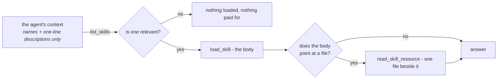

# Skills

A skill is know-how written once and attached to many agents: how refunds are
handled, what the house style is, which checks a report must pass before it goes
out.

The thing it replaces is an instructions field that grows. Twenty procedures in
one prompt means every run pays for all twenty, and the twenty-first pushes the
conversation out of the window. Skills invert that:



Twenty skills cost almost nothing; the twenty-first costs nothing either.

The other half of the point is who writes them. A skill is a row in the database,
editable in the UI, so a support lead can fix the refund policy on a Tuesday
afternoon. No deploy, no pull request, no engineer.

## The shape

```markdown
---
name: refund-policy
description: When a refund is given without asking, when it needs approval, and how to say no.
category: support
---

# Refunds

Most refund questions are decided by the order date and one exception. Check
those before escalating anything.

## Decide without asking
...
```

!!! tip "`description` is the field that decides whether the skill is ever loaded"

    It is the only part the model sees for free. Write it as *when to reach for
    this*, not as a title.

A skill may carry **resources** — further files beside it, loaded on demand.
`refund-policy` ships an `exceptions.md`; the body says when to consult it. That is
the same progressive disclosure one level down: detail that only some
conversations need does not have to be in the body that every relevant
conversation loads.

`category` is one of twenty suggestions (`support`, `engineering`, `finance`,
`legal`, `security`, `marketing`, …) and drives the filter on the skills listing. It
has no effect on what the agent sees — the model chooses by `description`, never by
category.

## How an agent reads one

Through the [`skills` capability](reference/capabilities.md#skills), which
contributes three tools:

| Tool | What it does |
|---|---|
| `list_skills` | Names and one-line descriptions of everything bound to this agent |
| `load_skill` | The full body of one skill |
| `read_skill_resource` | One file beside a skill |

A spec binds skills by id in `skill_ids`, so an agent sees the ones it was given
and nothing else. Enabling the capability with no skills bound is not useful —
give the agent skills, or leave the capability off.

## In a workspace, a skill is also files

An agent that has both skills and a
[workspace](reference/capabilities.md#files-shell) gets each skill written into
it as well:

```
/skills/<name>/SKILL.md      the body, with its name and description
/skills/<name>/<resource>    each resource, beside it
```

This is what makes a skill's script useful. A skill whose resource is
`reconcile.py` was previously handed to the model as text it could quote and not
run, while the same agent had `execute` one tool call away. On disk, it runs.

There is no `run_skill_script`. The sandbox's own `execute` already carries the
workspace's permission rules and the operator's ceilings; a second way to run
things would be a second set of rules to get wrong.

## An agent can propose a change; a person makes it

Those files are writable, and what the agent writes is **not** applied. A skill is
instructions every agent bound to it follows on every run — an agent that could
edit one directly could rewrite what another agent does, inside a conversation
nobody is reviewing, and the next reader would have no way to tell a considered
improvement from a hallucinated one.

So a write becomes a proposal, and it appears above the list on the Skills page
for anyone holding `skills:edit`:

- **Apply** rewrites the skill and bumps its version, which reaches every bound
  agent on its next run.
- **Discard** keeps the record. An agent proposing the same edit repeatedly is
  telling somebody something about the skill, and a deleted row makes that
  invisible.

!!! warning "A decision on a proposal is final"

    Applying twice would bump a version against a body already stored, and
    discarding something applied would tell a reader it never landed.

The proposal carries the whole body rather than a diff, so a reviewer weeks later is
comparing two complete versions instead of applying a patch somewhere it was never
meant to go. A directory the agent created with no `SKILL.md` in it, and one whose
frontmatter it mangled, are both refused rather than guessed at — and a *deleted*
resource is deliberately not a change, because a file the model never touched and
one it meant to delete leave the same absence.

Three turns of one conversation refining the same skill leave one proposal, not
three: a reviewer asked the same question three times has been given more work
rather than more information.

## Getting skills into an organization

**Write one.** Skills → New, in the UI. This is the normal path.

**The bundled ones are already there.** The repository ships three as worked
examples — `refund-policy`, `code-review` and `incident-report` — and every
organization starts with them: creating an organization copies the whole shipped
library in as ordinary skills, owned by the organization's owner and visible to
the organization. There is no Install button and no separate "ready-made" list —
the skills page shows one list, with a `built-in` badge on anything whose name
matches the shipped library.

**And they stay there.** The catalog grows with deploys, so the skills listing
tops itself up: a bundled skill the organization does not have yet is copied in
the next time anyone opens the page, matched by name so an edited copy is left
exactly as it is. An organization created before a deployment gained a new
bundled skill sees it on its next visit rather than never.

!!! warning "Deleting a built-in brings it back on the next listing"

    The top-up treats an absent bundled name as a gap to close. **Disable** one
    to retire it.

The seed command does the same from a terminal, for scripted setups:

```bash
uv run agenticos cmd seed-skills                    # every organization
uv run agenticos cmd seed-skills --org <org-id>     # one
uv run agenticos cmd seed-skills --dry-run          # say what would happen, do nothing
```

It is idempotent by name — a skill the organization already has is left exactly
as it is, so an edited refund policy survives a reseed.

`e2e/seed.setup.ts` also creates one through the UI, which is what the E2E suite
asserts against.

### Seeding copies

A seeded skill is an ordinary skill owned by the organization, editable from the
moment the organization exists. It is a copy, not a link.

That is deliberate. The point of a skill is that a support lead can fix the refund
policy without a deploy, and a live link back to the repository's copy would take
exactly that away — the organization would be reading a file only an engineer can
change. Editing is final in the ordinary way; deleting is not, because the
listing's top-up treats an absent bundled name as a gap to close. A built-in the
organization does not want is disabled, which every agent respects and nothing
overwrites.

### Why the library is bundled and not fetched

Adding a skill to the shipped library is a deploy. The alternative — importing from
a git URL — costs outbound network from the backend, a parser pointed at somebody
else's repository, and a promise about content nobody here has read. Each folder in
`app/core/catalog/skills/` is the same small promise the
[MCP catalog](mcp.md#the-catalog) makes: somebody looked at it.

## Skills or knowledge?

They answer different questions and the difference matters when an agent gets the
wrong one.

|  | Skills | [Knowledge](file-processing.md) |
|---|---|---|
| Contains | Procedure — how we do this | Documents — what we know |
| Written by | A person, deliberately | Ingested in bulk |
| Retrieved by | The model choosing a name | Semantic search over chunks |
| Cites | Nothing; it *is* the instruction | The passage and its source |
| Scale | Tens | Thousands of documents |

!!! example "Which is which"

    "Refunds over £500 need a manager" is a **skill**. The signed contract that
    says so is **knowledge**. An agent handling refunds usually wants both.

The two capabilities compose — `skills` for the procedure, `knowledge` for the
evidence.

## Access

Skills are organization-scoped resources, governed like agents and collections:
visibility plus per-row grants on top of the role. See
[Permissions](permissions.md#layer-3-visibility-and-grants).

!!! important "Binding a skill lends it"

    Every run of the agent reads the body and the files, whoever ran it - so
    publishing requires the *publisher* to hold `skills:view` on that row.

That check goes through `resolve_access`, so a grant
counts and a member who was shared one skill can bind it without being promoted.
A skill they cannot reach is refused as `Skill not found: <id>`, worded identically
to an id that does not exist: skills are bound by UUID from the API and from a
hand-edited draft, not only picked from the Builder's list, and a refusal that read
differently would map the organization's private skills one guess at a time. The
same check runs on an [inline specialist's](concepts.md#delegate-vs-inline-specialist)
`skill_ids`, reported with the specialist's name.

At run time nothing is re-checked: the frozen spec's skills are resolved inside the
run's organization and handed to the agent. That is the rule collections and
delegates already follow — [the reference is checked once, at
publish](permissions.md#delegation-is-not-a-privilege-boundary) — and the
alternative is worse in two specific ways. Every context with no subject (an API
key, an embedded widget, a channel message) is refused by `resolve_access` by
design, so a per-runner check would strip every skill from exactly those surfaces;
and where there is a subject, one published version would give a member — whose role
reaches shared skills only — thinner instructions than it gives a builder, with the
difference visible nowhere.

A skill deleted or disabled after publish is skipped with a warning rather than
failing the run — the agent is less capable, not broken.
