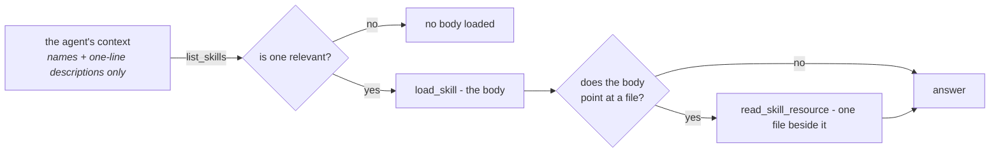

# Skille { #skills }

Skill to wiedza praktyczna zapisana raz i podpięta do wielu agentów: jak
obsługuje się zwroty pieniędzy, jaki jest styl firmowy, jakie sprawdzenia musi
przejść raport, zanim pójdzie na zewnątrz.

Zastępuje pole z instrukcjami, które rośnie.

Dwadzieścia procedur w jednym prompcie oznacza, że każdy run płaci za wszystkie
dwadzieścia, a dwudziesta pierwsza wypycha rozmowę poza okno kontekstu. Skille
odwracają tę zależność:



Dwadzieścia skilli kosztuje mniej więcej dwadzieścia *opisów* zamiast dwudziestu
*procedur*.

!!! note "Wykrywanie jest tanie, ale nie darmowe"

    `list_skills` odpowiada nazwą i opisem każdego podpiętego skilla, a ten wynik
    trafia do kolejnego zapytania do modelu — więc każdy skill, do którego agent
    jest podpięty, faktycznie kosztuje tokeny w turze, w której wykrywanie się
    uruchamia.

    To linijka na skilla zamiast całej treści na skilla i dlatego rachunek się spina.
    Nie jest to jednak powód, żeby podpinać nieograniczony katalog.

Druga połowa sensu to **kto je pisze**. Skill jest wierszem w bazie danych,
edytowalnym w UI, więc szef wsparcia może poprawić politykę zwrotów we wtorek po
południu. Bez deployu, bez pull requesta, bez inżyniera.

!!! info "Skill, plik kontekstowy czy kolekcja wiedzy?"

    **Skill** to procedura, którą model wczytuje, kiedy uzna, że przyszło na nią
    zadanie. [Plik kontekstowy](context.md) to wiedza stała — krótka, zawsze
    istotna, wstrzykiwana albo czytana na żądanie.
    [Kolekcja wiedzy](file-processing.md) to korpus zbyt duży, żeby go przeczytać,
    dostępny przez wyszukiwanie.

## Kształt { #the-shape }

```markdown
---
name: refund-policy
description: When a refund is given without asking, when it needs approval, and how to say no.
category: support
---

# Refunds

Most refund questions are decided by the order date and one exception. Check
those before escalating anything.

## Decide without asking
...
```

!!! tip "`description` to pole, które decyduje, czy skill kiedykolwiek zostanie wczytany"

    To jedyna część, którą model widzi za darmo. Napisz je jako **kiedy po to
    sięgnąć**, a nie jako tytuł.

Skill może nieść **zasoby** — kolejne pliki obok niego, wczytywane na żądanie.
`refund-policy` ma przy sobie `exceptions.md`, a treść mówi, kiedy do niego
zajrzeć.

To to samo stopniowe odsłanianie, tylko poziom niżej: szczegół potrzebny tylko
części rozmów nie musi siedzieć w treści, którą wczytuje każda istotna rozmowa.

`category` to jedna z dwudziestu sugestii (`support`, `engineering`, `finance`,
`legal`, `security`, `marketing`, …) i steruje filtrem na liście skilli. Nie ma
wpływu na to, co widzi agent — model wybiera po `description`, nigdy po
kategorii.

## Jak agent go czyta { #how-an-agent-reads-one }

Przez [capability `skills`](reference/capabilities.md#skills), która wnosi trzy
narzędzia:

| Narzędzie | Co robi |
|---|---|
| `list_skills` | Nazwy i jednolinijkowe opisy wszystkiego, co jest podpięte do tego agenta |
| `load_skill` | Pełna treść jednego skilla |
| `read_skill_resource` | Jeden plik obok skilla |

Spec podpina skille po id w `skill_ids`, więc agent widzi te, które dostał, i nic
poza tym.

Włączenie capability bez podpiętych skilli nie ma sensu — albo daj agentowi
skille, albo zostaw capability wyłączoną.

## W workspace skill to także pliki { #in-a-workspace-a-skill-is-also-files }

Agent, który ma jednocześnie skille i
[workspace](reference/capabilities.md#files-shell), dostaje każdy skill zapisany
również w nim:

```
/skills/<name>/SKILL.md      the body, with its name and description
/skills/<name>/<resource>    each resource, beside it
```

To właśnie sprawia, że skrypt w skillu jest do czegokolwiek. Skill, którego
zasobem jest `reconcile.py`, był wcześniej podawany modelowi jako tekst, który
mógł zacytować, ale nie uruchomić, podczas gdy ten sam agent miał `execute` w
odległości jednego wywołania narzędzia. Na dysku — działa.

!!! note "Nie ma `run_skill_script`"

    Własne `execute` sandboksa niesie już reguły uprawnień workspace'u i limity
    operatora. Drugi sposób uruchamiania rzeczy byłby drugim zestawem reguł do
    pomylenia.

## Agent może zaproponować zmianę; wprowadza ją człowiek { #an-agent-can-propose-a-change-a-person-makes-it }

Te pliki są zapisywalne, a to, co agent zapisze, **nie** zostaje zastosowane.

Skill to instrukcje, którymi w każdym runie kieruje się każdy podpięty do niego
agent. Agent, który mógłby go edytować bezpośrednio, mógłby przepisać to, co robi
inny agent, wewnątrz rozmowy, której nikt nie przegląda, a kolejny czytelnik nie
miałby jak odróżnić przemyślanego ulepszenia od zahalucynowanego.

Dlatego zapis staje się **propozycją** i pojawia się nad listą na stronie Skills
każdemu, kto ma `skills:edit`:

- **Apply** przepisuje skilla i podbija jego wersję, która dociera do każdego
  podpiętego agenta przy jego następnym runie.
- **Discard** zachowuje zapis. Agent proponujący w kółko tę samą zmianę mówi
  komuś coś o skillu, a usunięty wiersz czyni to niewidocznym.

!!! warning "Decyzja o propozycji jest ostateczna"

    Zastosowanie dwa razy podbiłoby wersję wobec treści już zapisanej, a
    odrzucenie czegoś zastosowanego mówiłoby czytelnikowi, że nigdy nie weszło.

Propozycja niesie **całą treść**, a nie diff, więc recenzent kilka tygodni
później porównuje dwie kompletne wersje, zamiast nakładać łatkę w miejscu, do
którego nigdy nie była przeznaczona.

Dwie rzeczy zostają odrzucone, zamiast być zgadywane: katalog utworzony przez
agenta bez `SKILL.md` w środku oraz taki, któremu agent zepsuł frontmatter. A
*usunięty* zasób celowo nie jest zmianą, bo plik, którego model nigdy nie
dotknął, i taki, który zamierzał usunąć, zostawiają po sobie ten sam brak.

Trzy tury jednej rozmowy dopracowujące ten sam skill zostawiają **jedną**
propozycję, nie trzy. Recenzent zapytany trzy razy o to samo dostał więcej pracy,
a nie więcej informacji.

## Jak skille trafiają do organizacji { #getting-skills-into-an-organization }

**Napisz go.** Skills → New, w UI. To zwykła droga.

**Te dołączone już tam są.** Repozytorium dostarcza trzy jako przykłady z
rozwiązaniem — `refund-policy`, `code-review` i `incident-report` — i każda
organizacja zaczyna z nimi. Utworzenie organizacji kopiuje całą dostarczoną
bibliotekę jako zwykłe skille, należące do właściciela (owner) organizacji i
widoczne dla organizacji.

Strona skilli pokazuje jedną listę, z odznaką `built-in` przy wszystkim, czego
nazwa pasuje do dostarczonej biblioteki. Tych trzech się nie wybiera — one po
prostu przychodzą.

**I tam zostają.** Katalog rośnie wraz z deployami, więc lista sama się
uzupełnia: dołączony skill, którego organizacja jeszcze nie ma, zostaje
skopiowany, gdy ktokolwiek następnym razem otworzy stronę, dopasowywany po
nazwie, więc edytowana kopia zostaje dokładnie taka, jaka jest.

Organizacja utworzona, zanim deployment dostał nowy dołączony skill, zobaczy go
przy następnej wizycie, a nie nigdy.

!!! warning "Usunięcie built-ina przywraca go przy następnym wyświetleniu listy"

    Uzupełnianie traktuje brakującą dołączoną nazwę jako lukę do zamknięcia.
    Żeby wycofać taki skill, **wyłącz** go przyciskiem **Disable**.

Komenda seed robi to samo z terminala, na potrzeby skryptowanych instalacji:

```bash
uv run agenticos cmd seed-skills                    # every organization
uv run agenticos cmd seed-skills --org <org-id>     # one
uv run agenticos cmd seed-skills --dry-run          # say what would happen, do nothing
```

Jest idempotentna po nazwie — skill, który organizacja już ma, zostaje dokładnie
taki, jaki jest, więc edytowana polityka zwrotów przeżywa ponowny seed.

`e2e/seed.setup.ts` tworzy jednego również przez UI i to na nim opiera swoje
asercje zestaw E2E.

### Galeria — siedemdziesiąt kolejnych i żaden nie przychodzi nieproszony { #the-gallery-seventy-more-and-none-of-them-arrive-uninvited }

**Skills → Skill gallery** otwiera katalog gotowych skilli pogrupowanych według
branż: ochrona zdrowia, finanse i ubezpieczenia, e-commerce i print on demand,
zespoły software'owe, sektor publiczny i usługi komunalne, usługi prawne i
profesjonalne, produkcja i logistyka. Po dziesięć w każdej.

Wybierz branżę, a potem zainstaluj jeden skill albo całą półkę. Od tej chwili to
zwykły skill, który organizacja posiada i edytuje, dokładnie jak dołączony.

!!! info "Galeria działa na zaproszenie i na tym polega cała różnica"

    Dołączona trójka mieszka w `app/core/catalog/skills/` i jest kopiowana
    automatycznie do **każdej** organizacji. Galeria mieszka w
    `app/core/catalog/skill_gallery/` i nie jest kopiowana do **żadnej** — czyta
    ją ten sam parser, z drugiego katalogu, i nigdy nie jest seedowana.

    Siedemdziesiąt branżowych skilli w pierwszym katalogu byłoby siedemdziesięcioma
    wierszami, o które nikt nie prosił, w każdym tenancie, przy następnym deployu.

Instalacja półki, z której masz już jeden skill, instaluje resztę i zostawia
tamten w spokoju: istniejąca nazwa jest pomijana, a nie nadpisywana, a odpowiedź
na żądanie mówi, co zainstalowano, co pominięto i jakiego klucza ten deployment
nie dostarcza.

Dodanie do galerii wygląda tak samo jak dodanie dołączonego skilla — katalog z
`SKILL.md`, pod branżą, do której należy — z jedną dodatkową regułą: **jego nazwa
nie może kolidować z dołączonym skillem ani z innym skillem z galerii.**
Instalacja dopasowuje po nazwie, więc kolizja oznaczałaby ciche pomijanie na
zawsze. Test czyta całą siedemdziesiątkę i wywala się na kolizji.

### Seed tworzy kopie { #seeding-copies }

Zaseedowany skill to zwykły skill należący do organizacji, edytowalny od chwili,
w której organizacja istnieje. To **kopia**, nie link.

To celowe. Sens skilla polega na tym, że szef wsparcia może poprawić politykę
zwrotów bez deployu, a żywy link do kopii z repozytorium odebrałby dokładnie to —
organizacja czytałaby plik, który może zmienić tylko inżynier.

Edycja jest ostateczna w zwykły sposób. Usunięcie nie, bo uzupełnianie listy
traktuje brakującą dołączoną nazwę jako lukę do zamknięcia, więc built-in,
którego organizacja nie chce, zostaje **wyłączony** — co respektuje każdy agent i
czego nic nie nadpisuje.

### Dlaczego biblioteka jest dołączona, a nie pobierana { #why-the-library-is-bundled-and-not-fetched }

Dodanie skilla do dostarczanej biblioteki albo do galerii to deploy.

Alternatywa — import z URL-a gita — kosztuje ruch wychodzący z backendu, parser
wycelowany w czyjeś repozytorium i obietnicę dotyczącą treści, której nikt tutaj
nie przeczytał. Każdy katalog w `app/core/catalog/skills/` i
`app/core/catalog/skill_gallery/` jest tą samą małą obietnicą, którą składa
[katalog MCP](mcp.md#the-catalog): ktoś na to spojrzał.

## Skille czy wiedza? { #skills-or-knowledge }

Odpowiadają na różne pytania, a różnica ma znaczenie, kiedy agent dostanie nie
to, co trzeba.

|  | Skille | [Wiedza](file-processing.md) |
|---|---|---|
| Zawiera | Procedurę — jak to robimy | Dokumenty — co wiemy |
| Pisane przez | Człowieka, świadomie | Wciągane hurtowo |
| Pobierane przez | Model wybierający nazwę | Wyszukiwanie semantyczne po chunkach |
| Cytuje | Nic; *jest* instrukcją | Fragment i jego źródło |
| Skala | Dziesiątki | Tysiące dokumentów |

!!! example "Co jest czym"

    „Zwroty powyżej 500 £ wymagają zgody menedżera” to **skill**. Podpisana
    umowa, która tak stanowi, to **wiedza**.

    Agent obsługujący zwroty zwykle chce obu naraz, a te dwie capabilities
    składają się w całość — `skills` na procedurę, `knowledge` na dowód.

## Dostęp { #access }

Skille są zasobami w zakresie organizacji, rządzonymi tak jak agenty i kolekcje:
widoczność plus granty na poszczególnych wierszach na wierzchu roli. Zobacz
[Uprawnienia](permissions.md#layer-3-visibility-and-grants).

!!! important "Podpięcie skilla wypożycza go"

    Każdy run agenta czyta treść i pliki, niezależnie od tego, kto go uruchomił —
    więc publikacja wymaga, żeby to **publikujący** miał `skills:view` na tym
    wierszu.

To sprawdzenie idzie przez `resolve_access`, więc grant się liczy: członek, z
którym udostępniono jeden skill, może go podpiąć bez awansu roli.

Skill, do którego nie sięga, zostaje odrzucony jako `Skill not found: <id>`,
sformułowane identycznie jak dla id, które nie istnieje. Skille podpina się po
UUID z API i z ręcznie edytowanego draftu, a nie tylko wybiera z listy w
Builderze, a odrzucenie brzmiące inaczej mapowałoby prywatne skille organizacji,
zgadywanie po zgadywaniu.

To samo sprawdzenie działa na `skill_ids`
[specjalisty inline](concepts.md#delegate-vs-inline-specialist) i jest
raportowane wraz z nazwą specjalisty.

W czasie runa nic nie jest sprawdzane ponownie. Skille z zamrożonego speca są
rozwiązywane wewnątrz organizacji runa i wręczane agentowi — zgodnie z regułą,
którą kolekcje i delegaci już stosują, że
[referencja jest sprawdzana raz, przy publikacji](permissions.md#delegation-is-not-a-privilege-boundary).

Alternatywa jest gorsza na dwa konkretne sposoby:

- Każdy kontekst bez podmiotu — klucz API, osadzony widget, wiadomość z kanału —
  zostaje z założenia odrzucony przez `resolve_access`, więc sprawdzanie przy
  każdym uruchomieniu zdarłoby każdy skill dokładnie z tych powierzchni.
- Tam, gdzie podmiot *jest*, jedna opublikowana wersja dawałaby członkowi —
  którego rola sięga wyłącznie udostępnionych skilli — chudsze instrukcje niż
  daje budującemu, a różnica nie byłaby widoczna nigdzie.

Skill usunięty albo wyłączony po publikacji jest pomijany z ostrzeżeniem, zamiast
wywracać run. Agent jest mniej zdolny, nie zepsuty.

## Podsumowanie { #recap }

- Skill to **procedura**, napisana przez człowieka i wczytywana tylko wtedy, gdy
  model uzna jego *description* za istotny — wykrywanie kosztuje linijkę na
  skilla, a treść nie kosztuje nic, dopóki nie zostanie otwarta.
- W workspace'ie skill to także **pliki** i to właśnie czyni jego skrypty
  uruchamialnymi.
- Agent **proponuje** zmianę; człowiek ją stosuje, raz, a decyzja jest ostateczna.
- Podpięcie skilla **wypożycza** go, więc publikujący musi móc go zobaczyć — a w
  czasie runa nic nie jest sprawdzane ponownie.
- **Galeria** to siedemdziesiąt gotowych skilli według branż, instalowanych na
  życzenie — w odróżnieniu od dołączonej trójki, która przychodzi sama.
