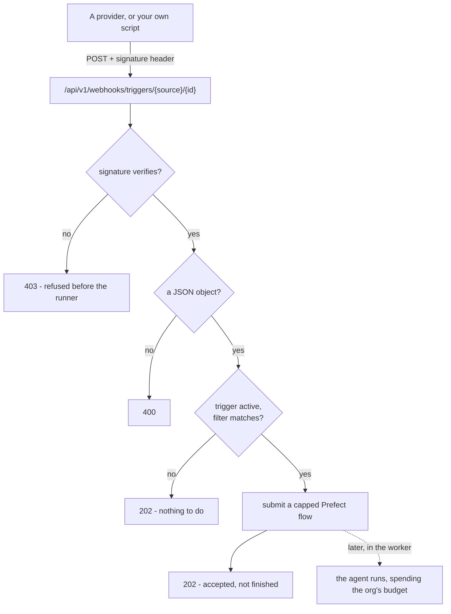

# Einen Event-Trigger einrichten { #setting-up-an-event-trigger }

Ein **Event-Trigger** löst einen Agent aus, wenn woanders etwas passiert.

Es gibt zwei Wege, auf denen das bei uns ankommt, und welchen eine Quelle nutzt,
ist die Sache der Quelle und nicht Ihre:

- **Geschoben.** Ein Provider schickt per POST eine signierte Payload — ein
  GitHub-Issue, oder alles, was signiertes JSON senden kann (die Quelle **API**).
- **Abgefragt.** Die Plattform liest ein verbundenes Konto nach einem Zeitplan.
  **Gmail** ist so eine: es wird nichts an uns gepostet, es gibt also keine URL
  zu konfigurieren und kein Secret zu verwahren. Sie verbinden das Postfach, und
  das ist die gesamte Einrichtung.

[Konzepte](concepts.md#trigger) behandelt, was ein Trigger *ist* und wie sich ein
ausgelöster Run verhält; [Governance](governance.md) behandelt, was er ausgibt
und wie eine Ablehnung behandelt wird.

Diese Seite ist das, was Sie als Nächstes tun: wie Sie einen echten Provider auf
den Webhook zeigen lassen, was die Zustellung enthalten muss und wie Sie das
Ganze von einem Laptop aus testen.

!!! tip "Wenn Sie nur die Uhr brauchen, wollen Sie einen Schedule"

    Kein Webhook, kein Secret, kein zu konfigurierender Provider.

    Beide Arten können von einem vorbereiteten **Template** ausgehen
    (`GET /trigger-templates`). Ein Schedule-Template — "fasse jeden Werktagmorgen
    meine offenen Pull Requests zusammen" — füllt den Prompt und einen vernünftigen
    Takt vor. Ein Event-Template — "triagiere das neue Issue", "entwirf eine Antwort
    auf die E-Mail" — füllt den Prompt am Nachrichtenschritt seiner eigenen Quelle
    vor. Keines beginnt bei einem leeren Feld.

Alles Weitere unten gilt dem Event-Fall.

## Wo sie im Produkt liegen, und wie man sie nennt { #where-they-live-in-the-product-and-what-to-call-them }

**Routines** ist der Oberbegriff - die Navigation, die Seite, das eigene Panel des
Agents, die Chat-Seitenleiste und die Dashboard-Karte verwenden alle dieses eine
Wort, eine Person trifft also überall auf dasselbe Substantiv, wo immer sie
ankommt. Die beiden Familien darunter bleiben unterschieden, weil sie sich
unterschiedlich verhalten: ein **Schedule** löst nach der Uhr aus, ein **Trigger**
löst bei einer Ankunft aus. Was sich nicht unterscheiden durfte, war der
Oberbegriff, und so kam es, dass die Navigation "Routines" über einem Panel mit
der Überschrift "Schedules & triggers" sagte (#594).

Vier Oberflächen, eine Liste:

| Wo | Wofür es da ist |
|---|---|
| **Routines** (`/routines`) | Jede Routine der Organisation, und die beiden Wege, eine zu beginnen |
| Der Tab **Availability** eines Agents | Nur die dieses Agents, neben der Stelle, an der seine Exposure konfiguriert wird |
| Der Abschnitt Routines in der **Chat**-Seitenleiste | Was der Agent, mit dem Sie sprechen, von sich aus tut |
| Die Dashboard-Karte **Routines** | Die nächsten zuerst, mit dem Ausgang der letzten Auslösung - eine Routine, die stündlich fehlschlägt, ist sonst nirgends auf dieser Seite sichtbar |

Die Dashboard-Karte lässt sich über `Customize` hinzufügen und liegt in der
Standardanordnung unter **Needs attention**. Sie liest dieselbe organisationsweite
Liste, wer also die Agents sehen darf, sieht ihre Routinen; Ausgang und Kosten in
jeder Zeile brauchen `runs:view` und fehlen ohne es schlicht.

## Die Mechanik, einmal { #the-mechanism-once }

Ein Event-Trigger gibt Ihnen zwei Dinge: eine **Webhook-URL** und ein
**Signatur-Secret**. Ein Provider schickt seine Payload per POST an die URL und
signiert die Anfrage; die Plattform berechnet die Signatur neu und löst den Agent
nur aus, wenn beide übereinstimmen.



- **Die URL** wird auf der einen öffentlichen Adresse des Deployments
  (`PUBLIC_BASE_URL`) aufgebaut und nicht auf dem Origin des Dashboards - der
  Webhook wird vom API-Host bedient, der meist ein anderer Origin ist als die UI.
  Ihre Form lautet:

  ```
  {PUBLIC_BASE_URL}/api/v1/webhooks/triggers/{source}/{trigger_id}
  ```

  `source` ist entweder `github` oder `webhook` (der Leitungsname der Quelle API);
  `trigger_id` ist eine nicht erratbare UUID. Der Dialog füllt das für Sie aus -
  kopieren Sie es, bauen Sie es nicht von Hand. **`gmail` hat keine URL**: eine
  abgefragte Quelle hat keine eingehende Tür, und ein POST, der eine benennt, wird
  wie jede Zustellung ohne etwas zu tun beantwortet.

- **Die Signatur** ist `HMAC-SHA256` über die **exakten rohen Anfrage-Bytes**, mit
  dem Signatur-Secret als Schlüssel, hex-kodiert und mit `sha256=` vorangestellt.
  Sie reist in einem Header mit, der von der Quelle abhängt:

  | Quelle | Header |
  |---|---|
  | `github` | `X-Hub-Signature-256` |
  | `webhook` | `X-Signature-256` |

  GitHub signiert seine Zustellungen von Haus aus unter seinem eigenen Header
  `X-Hub-Signature-256`, Sie geben GitHub also das Secret und es übernimmt das
  Signieren. Die Quelle API verwendet dasselbe Verfahren unter `X-Signature-256`
  wieder, das setzen muss, was auch immer Sie auf die URL zeigen lassen. Eine
  **abgefragte** Quelle signiert nichts und hält kein Secret: sie wurde nicht
  adressiert, sie wurde gelesen, und die OAuth-Zustimmung des Kontos ist das, was
  das Lesen autorisiert hat.

!!! danger "Die Signatur ist keine Zierde"

    Ohne sie ist die URL das Einzige zwischen einer fremden Person und dem
    Modellbudget Ihrer Organisation - und URLs sickern durch: in Logs, in die
    Zustellhistorie eines Providers, in einen Screenshot in einem Support-Ticket.
    Wer die URL hat, könnte den Agent nach Belieben auslösen und gegen Ihre
    Obergrenzen ausgeben. Das Secret ist das, was eine Zustellung *authentisch*
    macht statt bloß *korrekt adressiert*.

Eine Anfrage, deren Signatur sich nicht verifizieren lässt, wird mit einer `403`
abgelehnt, bevor der Runner überhaupt erreicht wird; das Secret ist im
[Vault](secrets.md) versiegelt und taucht in keinem Read, keiner Auflistung und
nicht in der URL auf.

!!! info "Die `202` bedeutet angenommen, nicht fertig"

    Eine passende Zustellung wird als eigener `run-scheduled-trigger`-Flow
    eingereicht, und der Agent läuft im Worker, der Provider bekommt seine Antwort
    also in einem schnellen Prefect-Aufruf, statt ein Modell abzuwarten. Lesen Sie
    eine `202` nicht als "der Agent hat geantwortet" - lesen Sie dafür den Run in
    Activity.

Eine verifizierte Zustellung, für die es nichts zu tun gibt - ein inaktiver
Trigger, oder eine Payload, auf die der Filter nicht passt - antwortet genauso mit
`202` wie eine auslösende, das Secret zu halten sagt Ihnen also nichts darüber,
welche Trigger es gibt. Ein Body, der kein JSON-Objekt ist, ist eine `400`.

## Das Secret rotieren und den Filter bearbeiten { #rotating-the-secret-and-editing-the-filter }

Die URL ist die **Identität** des Triggers und ändert sich nie. Das Secret ist
eine **Zugangsinformation**, und wie jeder andere Key in diesem Produkt kann es
rotiert werden — ein erneutes Versiegeln und ein frischer Klartext, der genau
einmal gezeigt wird.

```
POST /agents/{agent_id}/triggers/{trigger_id}/rotate-secret
```

Es erzeugt ein neues Secret, versiegelt es und gibt den Trigger mit einmal
gesetztem `reveal_secret` zurück — dasselbe Feld, das auch das Anlegen verwendet.
Rotieren Sie in dem Moment, in dem ein Secret durchgesickert sein könnte; das alte
verifiziert sofort nicht mehr.

Bei einem Hook, den die Plattform selbst registriert hat (`auto_webhook`),
registriert die Rotation ihn mit dem neuen Secret neu, seine Zustellungen
verifizieren also weiterhin und es gibt nichts zu enthüllen. Es sei denn, das
Konto kann ihn nicht mehr registrieren, dann fällt der Trigger auf `manual` zurück
und das enthüllte Secret ist das, was Sie neu einfügen.

Ein Schedule hat kein Secret, einen zu rotieren wird also abgelehnt.

**Welche Issue-Aktionen auslösen, ist ein Filter und kein anderer Trigger**, es ist
also an Ort und Stelle bearbeitbar. Schicken Sie dem Trigger ein `PATCH` mit einer
neuen `event_config`, und sie wird gegen die Regeln der Quelle genauso neu
validiert, wie das Anlegen sie validiert — ein unbekannter Schlüssel wird
abgelehnt, statt gespeichert zu werden und auf nichts zu passen.

Die Quelle und das Secret sind auf diesem Weg nicht bearbeitbar. Einen
Event-Trigger auf eine andere Quelle umzuhängen ist ein neuer Trigger: löschen Sie
diesen, legen Sie jenen an.

## Gmail (~1 Minute, und nirgends ein Secret) { #gmail-1-minute-and-no-secret-anywhere }

Gmail wird abgefragt, die Einrichtung ist also ein Zustimmungsbildschirm und sonst
nichts.

1. **Verbinden Sie das Konto.** *Routines → New event trigger → Gmail → Connect
   account*. Das braucht `mcp:manage`, dieselbe Berechtigung, die jedes andere
   verbundene Konto braucht.
2. **Wählen Sie, was auslöst**: jede neue Nachricht, nur der Posteingang, oder als
   wichtig markiert. Grenzen Sie weiter ein mit einem Teilstring in Absender oder
   Betreff, oder mit einem Gmail-Label.
3. **Schreiben Sie den Prompt**, oder gehen Sie vom Template "draft a reply" aus.

Es gibt keine URL zum Einfügen und kein Secret zum Speichern, weil nichts an uns
postet. Was Sie darüber wissen sollten, wie es liest:

- **Einmal pro Minute.** Der Heartbeat fragt Gmail, was seit dem letzten Blick
  angekommen ist, die schlimmstenfalls auftretende Latenz ist also eine Minute.
  Das ist Absicht: die Alternative - `users.watch` in ein Google-Cloud-Pub/Sub-Topic -
  ist echtzeitfähig und kostet ein Topic und ein Abonnement als *Deployment*-
  Voraussetzungen, dazu eine Registrierung, die alle sieben Tage abläuft und etwas
  braucht, das sie erneuert.
- **Das Verbinden löst nichts aus - und verliert nichts.** Die Position des
  Postfachs wird in dem Moment genommen, in dem die Zustimmung abgeschlossen ist,
  das Verbinden löst den Agent also nicht einmal pro bereits dort liegender
  Nachricht aus, und Post, die zwischen der Zustimmung und dem ersten Heartbeat
  eintrifft, landet trotzdem nach dieser Position und löst aus.
- **Ein Schwall ist begrenzt.** Ein Tick liest höchstens 25 neue Nachrichten
  vollständig. Der Abwurf einer Mailingliste wird nicht zu 400 Agent-Runs; die
  Position rückt trotzdem vor, der Rückstand wird also nicht ewig neu gelesen.
- **Eine Nachricht kann mehrere Trigger auslösen.** Anders als bei einem Webhook,
  dessen URL genau einen benennt - "jede Nachricht" und "als wichtig markiert" auf
  demselben Postfach lösen beide aus.
- **Eine verpasste Woche repariert sich selbst.** Google hält etwa eine Woche
  Historie vor. Ein Cursor, der älter ist als das, synchronisiert sich auf jetzt,
  statt das Postfach für immer stillzulegen.

Das Deployment braucht einen Google-OAuth-Client (`GOOGLE_CLIENT_ID` /
`GOOGLE_CLIENT_SECRET` - dasselbe Paar, das die Google-Anmeldung verwendet) mit
aktivierter Gmail-API. Ohne einen sagt die Karte das, statt eine
Connect-Schaltfläche anzubieten, die nur scheitern könnte. Anders als bei GitHub
gehört der Client dem *Deployment* und nicht jeder Organisation: Googles
Zustimmungsbildschirm für einen Postfach-Scope braucht ein verifiziertes Projekt,
das ein Betreiber einmal registriert und das kein Tenant von ihm überhaupt
registrieren kann.

## Ein GitHub-Rezept (~5 Minuten) { #a-github-recipe-5-minutes }

GitHub signiert seine Zustellungen selbst, das ist also die Quelle, die sich am
schnellsten verdrahten lässt. Legen Sie zuerst den Trigger mit der Quelle
**GitHub** an, kopieren Sie seine Webhook-URL und sein Signatur-Secret, dann:

1. Gehen Sie im Repository, das Sie beobachten wollen, zu
   **Settings → Webhooks → Add webhook**.
2. **Payload URL** - fügen Sie die Webhook-URL aus dem Trigger-Dialog ein.
3. **Content type** - wählen Sie `application/json`. Nicht
   `application/x-www-form-urlencoded`: die Signatur deckt genau die Bytes ab, die
   GitHub sendet, und die Formularkodierung ändert sie, eine formularkodierte
   Zustellung verifiziert also gegen nichts und kommt mit `403` zurück.
4. **Secret** - fügen Sie das Signatur-Secret ein.
5. **Which events?** - wählen Sie *Let me select individual events*, kreuzen Sie
   **Issues** an und entfernen Sie alle anderen Haken. Nur `issues`-Webhooks
   erreichen den Auslösepfad überhaupt (der Event-Typ wird aus dem Header
   `X-GitHub-Event` gelesen); alles andere wird verworfen. Grenzen Sie mit dem
   Filter des Triggers ein, *welche* Issue-Aktionen auslösen - standardmäßig ist
   das das Anlegen eines Issues (`opened`).
6. **Add webhook.** GitHub sendet ein `ping`, was kein `issues`-Event ist, es wird
   den Agent also nicht auslösen - das ist erwartet.

Wird eine Zustellung abgelehnt, diagnostizieren Sie das im Tab **Recent
Deliveries** des Webhooks bei GitHub: er zeigt die genaue Anfrage und die Antwort.
Eine `403` dort ist eine nicht passende Signatur - fast immer ist das Secret
falsch oder der Content Type ist nicht `application/json`.

## Der Payload-Vertrag für über ein Relay zugestellte Quellen { #the-payload-contract-for-relay-delivered-sources }

GitHub besitzt die Form seiner Payload, und die einer abgefragten Quelle wird von
dem Adapter gelesen, der sie liest - die Filter eines Gmail-Triggers werden gegen
die Nachricht selbst abgeglichen, es gibt also keinen Vertrag, den Sie erfüllen
müssten.

Der, der Ihnen gehört, ist die Auffangquelle `webhook` - **API** in den Dialogen.
Sie hat **keinen Filter**: eine verifizierte Zustellung löst aus, und der gesamte
JSON-Body wird an den Prompt angehängt. Nutzen Sie sie für alles, was kein Portal
abdeckt - das Beobachten eines Feeds, für den kein Provider eine API anbietet
(eine LinkedIn-Seite, ein Marktplatz-Inserat), oder irgendein Werkzeug, das POSTen
kann - wobei das von Ihnen geschriebene Relay das Beobachten übernimmt.

Früher gab es hier eine Quelle `email`, und sie war genau diese unter einem
anderen Namen: sie benannte zwei Filterfelder um und verlangte von Ihnen, ein
Relay zu betreiben - einen Code-Schritt in Zapier oder Make, ein kleines Skript -,
das JSON signierte und an uns postete, weil nichts in diesem Produkt Post
empfangen konnte. Sie wurde aus demselben Grund entfernt wie `linkedin`: ein
Dropdown-Eintrag, dessen Name eine Integration verspricht, die es nicht gibt.
Gmail hat sie als echtes verbundenes Konto ersetzt (oben), und ein per Relay
gespeistes Postfach ist die Quelle API mit einem dokumentierten Beispiel.

**Eine per Relay gespeiste E-Mail, als Quelle API:**

```json
{ "from": "billing@acme.com", "subject": "Invoice #4021", "body": "…" }
```

Auf diese Namen filtert nichts mehr, der gesamte Body erreicht also den Prompt und
der Agent liest ihn. Wenn Sie das *Filtern* wollen, verbinden Sie stattdessen das
Postfach.

## Eine Zustellung selbst signieren { #signing-a-delivery-yourself }

Für die generische Quelle `webhook` (und um jede Quelle von Hand zu testen)
signieren Sie die Anfrage selbst. Zwei Fußangeln entscheiden darüber, ob die
Signatur verifiziert, denn beide verändern die Bytes:

- **Signieren Sie die Bytes, die Sie senden, und nur diese.** `echo` hängt einen
  abschließenden Zeilenumbruch an, der mitsigniert, aber vielleicht nicht
  mitgesendet wird, oder gesendet, aber nicht signiert; nutzen Sie `printf '%s'`
  und übergeben Sie den Body mit `curl --data-raw`, damit nichts hinzugefügt oder
  interpretiert wird.
- **Serialisieren Sie nicht neu.** Ein Dict zu signieren und es dann von Ihrem
  HTTP-Client neu kodieren zu lassen erzeugt andere Bytes (umsortierte Schlüssel,
  andere Abstände). Signieren Sie eine Zeichenkette und senden Sie *dieselbe*
  Zeichenkette.

=== "curl"

    ```bash
    SECRET='your-signing-secret'
    URL='https://api.example.com/api/v1/webhooks/triggers/webhook/<trigger_id>'
    BODY='{"hello":"world"}'

    SIG="sha256=$(printf '%s' "$BODY" | openssl dgst -sha256 -hmac "$SECRET" | sed 's/^.* //')"

    curl -sS -X POST "$URL" \
      -H 'Content-Type: application/json' \
      -H "X-Signature-256: $SIG" \
      --data-raw "$BODY"
    ```

=== "Python (httpx)"

    ```python
    import hashlib
    import hmac

    import httpx

    secret = b"your-signing-secret"
    url = "https://api.example.com/api/v1/webhooks/triggers/webhook/<trigger_id>"
    body = b'{"hello":"world"}'

    signature = "sha256=" + hmac.new(secret, body, hashlib.sha256).hexdigest()

    # content=body sends these exact bytes. json=... would re-serialize and sign nothing.
    httpx.post(
        url,
        content=body,
        headers={"Content-Type": "application/json", "X-Signature-256": signature},
    )
    ```

Für die Quelle `github` ist der Algorithmus identisch; nur der Headername wechselt
zu `X-Hub-Signature-256`.

## Zapier und Make können das ohne einen Code-Schritt nicht { #zapier-and-make-cannot-do-this-without-a-code-step }

!!! warning "Keines von beiden hat eine HMAC-Aktion"

    Ihre üblichen "POST an einen Webhook"-Schritte senden den Body, können ihn aber
    nicht signieren, jede Zustellung kommt also unsigniert an und wird mit `403`
    abgelehnt. Planen Sie eine Stunde mit einem Code-Schritt ein, nicht fünf Minuten
    Klicken.

Es ist verlockend, in Zapier oder Make nach einer No-Code-Webhook-Aktion zu
greifen. Sie müssen deren **Code-Schritt** hinzufügen (Zapiers *Code by Zapier*,
Makes Modul *Custom JS / functions*), den HMAC als `sha256=<hex>` über genau den
Body berechnen, den Sie senden werden, und daraus den Header `X-Signature-256`
setzen.

Das funktioniert, aber seien Sie ehrlich über den Aufwand: es ist grob eine Stunde
mit einem Code-Schritt, nicht fünf Minuten Klicken. Wenn Sie nur den Trigger von
Anfang bis Ende nachweisen wollen, signieren Sie zuerst eine Anfrage von Hand mit
dem Schnipsel oben.

## Lokal testen { #testing-locally }

!!! tip "Probieren Sie *Run now*, bevor Sie einen Provider einrichten"

    Es löst jede Art von Trigger einmal auf Anforderung aus, ohne Signatur und ohne
    beteiligten Webhook - der schnellste Weg, sich zu vergewissern, dass der Agent,
    sein Prompt und sein Budget sich wie erwartet verhalten.

Auf einem Laptop ist `PUBLIC_BASE_URL` standardmäßig `http://localhost:8000`, die
URL, die der Dialog Ihnen gibt, ist von GitHub oder einem gehosteten Relay aus
also nicht erreichbar - sie können Ihre Maschine nicht sehen. Zwei Wege
hindurch:

- **Nutzen Sie einfach Run now.** *Run now* löst jede Art von Trigger einmal auf
  Anforderung aus - ein Schedule löst ein zusätzliches Mal aus, ohne dass sein Takt
  berührt wird, und ein **Event-Trigger löst ebenfalls aus**, als manuelle
  Testauslösung: der Agent läuft mit seinem Basis-Prompt, **ohne Zustellkontext,
  ohne Signatur und ohne beteiligten Webhook**. Es ist der schnellste Weg, sich zu
  vergewissern, dass der Agent, sein Prompt und sein Budget sich wie erwartet
  verhalten, ganz ohne eingerichteten Provider. Ein inaktiver (pausierter) Trigger
  wird respektiert - *Run now* tut einem solchen nichts. Seine eine Lücke ist, dass
  es weder den Signaturpfad noch eine echte Payload ausübt, es wird also weder ein
  falsches Secret noch ein falsch benanntes Feld aufdecken.

- **Legen Sie den Port über einen Tunnel frei**, wenn Sie doch den echten
  Webhook-Pfad testen wollen. Richten Sie einen Tunnel auf die API, setzen Sie
  `PUBLIC_BASE_URL` auf die öffentliche Adresse des Tunnels und **legen Sie den
  Trigger danach an** - die URL wird zum Lesezeitpunkt aus `PUBLIC_BASE_URL`
  gebaut, ein vor der Änderung angelegter Trigger würde also weiterhin eine
  `localhost`-URL herausgeben.

  ```bash
  cloudflared tunnel --url http://localhost:8000
  # then set PUBLIC_BASE_URL to the printed https URL, restart the API,
  # and create the trigger
  ```

  Richten Sie den Provider (oder Ihr Signierskript) auf die Tunnel-URL, und die
  Zustellung erreicht Ihre Maschine wie jede gehostete.

## Zusammenfassung { #recap }

- Ein Trigger gibt Ihnen eine **URL** und ein **Signatur-Secret**. Die URL ist
  seine Identität und ändert sich nie; das Secret ist eine Zugangsinformation und
  kann rotiert werden.
- Die Signatur ist `HMAC-SHA256` über die **exakten rohen Bytes**, und sie ist das,
  was eine Zustellung authentisch macht statt bloß korrekt adressiert.
- Eine `202` bedeutet **angenommen**, nicht fertig. Lesen Sie den Run in Activity.
- **Gmail wird abgefragt**, es hat also überhaupt keine URL und kein Secret —
  verbinden Sie das Postfach, und das ist die Einrichtung.
- Greifen Sie auf einem Laptop nach **Run now**, bevor Sie nach einem Tunnel
  greifen.
