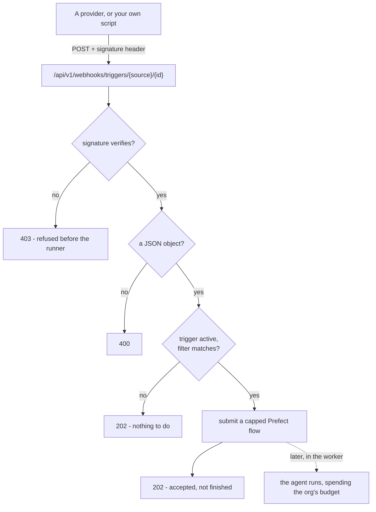

# Configurar un trigger de evento { #setting-up-an-event-trigger }

Un **trigger de evento** dispara un agent cuando pasa algo en otro sitio.

Hay dos maneras de que eso nos llegue, y cuál usa una fuente es asunto de la
fuente y no tuyo:

- **Por envío (push).** Un provider hace POST de una carga firmada — una issue de
  GitHub, o cualquier cosa que pueda enviar JSON firmado (la fuente **API**).
- **Por sondeo (polling).** La plataforma lee una cuenta conectada con una
  cadencia. **Gmail** es así: no se nos envía nada, así que no hay URL que
  configurar ni secreto que guardar. Conectas el buzón y ese es todo el montaje.

[Conceptos](concepts.md#trigger) cuenta qué *es* un trigger y cómo se comporta un
run disparado; [Gobernanza](governance.md) cuenta lo que gasta y cómo se trata un
rechazo.

Esta página es lo que haces después: cómo apuntar un provider real al webhook,
qué tiene que contener la entrega, y cómo probarlo todo desde un portátil.

!!! tip "Si solo necesitas el reloj, lo que quieres es un horario"

    Sin webhook, sin secreto, sin provider que configurar.

    Cualquiera de los dos tipos puede partir de una **plantilla** sembrada
    (`GET /trigger-templates`). Una plantilla de horario — «resume mis pull
    requests abiertas cada mañana de entre semana» — rellena de antemano el
    prompt y una cadencia sensata. Una plantilla de evento — «clasifica la nueva
    issue», «redacta una respuesta al correo» — rellena de antemano el prompt en
    el paso de mensaje de su propia fuente. Ninguna de las dos parte de una caja
    en blanco.

Todo lo de abajo es para el caso de los eventos.

## Dónde viven en el producto, y cómo llamarlos { #where-they-live-in-the-product-and-what-to-call-them }

**Routines** es el paraguas - la navegación, la página, el panel propio del
agent, la barra lateral del chat y la tarjeta del dashboard usan esa única
palabra, así que una persona se encuentra el mismo nombre llegue por donde
llegue. Las dos familias que hay debajo siguen siendo distintas porque se
comportan de forma distinta: un **horario** dispara con el reloj, un **trigger**
dispara con una llegada. Lo que no podía diferir era el paraguas, que es como la
navegación acabó diciendo «Routines» sobre un panel titulado «Schedules &
triggers» (#594).

Cuatro superficies, una lista:

| Dónde | Para qué sirve |
|---|---|
| **Routines** (`/routines`) | Todas las rutinas de la organización, y las dos maneras de empezar una |
| La pestaña **Availability** de un agent | Solo las de ese agent, al lado de donde se configura su exposición |
| La sección Routines de la barra lateral del **chat** | Lo que hace por su cuenta el agent con el que estás hablando |
| La tarjeta **Routines** del dashboard | Lo más próximo primero, con cómo fue el último disparo - una rutina que falla cada hora es invisible en cualquier otro sitio de esa página |

La tarjeta del dashboard se añade desde `Customize` y está en la disposición por
defecto bajo **Needs attention**. Lee esa misma lista de toda la organización,
así que quien puede ver los agents ve sus rutinas; el resultado y el coste de
cada fila necesitan `runs:view` y sin ese permiso sencillamente no aparecen.

## El mecanismo, una vez { #the-mechanism-once }

Un trigger de evento te entrega dos cosas: una **URL de webhook** y un **secreto
de firma**. Un provider hace POST de su carga a la URL y firma la petición; la
plataforma recalcula la firma y dispara el agent solo si las dos coinciden.



- **La URL** se construye sobre la única dirección pública del despliegue
  (`PUBLIC_BASE_URL`), no sobre el origen del dashboard - el webhook lo sirve el
  host de la API, que suele ser un origen distinto al de la interfaz. Su forma
  es:

  ```
  {PUBLIC_BASE_URL}/api/v1/webhooks/triggers/{source}/{trigger_id}
  ```

  `source` es `github` o `webhook` (el nombre de cable de la fuente API);
  `trigger_id` es un UUID imposible de adivinar. El diálogo la rellena por ti -
  cópiala, no la construyas a mano. **`gmail` no tiene URL**: una fuente sondeada
  no tiene puerta de entrada, y un POST que nombre una se responde como cualquier
  entrega que no tiene nada que hacer.

- **La firma** es `HMAC-SHA256` sobre los **bytes crudos exactos de la
  petición**, con el secreto de firma como clave, codificada en hexadecimal y con
  el prefijo `sha256=`. Viaja en una cabecera que depende de la fuente:

  | Fuente | Cabecera |
  |---|---|
  | `github` | `X-Hub-Signature-256` |
  | `webhook` | `X-Signature-256` |

  GitHub firma sus entregas de forma nativa bajo su propia cabecera
  `X-Hub-Signature-256`, así que le das el secreto a GitHub y él firma. La fuente
  API reutiliza el esquema idéntico bajo `X-Signature-256`, que tiene que poner
  por su cuenta lo que sea que apuntes a la URL. Una fuente **sondeada** no firma
  nada y no guarda ningún secreto: no se le envió nada, se la leyó, y el propio
  grant de OAuth de la cuenta es lo que autorizó esa lectura.

!!! danger "La firma no es un adorno"

    Sin ella, la URL es lo único que hay entre un desconocido y el budget de
    modelo de tu organización - y las URL se filtran: a los logs, al historial de
    entregas de un provider, a una captura de pantalla en un ticket de soporte.
    Cualquiera que tenga la URL podría disparar el agent a voluntad y gastar
    contra tus topes. El secreto es lo que hace que una entrega sea *auténtica* y
    no solo esté *bien dirigida*.

Una petición cuya firma no se verifica se rechaza con un `403` antes de llegar
siquiera al runner; el secreto está sellado en el [vault](secrets.md) y nunca
aparece en una lectura, en un listado ni en la URL.

!!! info "El `202` significa aceptado, no terminado"

    Una entrega que coincide se envía como su propio flow
    `run-scheduled-trigger` y el agent se ejecuta en el worker, así que el
    provider recibe su respuesta en una llamada rápida a Prefect en vez de
    esperar a un modelo. No leas un `202` como «el agent ya ha respondido» - para
    eso lee el run en Activity.

Una entrega verificada que no tiene nada que hacer - un trigger inactivo, o una
carga que el filtro no hace coincidir - responde `202` exactamente igual que una
que dispara, así que tener el secreto no te dice nada sobre qué triggers existen.
Un cuerpo que no es un objeto JSON es un `400`.

## Rotar el secreto y editar el filtro { #rotating-the-secret-and-editing-the-filter }

La URL es la **identidad** del trigger y nunca cambia. El secreto es una
**credencial**, y como cualquier otra clave de este producto se puede rotar — un
resellado y un texto plano nuevo que se muestra exactamente una vez.

```
POST /agents/{agent_id}/triggers/{trigger_id}/rotate-secret
```

Acuña un secreto nuevo, lo sella y devuelve el trigger con `reveal_secret` puesto
una vez — el mismo campo que usa la creación. Rota en cuanto un secreto pueda
haberse filtrado; el antiguo deja de verificar inmediatamente.

Para un hook que registró la propia plataforma (`auto_webhook`), la rotación lo
vuelve a registrar con el secreto nuevo, así que sus entregas siguen verificando
y no hay nada que revelar. Salvo que la cuenta ya no pueda registrarlo, en cuyo
caso el trigger cae a `manual` y el secreto revelado es lo que vuelves a pegar.

Un horario no tiene secreto, así que rotar uno se rechaza.

**Qué acciones de una issue disparan es un filtro, no un trigger distinto**, así
que se edita en el sitio. Haz `PATCH` del trigger con un `event_config` nuevo y
se vuelve a validar contra las reglas de la fuente exactamente igual que lo
valida la creación — una clave desconocida se rechaza en vez de guardarse para no
coincidir con nada.

La fuente y el secreto no se editan así. Reapuntar un trigger de evento a otra
fuente es un trigger nuevo: borra este, crea aquel.

## Gmail (~1 minuto, y sin ningún secreto) { #gmail-1-minute-and-no-secret-anywhere }

Gmail se sondea, así que el montaje es una pantalla de consentimiento y nada más.

1. **Conecta la cuenta.** *Routines → New event trigger → Gmail → Connect
   account*. Eso necesita `mcp:manage`, el mismo permiso que necesita cualquier
   otra cuenta conectada.
2. **Elige qué lo dispara**: cualquier mensaje nuevo, solo la bandeja de entrada,
   o marcado como importante. Afina más con un remitente o un fragmento del
   asunto, o con una etiqueta de Gmail.
3. **Escribe el prompt**, o parte de la plantilla «redacta una respuesta».

No hay URL que pegar ni secreto que guardar, porque nadie nos envía nada. Lo que
conviene saber sobre cómo lee:

- **Una vez por minuto.** El latido le pregunta a Gmail qué ha llegado desde que
  miró por última vez, así que la latencia en el peor caso es un minuto. Es
  deliberado: la alternativa - `users.watch` hacia un topic de Google Cloud
  Pub/Sub - es en tiempo real y cuesta un topic y una suscripción como requisitos
  del *despliegue*, más un registro que caduca cada siete días y necesita algo
  que lo renueve.
- **Conectar no dispara nada - y no pierde nada.** La posición del buzón se toma
  en el momento en que se completa el consentimiento, así que conectar no dispara
  el agent una vez por cada mensaje que ya estuviera ahí, y el correo que llegue
  entre el consentimiento y el primer latido aterriza igualmente después de esa
  posición y dispara.
- **Una ráfaga está acotada.** Un tic lee como mucho 25 mensajes nuevos enteros.
  El volcado de una lista de correo no se convierte en 400 runs de agent; la
  posición avanza igualmente, así que el atasco no se relee para siempre.
- **Un mensaje puede disparar varios triggers.** A diferencia de un webhook, cuya
  URL nombra exactamente uno - «cualquier mensaje» y «marcado como importante»
  sobre el mismo buzón disparan los dos.
- **Una semana perdida se repara sola.** Google guarda alrededor de una semana de
  historial. Un cursor más antiguo que eso se resincroniza con el ahora en vez de
  dejar el buzón aparcado para siempre.

El despliegue necesita un cliente OAuth de Google (`GOOGLE_CLIENT_ID` /
`GOOGLE_CLIENT_SECRET` - el mismo par que usa el inicio de sesión con Google) con
la API de Gmail habilitada. Sin él la tarjeta lo dice en vez de ofrecer un botón
Connect que solo podría fallar. A diferencia de GitHub, el cliente es del
*despliegue* y no de cada organización: la pantalla de consentimiento de Google
para un scope de buzón necesita un proyecto verificado, que un operador registra
una vez y que ninguno de sus inquilinos puede registrar en absoluto.

## Una receta con GitHub (~5 minutos) { #a-github-recipe-5-minutes }

GitHub firma sus propias entregas, así que es la fuente más rápida de conectar.
Crea primero el trigger con la fuente **GitHub**, copia su URL de webhook y su
secreto de firma, y después:

1. En el repositorio que quieras vigilar, ve a **Settings → Webhooks → Add
   webhook**.
2. **Payload URL** - pega la URL de webhook del diálogo del trigger.
3. **Content type** - elige `application/json`. No
   `application/x-www-form-urlencoded`: la firma cubre los bytes exactos que
   envía GitHub, y la codificación de formulario los cambia, así que una entrega
   codificada como formulario no verifica contra nada y vuelve como `403`.
4. **Secret** - pega el secreto de firma.
5. **Which events?** - elige *Let me select individual events*, marca **Issues**
   y desmarca todo lo demás. Solo los webhooks de `issues` llegan siquiera al
   camino del disparo (el tipo de evento se lee de la cabecera `X-GitHub-Event`);
   cualquier otra cosa se descarta. Afina *qué* acciones de una issue disparan
   con el filtro del trigger - por defecto es la creación de una issue
   (`opened`).
6. **Add webhook.** GitHub envía un `ping`, que no es un evento `issues`, así que
   no disparará el agent - eso es lo esperado.

Cuando una entrega se rechaza, diagnostícala en la pestaña **Recent Deliveries**
del webhook en GitHub: muestra la petición exacta y la respuesta. Un `403` ahí es
una firma que no cuadra - casi siempre el secreto está mal o el content type no
es `application/json`.

## El contrato de la carga para las fuentes entregadas por relé { #the-payload-contract-for-relay-delivered-sources }

GitHub es el dueño de la forma de su carga, y la de una fuente sondeada la lee el
adaptador que la lee - los filtros de un trigger de Gmail se contrastan con el
propio mensaje, así que no hay contrato que tú tengas que cumplir.

El que sí es tuyo es la fuente comodín `webhook` - **API** en los diálogos. **No
tiene filtro**: una entrega verificada dispara, y todo el cuerpo JSON se añade al
prompt. Úsala para cualquier cosa que ningún portal cubra - vigilar un feed para
el que ningún provider expone una API (una página de LinkedIn, un anuncio de un
marketplace), o cualquier herramienta que sepa hacer POST - siendo el relé que tú
escribas el que vigila.

Aquí había antes una fuente `email`, y era esta misma con otro nombre: renombraba
dos campos del filtro y te pedía ejecutar un relé - un code step de Zapier o de
Make, un script pequeño - que firmara y nos enviara JSON, porque nada en este
producto podía recibir correo. Se quitó por la misma razón que `linkedin`: una
entrada de un desplegable cuyo nombre promete una integración que no existe.
Gmail la sustituyó como cuenta conectada de verdad (más arriba), y un buzón
alimentado por un relé es la fuente API con un ejemplo documentado.

**Un correo alimentado por un relé, como fuente API:**

```json
{ "from": "billing@acme.com", "subject": "Invoice #4021", "body": "…" }
```

Ya nada filtra por esos nombres, así que todo el cuerpo llega al prompt y el
agent lo lee. Si lo que quieres es el *filtrado*, conecta el buzón en su lugar.

## Firmar una entrega tú mismo { #signing-a-delivery-yourself }

Para la fuente genérica `webhook` (y para probar a mano cualquier fuente), la
petición la firmas tú. Dos trampas deciden si la firma verifica, porque las dos
cambian los bytes:

- **Firma los bytes que envías, y solo esos.** `echo` añade un salto de línea
  final que se firma pero puede no enviarse, o enviarse sin haberse firmado; usa
  `printf '%s'` y pasa el cuerpo con `curl --data-raw` para que no se añada ni se
  interprete nada.
- **No vuelvas a serializar.** Firmar un dict y dejar después que tu cliente HTTP
  lo recodifique produce bytes distintos (claves reordenadas, espaciado
  distinto). Firma una cadena y envía *esa misma* cadena.

=== "curl"

    ```bash
    SECRET='your-signing-secret'
    URL='https://api.example.com/api/v1/webhooks/triggers/webhook/<trigger_id>'
    BODY='{"hello":"world"}'

    SIG="sha256=$(printf '%s' "$BODY" | openssl dgst -sha256 -hmac "$SECRET" | sed 's/^.* //')"

    curl -sS -X POST "$URL" \
      -H 'Content-Type: application/json' \
      -H "X-Signature-256: $SIG" \
      --data-raw "$BODY"
    ```

=== "Python (httpx)"

    ```python
    import hashlib
    import hmac

    import httpx

    secret = b"your-signing-secret"
    url = "https://api.example.com/api/v1/webhooks/triggers/webhook/<trigger_id>"
    body = b'{"hello":"world"}'

    signature = "sha256=" + hmac.new(secret, body, hashlib.sha256).hexdigest()

    # content=body sends these exact bytes. json=... would re-serialize and sign nothing.
    httpx.post(
        url,
        content=body,
        headers={"Content-Type": "application/json", "X-Signature-256": signature},
    )
    ```

Para la fuente `github` el algoritmo es idéntico; solo cambia el nombre de la
cabecera, que pasa a ser `X-Hub-Signature-256`.

## Zapier y Make no pueden hacer esto sin un code step { #zapier-and-make-cannot-do-this-without-a-code-step }

!!! warning "Ninguno de los dos tiene una acción HMAC"

    Sus pasos estándar de «POST a un webhook» envían el cuerpo pero no pueden
    firmarlo, así que cada entrega llega sin firmar y se rechaza con `403`.
    Cuenta con una hora con un code step, no con cinco minutos de clics.

Es tentador echar mano de una acción de webhook sin código en Zapier o en Make.
Tienes que añadir su **code step** (el *Code by Zapier* de Zapier, el módulo
*Custom JS / functions* de Make), calcular el HMAC `sha256=<hex>` sobre el cuerpo
exacto que vas a enviar, y poner con él la cabecera `X-Signature-256`.

Eso funciona, pero sé honesto sobre el coste: es más o menos una hora con un code
step, no cinco minutos de clics. Si lo único que quieres es comprobar el trigger
de principio a fin, firma antes una petición a mano con el fragmento de arriba.

## Probar en local { #testing-locally }

!!! tip "Prueba *Run now* antes de configurar un provider"

    Dispara cualquiera de los dos tipos de trigger una vez, bajo demanda, sin
    firma y sin webhook de por medio - la forma más rápida de confirmar que el
    agent, su prompt y su budget se comportan.

En un portátil `PUBLIC_BASE_URL` vale por defecto `http://localhost:8000`, así
que la URL que te entrega el diálogo es inalcanzable desde GitHub o desde
cualquier relé alojado - no pueden ver tu máquina. Dos maneras de salvarlo:

- **Usa simplemente Run now.** *Run now* dispara cualquiera de los dos tipos de
  trigger una vez y bajo demanda - un horario dispara una vez de más con su
  cadencia intacta, y un **trigger de evento dispara también**, como disparo
  manual de prueba: el agent ejecuta su prompt base **sin contexto de entrega,
  sin firma y sin webhook de por medio**. Es la forma más rápida de confirmar que
  el agent, su prompt y su budget se comportan sin ningún provider configurado.
  Un trigger inactivo (en pausa) se respeta - *Run now* no le hace nada. Su única
  laguna es que no recorre el camino de la firma ni una carga real, así que no
  pillará un secreto equivocado ni un campo mal nombrado.

- **Expón el puerto con un túnel** cuando sí quieras probar el camino real del
  webhook. Apunta un túnel a la API, pon `PUBLIC_BASE_URL` a la dirección pública
  del túnel, y **crea el trigger después de eso** - la URL se construye a partir
  de `PUBLIC_BASE_URL` en el momento de leerla, así que un trigger creado antes
  del cambio seguiría entregando una URL de `localhost`.

  ```bash
  cloudflared tunnel --url http://localhost:8000
  # then set PUBLIC_BASE_URL to the printed https URL, restart the API,
  # and create the trigger
  ```

  Apunta el provider (o tu script de firma) a la URL del túnel y la entrega llega
  a tu máquina como cualquiera alojada.

## Resumen { #recap }

- Un trigger te entrega una **URL** y un **secreto de firma**. La URL es su
  identidad y nunca cambia; el secreto es una credencial y se puede rotar.
- La firma es `HMAC-SHA256` sobre los **bytes crudos exactos**, y es lo que hace
  que una entrega sea auténtica y no solo esté bien dirigida.
- Un `202` significa **aceptado**, no terminado. Lee el run en Activity.
- **Gmail se sondea**, así que no tiene URL ni secreto alguno — conecta el buzón
  y ese es todo el montaje.
- En un portátil, echa mano de **Run now** antes que de un túnel.
