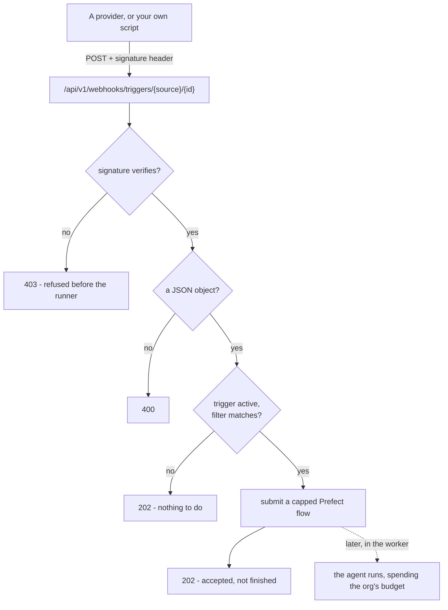

# Konfigurowanie triggera zdarzeniowego { #setting-up-an-event-trigger }

**Trigger zdarzeniowy** uruchamia agenta, gdy coś wydarzy się gdzie indziej.

Są dwie drogi, którymi to do nas dociera, a to, której używa dane źródło, jest
sprawą tego źródła, a nie twoją:

- **Wypychane.** Provider wysyła POST-em podpisany payload — issue z GitHuba albo
  cokolwiek, co potrafi wysłać podpisany JSON (źródło **API**).
- **Odpytywane.** Platforma czyta podłączone konto według harmonogramu. **Gmail**
  jest właśnie taki: nic nie jest do nas wysyłane, więc nie ma URL-a do
  skonfigurowania ani sekretu do przechowania. Podłączasz skrzynkę i to cała
  konfiguracja.

[Koncepcje](concepts.md#trigger) opisują, czym trigger *jest* i jak zachowuje się
uruchomiony run; [Nadzór](governance.md) opisuje, co on wydaje i jak obsługiwana
jest odmowa.

Ta strona jest o tym, co robisz dalej: jak skierować prawdziwego providera na
webhook, co musi zawierać dostarczenie i jak przetestować całość z laptopa.

!!! tip "Jeśli potrzebujesz tylko zegara, chodzi ci o harmonogram"

    Żadnego webhooka, żadnego sekretu, żadnego providera do skonfigurowania.

    Każdy z tych dwóch rodzajów może zacząć od zasianego **szablonu**
    (`GET /trigger-templates`). Szablon harmonogramu — „podsumuj moje otwarte
    pull requesty każdego ranka w dzień roboczy” — wypełnia z góry prompt i
    sensowną kadencję. Szablon zdarzeniowy — „posegreguj nowe issue”, „napisz
    szkic odpowiedzi na maila” — wypełnia z góry prompt na kroku wiadomości
    swojego własnego źródła. Żaden nie zaczyna od pustego pola.

Wszystko poniżej dotyczy przypadku zdarzeniowego.

## Gdzie żyją w produkcie i jak je nazywać { #where-they-live-in-the-product-and-what-to-call-them }

**Routines** to parasol - nawigacja, strona, własny panel agenta, boczny pasek
czatu i kafelek na dashboardzie używają tego jednego słowa, więc człowiek spotyka
ten sam rzeczownik, gdziekolwiek trafi. Dwie rodziny pod tym parasolem pozostają
rozróżnione, bo zachowują się inaczej: **harmonogram** odpala się z zegara,
**trigger** odpala się na przyjściu czegoś. Tym, czemu nie wolno było się różnić,
był parasol — i tak właśnie nawigacja zaczęła mówić „Routines” nad panelem
zatytułowanym „Schedules & triggers” (#594).

Cztery powierzchnie, jedna lista:

| Gdzie | Do czego służy |
|---|---|
| **Routines** (`/routines`) | Każda rutyna w organizacji i dwa sposoby, żeby zacząć nową |
| Zakładka **Availability** agenta | Tylko rutyny tego agenta, obok miejsca, gdzie konfiguruje się jego ekspozycję |
| Sekcja Routines w bocznym pasku **czatu** | To, co agent, z którym rozmawiasz, robi sam z siebie |
| Kafelek **Routines** na dashboardzie | Najbliższe na górze, wraz z tym, jak poszło ostatnie odpalenie - rutyna psująca się co godzinę jest niewidoczna gdziekolwiek indziej na tej stronie |

Kafelek dashboardu można dodać z `Customize` i jest na domyślnym układzie pod
**Needs attention**. Czyta tę samą listę obejmującą całą organizację, więc ten,
kto może widzieć agentów, widzi ich rutyny; wynik i koszt w każdym wierszu
wymagają `runs:view` i po prostu ich nie ma bez tego uprawnienia.

## Mechanizm, raz { #the-mechanism-once }

Trigger zdarzeniowy daje ci dwie rzeczy: **URL webhooka** i **sekret
podpisujący**. Provider wysyła POST-em swój payload na ten URL i podpisuje
żądanie; platforma przelicza podpis i odpala agenta tylko wtedy, gdy oba się
zgadzają.



- **URL** budowany jest na jednym publicznym adresie deploymentu
  (`PUBLIC_BASE_URL`), a nie na originie dashboardu - webhook serwowany jest przez
  host API, który zwykle jest innym originem niż UI. Jego kształt to:

  ```
  {PUBLIC_BASE_URL}/api/v1/webhooks/triggers/{source}/{trigger_id}
  ```

  `source` to `github` albo `webhook` (nazwa źródła API na drucie); `trigger_id`
  to nieodgadywalny UUID. Dialog wypełnia to za ciebie - skopiuj, nie buduj tego
  ręcznie. **`gmail` nie ma URL-a**: odpytywane źródło nie ma drzwi wejściowych, a
  POST nazywający je dostaje odpowiedź jak każde dostarczenie, przy którym nie ma
  nic do zrobienia.

- **Podpis** to `HMAC-SHA256` po **dokładnych surowych bajtach żądania**,
  kluczowany sekretem podpisującym, zakodowany szesnastkowo i poprzedzony
  `sha256=`. Jedzie w nagłówku, który zależy od źródła:

  | Źródło | Nagłówek |
  |---|---|
  | `github` | `X-Hub-Signature-256` |
  | `webhook` | `X-Signature-256` |

  GitHub podpisuje swoje dostarczenia natywnie, pod własnym nagłówkiem
  `X-Hub-Signature-256`, więc dajesz GitHubowi sekret, a on robi podpisywanie.
  Źródło API używa identycznego schematu pod `X-Signature-256`, który to, co
  skierujesz na ten URL, musi ustawić samo. Źródło **odpytywane** nic nie
  podpisuje i nie trzyma sekretu: nie było adresowane, tylko odczytane, a
  autoryzacją odczytu jest własna zgoda OAuth tego konta.

!!! danger "Podpis nie jest ozdobą"

    Bez niego URL jest jedyną rzeczą między obcym a budżetem modelowym twojej
    organizacji - a URL-e wyciekają: do logów, do historii dostarczeń providera,
    na zrzut ekranu w zgłoszeniu do supportu. Ktokolwiek ma ten URL, mógłby
    odpalać agenta do woli i wydawać z twoich limitów. Sekret jest tym, co czyni
    dostarczenie *autentycznym*, a nie tylko *poprawnie zaadresowanym*.

Żądanie, którego podpis się nie weryfikuje, jest odrzucane z `403`, zanim
runner zostanie w ogóle osiągnięty; sekret jest zapieczętowany w
[vault](secrets.md) i nigdy nie pojawia się w odczycie, w listingu ani w URL-u.

!!! info "`202` znaczy przyjęte, a nie zakończone"

    Dopasowane dostarczenie jest zgłaszane jako własny flow
    `run-scheduled-trigger`, a agent działa w workerze, więc provider dostaje
    swoją odpowiedź w jednym szybkim wywołaniu Prefect, zamiast czekać na model.
    Nie czytaj `202` jako „agent odpowiedział” - od tego jest przeczytanie runa w
    Activity.

Zweryfikowane dostarczenie, przy którym nie ma nic do zrobienia - nieaktywny
trigger albo payload, którego filtr nie dopasowuje - odpowiada `202` dokładnie
tak samo jak odpalone, więc posiadanie sekretu nie mówi ci nic o tym, które
triggery istnieją. Body, które nie jest obiektem JSON, to `400`.

## Rotowanie sekretu i edytowanie filtra { #rotating-the-secret-and-editing-the-filter }

URL jest **tożsamością** triggera i nigdy się nie zmienia. Sekret jest
**poświadczeniem** i jak każdy inny klucz w tym produkcie może być rotowany —
ponowne zapieczętowanie i świeży tekst jawny pokazany dokładnie raz.

```
POST /agents/{agent_id}/triggers/{trigger_id}/rotate-secret
```

Bije nowy sekret, pieczętuje go i zwraca trigger z `reveal_secret` ustawionym raz
— tym samym polem, którego używa tworzenie. Rotuj w chwili, gdy sekret mógł
wyciec; stary natychmiast przestaje się weryfikować.

Dla hooka, który platforma zarejestrowała sama (`auto_webhook`), rotacja
rejestruje go ponownie z nowym sekretem, więc jego dostarczenia dalej się
weryfikują i nie ma czego ujawniać. Chyba że konto nie może go już zarejestrować
— wtedy trigger spada do `manual`, a ujawniony sekret jest tym, co wklejasz
ponownie.

Harmonogram nie ma sekretu, więc rotowanie go jest odrzucane.

**To, które akcje na issue odpalają trigger, jest filtrem, a nie innym
triggerem**, więc daje się edytować w miejscu. Zrób `PATCH` na triggerze z nowym
`event_config`, a zostanie on ponownie zwalidowany wobec reguł źródła dokładnie
tak, jak waliduje tworzenie — nieznany klucz jest odrzucany, a nie zapisywany po
to, żeby nic nie dopasowywać.

Źródło i sekret nie są tą drogą edytowalne. Przekierowanie triggera zdarzeniowego
na inne źródło to nowy trigger: usuń ten, utwórz tamten.

## Gmail (~1 minuta i żadnego sekretu nigdzie) { #gmail-1-minute-and-no-secret-anywhere }

Gmail jest odpytywany, więc konfiguracja to ekran zgody i nic poza tym.

1. **Podłącz konto.** *Routines → New event trigger → Gmail → Connect account*.
   To wymaga `mcp:manage`, tego samego uprawnienia, którego wymaga każde inne
   podłączone konto.
2. **Wybierz, co go odpala**: dowolna nowa wiadomość, tylko skrzynka odbiorcza
   albo oznaczone jako ważne. Zawęź dalej fragmentem nadawcy lub tematu albo
   etykietą Gmaila.
3. **Napisz prompt** albo zacznij od szablonu „draft a reply”.

Nie ma URL-a do wklejenia ani sekretu do zapisania, bo nic do nas nie wysyła. Co
warto wiedzieć o tym, jak to czyta:

- **Raz na minutę.** Heartbeat pyta Gmaila, co przyszło od ostatniego zajrzenia,
  więc najgorsze opóźnienie to minuta. To celowe: alternatywa - `users.watch` do
  tematu Google Cloud Pub/Sub - jest w czasie rzeczywistym i kosztuje temat oraz
  subskrypcję jako wymagania *deploymentu*, plus rejestrację, która wygasa co
  siedem dni i potrzebuje czegoś, co ją odnowi.
- **Podłączenie nic nie odpala - i nic nie gubi.** Pozycja skrzynki jest brana w
  chwili zakończenia zgody, więc podłączenie nie odpala agenta raz na każdą
  wiadomość, która już tam leży, a poczta przychodząca między zgodą a pierwszym
  heartbeatem wciąż ląduje za tą pozycją i odpala.
- **Nawał jest ograniczony.** Jedno tyknięcie czyta najwyżej 25 nowych wiadomości
  w całości. Zrzut z listy mailingowej nie staje się 400 runami agenta; pozycja
  i tak idzie do przodu, więc zaległość nie jest czytana w kółko.
- **Jedna wiadomość może odpalić kilka triggerów.** W odróżnieniu od webhooka,
  którego URL nazywa dokładnie jeden - „dowolna wiadomość” i „oznaczone jako
  ważne” na tej samej skrzynce odpalają oba.
- **Przegapiony tydzień naprawia się sam.** Google trzyma około tygodnia
  historii. Kursor starszy niż to resynchronizuje się do teraz, zamiast zaparkować
  skrzynkę na zawsze.

Deployment potrzebuje klienta Google OAuth (`GOOGLE_CLIENT_ID` /
`GOOGLE_CLIENT_SECRET` - tej samej pary, której używa logowanie przez Google) z
włączonym Gmail API. Bez niego kafelek mówi to wprost, zamiast oferować przycisk
Connect, który mógłby tylko zawieść. W odróżnieniu od GitHuba klient należy do
*deploymentu*, a nie do każdej organizacji: ekran zgody Google dla zakresu
skrzynki pocztowej wymaga zweryfikowanego projektu, który operator rejestruje raz
i którego żaden z jego tenantów nie może zarejestrować w ogóle.

## Przepis na GitHuba (~5 minut) { #a-github-recipe-5-minutes }

GitHub podpisuje własne dostarczenia, więc to najszybsze źródło do podłączenia.
Najpierw utwórz trigger ze źródłem **GitHub**, skopiuj jego URL webhooka i sekret
podpisujący, a potem:

1. W repozytorium, które chcesz obserwować, wejdź w **Settings → Webhooks → Add webhook**.
2. **Payload URL** - wklej URL webhooka z dialogu triggera.
3. **Content type** - wybierz `application/json`. Nie `application/x-www-form-urlencoded`:
   podpis obejmuje dokładne bajty, które GitHub wysyła, a kodowanie formularzowe je
   zmienia, więc dostarczenie zakodowane formularzowo weryfikuje się z niczym i wraca `403`.
4. **Secret** - wklej sekret podpisujący.
5. **Which events?** - wybierz *Let me select individual events*, zaznacz **Issues** i
   odznacz całą resztę. Tylko webhooki `issues` docierają w ogóle do ścieżki odpalania
   (typ zdarzenia czytany jest z nagłówka `X-GitHub-Event`); wszystko inne jest odrzucane.
   Zawęź to, *które* akcje na issue odpalają trigger, jego filtrem - domyślnie jest to
   utworzenie issue (`opened`).
6. **Add webhook.** GitHub wysyła `ping`, który nie jest zdarzeniem `issues`, więc nie
   odpali agenta - i tak ma być.

Kiedy dostarczenie zostaje odrzucone, zdiagnozuj to w zakładce **Recent Deliveries**
przy webhooku w GitHubie: pokazuje ona dokładne żądanie i odpowiedź. `403` tam to
niezgodność podpisu - prawie zawsze sekret jest zły albo content type nie jest
`application/json`.

## Kontrakt payloadu dla źródeł dostarczanych przez przekaźnik { #the-payload-contract-for-relay-delivered-sources }

GitHub jest właścicielem kształtu swojego payloadu, a payload źródła odpytywanego
czyta adapter, który go czyta - filtry triggera Gmaila dopasowywane są do samej
wiadomości, więc nie ma kontraktu, który miałbyś spełnić.

Tym, który należy do ciebie, jest uniwersalne źródło `webhook` - **API** w
dialogach. **Nie ma filtra**: zweryfikowane dostarczenie odpala, a całe body JSON
jest doklejane do promptu. Użyj go do wszystkiego, czego nie obejmuje żaden
portal - obserwowania kanału, dla którego żaden provider nie wystawia API (strona
na LinkedInie, ogłoszenie na marketplace) albo dowolnego narzędzia, które potrafi
wysłać POST - przy czym obserwowanie robi przekaźnik, który napiszesz.

Było tu kiedyś źródło `email` i było to właśnie to źródło pod inną nazwą:
zmieniało nazwy dwóch pól filtra i prosiło cię o uruchomienie przekaźnika - kroku
kodu w Zapierze albo Make, małego skryptu - który podpisywał i wysyłał do nas
JSON, bo nic w tym produkcie nie potrafiło odbierać poczty. Zostało usunięte z
tego samego powodu co `linkedin`: pozycja w liście rozwijanej, której nazwa
obiecuje integrację, której nie ma. Gmail zastąpił je jako prawdziwe podłączone
konto (powyżej), a skrzynka karmiona przekaźnikiem to źródło API z
udokumentowanym przykładem.

**E-mail karmiony przekaźnikiem, jako źródło API:**

```json
{ "from": "billing@acme.com", "subject": "Invoice #4021", "body": "…" }
```

Nic już nie filtruje po tych nazwach, więc całe body dociera do promptu i agent je
czyta. Jeśli chcesz *filtrowania*, podłącz skrzynkę zamiast tego.

## Samodzielne podpisanie dostarczenia { #signing-a-delivery-yourself }

Dla uniwersalnego źródła `webhook` (i żeby przetestować dowolne źródło ręcznie)
podpisujesz żądanie sam. O tym, czy podpis się zweryfikuje, decydują dwie pułapki,
bo obie zmieniają bajty:

- **Podpisuj te bajty, które wysyłasz, i tylko te.** `echo` dokleja kończący znak
  nowej linii, który zostaje podpisany, ale może nie zostać wysłany, albo wysłany, ale
  nie podpisany; użyj `printf '%s'` i przekaż body przez `curl --data-raw`, żeby nic nie
  zostało dodane ani zinterpretowane.
- **Nie serializuj ponownie.** Podpisanie słownika, a potem pozwolenie klientowi HTTP
  zakodować go na nowo, daje inne bajty (przestawione klucze, inne odstępy). Podpisz
  string i wyślij *ten sam* string.

=== "curl"

    ```bash
    SECRET='your-signing-secret'
    URL='https://api.example.com/api/v1/webhooks/triggers/webhook/<trigger_id>'
    BODY='{"hello":"world"}'

    SIG="sha256=$(printf '%s' "$BODY" | openssl dgst -sha256 -hmac "$SECRET" | sed 's/^.* //')"

    curl -sS -X POST "$URL" \
      -H 'Content-Type: application/json' \
      -H "X-Signature-256: $SIG" \
      --data-raw "$BODY"
    ```

=== "Python (httpx)"

    ```python
    import hashlib
    import hmac

    import httpx

    secret = b"your-signing-secret"
    url = "https://api.example.com/api/v1/webhooks/triggers/webhook/<trigger_id>"
    body = b'{"hello":"world"}'

    signature = "sha256=" + hmac.new(secret, body, hashlib.sha256).hexdigest()

    # content=body sends these exact bytes. json=... would re-serialize and sign nothing.
    httpx.post(
        url,
        content=body,
        headers={"Content-Type": "application/json", "X-Signature-256": signature},
    )
    ```

Dla źródła `github` algorytm jest identyczny; zmienia się tylko nazwa nagłówka na
`X-Hub-Signature-256`.

## Zapier i Make nie zrobią tego bez kroku kodu { #zapier-and-make-cannot-do-this-without-a-code-step }

!!! warning "Żaden z nich nie ma akcji HMAC"

    Ich standardowe kroki „POST na webhooka” wysyłają body, ale nie potrafią go
    podpisać, więc każde dostarczenie przychodzi niepodpisane i jest odrzucane
    `403`. Zaplanuj godzinę z krokiem kodu, a nie pięć minut klikania.

Kusi, żeby sięgnąć po no-code'ową akcję webhooka w Zapierze albo Make. Musisz
dodać ich **krok kodu** (*Code by Zapier* w Zapierze, moduł *Custom JS / functions* w Make), policzyć
HMAC `sha256=<hex>` po dokładnym body, które zaraz wyślesz, i ustawić z niego
nagłówek `X-Signature-256`.

To działa, ale bądź szczery co do kosztu: to mniej więcej godzina z krokiem kodu, a
nie pięć minut klikania. Jeśli tylko sprawdzasz trigger od początku do końca, podpisz
najpierw żądanie ręcznie snippetem powyżej.

## Testowanie lokalnie { #testing-locally }

!!! tip "Spróbuj *Run now*, zanim skonfigurujesz providera"

    Odpala jednorazowo trigger dowolnego rodzaju, na żądanie, bez podpisu i bez
    udziału webhooka - to najszybszy sposób, żeby potwierdzić, że agent, jego
    prompt i jego budżet zachowują się jak trzeba.

Na laptopie `PUBLIC_BASE_URL` domyślnie ma wartość `http://localhost:8000`, więc URL,
który daje ci dialog, jest nieosiągalny z GitHuba ani z żadnego hostowanego
przekaźnika - nie widzą twojej maszyny. Dwa sposoby, żeby to obejść:

- **Po prostu użyj Run now.** *Run now* odpala trigger dowolnego rodzaju raz, na
  żądanie - harmonogram odpala się jeden dodatkowy raz przy nietkniętej kadencji, a
  **trigger zdarzeniowy też się odpala**, jako ręczne odpalenie testowe: agent
  uruchamia swój bazowy prompt **bez kontekstu dostarczenia, bez podpisu i bez udziału
  webhooka**. To najszybszy sposób, żeby potwierdzić, że agent, jego prompt i jego
  budżet zachowują się jak trzeba, bez konfigurowania jakiegokolwiek providera.
  Nieaktywny (wstrzymany) trigger jest respektowany - *Run now* nic mu nie robi. Jego
  jedyną luką jest to, że nie ćwiczy ścieżki podpisu ani prawdziwego payloadu, więc nie
  wyłapie złego sekretu ani źle nazwanego pola.

- **Wystaw port tunelem**, kiedy rzeczywiście chcesz przetestować prawdziwą ścieżkę
  webhooka. Skieruj tunel na API, ustaw `PUBLIC_BASE_URL` na publiczny adres tunelu i
  **utwórz trigger dopiero potem** - URL budowany jest z `PUBLIC_BASE_URL` w momencie
  odczytu, więc trigger utworzony przed tą zmianą wciąż wydawałby URL z `localhost`.

  ```bash
  cloudflared tunnel --url http://localhost:8000
  # then set PUBLIC_BASE_URL to the printed https URL, restart the API,
  # and create the trigger
  ```

  Skieruj providera (albo swój skrypt podpisujący) na URL tunelu, a dostarczenie
  dotrze do twojej maszyny jak każde hostowane.

## Podsumowanie { #recap }

- Trigger daje ci **URL** i **sekret podpisujący**. URL jest jego tożsamością i
  nigdy się nie zmienia; sekret jest poświadczeniem i może być rotowany.
- Podpis to `HMAC-SHA256` po **dokładnych surowych bajtach** i to on czyni
  dostarczenie autentycznym, a nie tylko poprawnie zaadresowanym.
- `202` znaczy **przyjęte**, a nie zakończone. Przeczytaj run w Activity.
- **Gmail jest odpytywany**, więc nie ma URL-a ani sekretu w ogóle — podłącz
  skrzynkę i to cała konfiguracja.
- Na laptopie sięgnij po **Run now**, zanim sięgniesz po tunel.
