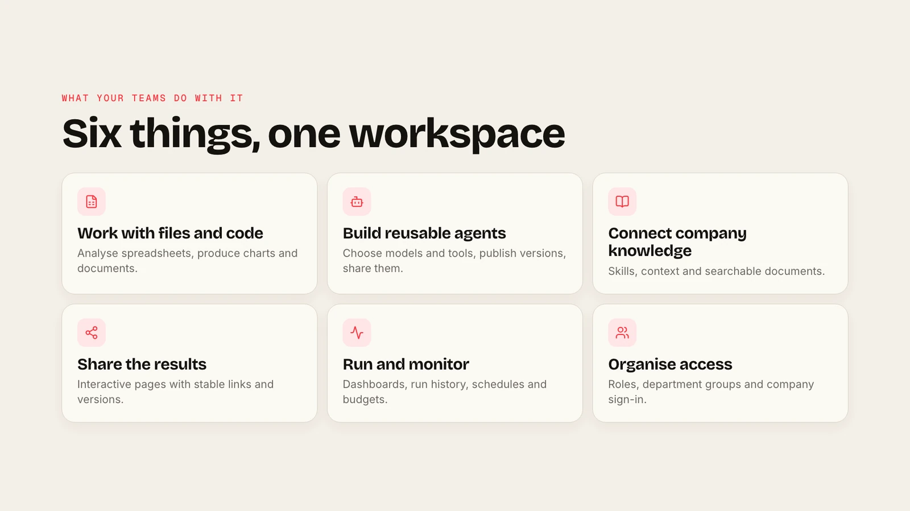
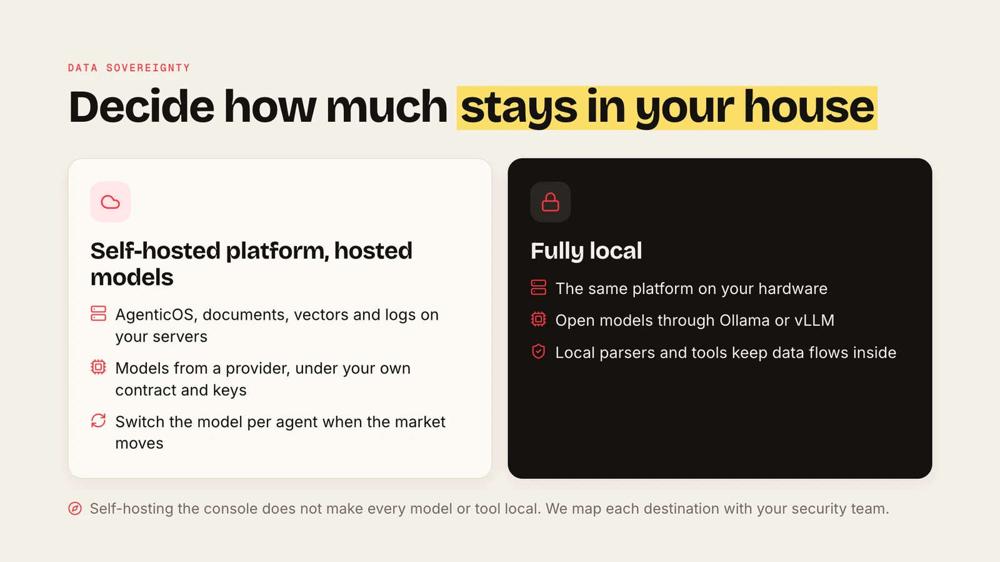

<div align="center">


# AgenticOS

### One place to build AI agents, connect them to your knowledge, and keep them under control.

Open source (Apache-2.0) · runs on your infrastructure · works with the models you choose

[See it in two minutes](#see-it-in-two-minutes) · [What it costs to run](#what-it-takes) · [How to start](#how-to-start) · [Talk to Vstorm](https://vstorm.co)

</div>

---

## The problem it solves

Most teams already use a chat assistant. Agents that actually do work, such as reading your documents, running on a schedule or acting in your systems, are still experiments scattered across tools. Then four questions arrive that nobody can answer:

| Question | AgenticOS answer |
|---|---|
| **Who may use which data?** | Roles, department groups and per-resource sharing, with company sign-in |
| **What does it cost?** | Monthly budgets per agent and per organisation, checked before each model request |
| **Who approved that action?** | Sensitive tools wait for a person; every decision is recorded |
| **Where does our data go?** | You run the platform; you choose each model, parser and tool it may reach |

## See it in two minutes



A recorded example: an agent turns a Notion brief into an interactive planner after researching GitHub. **Brief → research → shared result.**

<video src="https://github.com/user-attachments/assets/1d6bba29-3bfe-4c86-bda3-52ce2b0aa512#t=1" controls playsinline width="100%" poster="../docs/assets/screens/oss-launch-planner-poster.webp">
  
</video>

## How it fits into your company


## What managers see


Runs, completion, spend and active people for the period; what failed, what waits for approval and what a budget stopped; which agents people actually use. *Test deployment records, not a benchmark.*

## Your data, your decision



Self-hosting the platform does not by itself make every model or tool local. Your security team decides each destination.

## What it takes

- **A host:** 4 vCPU and 8 GB of RAM run it; two API workers suit a team of ten.
- **People:** someone who operates the deployment, and subject experts who maintain the instructions and documents.
- **Costs:** model usage, infrastructure, external services and people's time. No licence fee: Apache-2.0, commercial use included.

## How to start

1. **Choose one repeated task** and the person who will judge the answers.
2. **Set it up** in your environment with the model and access rules you choose.
3. **Check it** against measures you agreed beforehand, then decide on the next team.

There are [29 ready-made tutorials](https://vstorm-co.github.io/agenticos/use-cases/) to pick from: contract review, invoice extraction, support triage, weekly reports and more.

**Run it yourselves**, or **with Vstorm**: deployment in your infrastructure, documentation, process design and custom capabilities. Maintenance and support are agreed per engagement. [Contact Vstorm](https://vstorm.co).

<details>
<summary>For your technical team</summary>

```bash
curl -fsSL https://raw.githubusercontent.com/vstorm-co/agenticos/main/scripts/quickstart.sh | bash
```

[Installation](https://vstorm-co.github.io/agenticos/install/) · [Security and data flows](https://vstorm-co.github.io/agenticos/security/) · [Architecture](https://vstorm-co.github.io/agenticos/architecture/) · [Rollout](https://vstorm-co.github.io/agenticos/rollout/)

</details>

---

[Apache License 2.0](../LICENSE) · Built by [Vstorm](https://vstorm.co)
