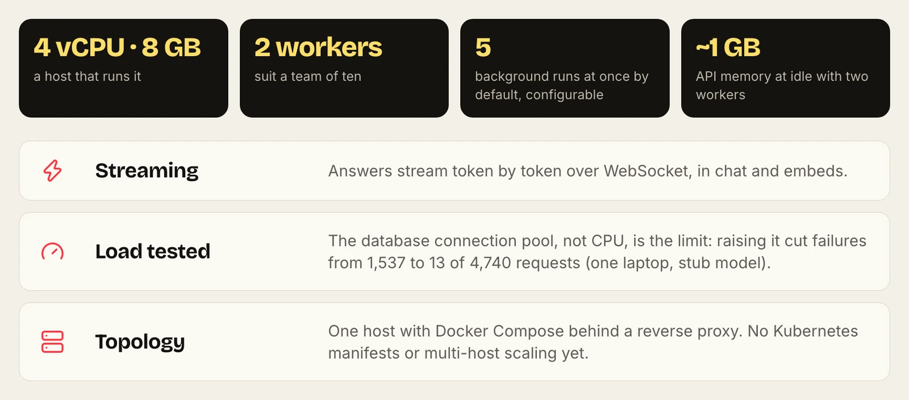

# AgenticOS

**A self-hosted agent platform on Pydantic AI.** Engineers register capabilities in typed Python; everyone else composes agents from them in a browser console. FastAPI, PostgreSQL + pgvector, Redis, Prefect, Next.js. Apache-2.0.

[](https://github.com/vstorm-co/agenticos/actions/workflows/ci.yml)
[](https://github.com/vstorm-co/agenticos/releases)
[](../LICENSE)
[](https://ai.pydantic.dev)

```bash
curl -fsSL https://raw.githubusercontent.com/vstorm-co/agenticos/main/scripts/quickstart.sh | bash
# --check to verify prerequisites only, --dry-run to see what it would do
```

Docker Compose ≥ 2.24 (WSL2 on Windows). The installer asks for a provider key, a login and an organization name, pulls the published images and starts a deployment with a working agent at http://localhost:3000.

---

## Architecture


| Layer | What runs there |
|---|---|
| Console | Next.js App Router |
| API | FastAPI, routes → services → repositories |
| Agent runtime | Pydantic AI, one runner behind every surface |
| Background work | Prefect workers; Redis/Valkey for cache and rate-limit buckets |
| Data | PostgreSQL with pgvector (one vector table per collection) |
| Code execution | `sandboxd` starts containers; the API holds no Docker socket |



Topology today: one host, Docker Compose, a reverse proxy. There are no Kubernetes manifests. [Architecture](https://vstorm-co.github.io/agenticos/architecture/) · [Deployment](https://vstorm-co.github.io/agenticos/deploy/)

## Capabilities

An agent is a spec: instructions, a model profile, capabilities, knowledge, budget, automations and exposure. Publishing freezes a version; named environments point at versions. Export and import specs as YAML.


Add your own: [Add a capability](https://vstorm-co.github.io/agenticos/howto/add-capability/) · [Add a sync connector](https://vstorm-co.github.io/agenticos/howto/add-sync-connector/) · [Add an MCP server to the catalog](https://vstorm-co.github.io/agenticos/howto/add-mcp-server/) · [Capability reference](https://vstorm-co.github.io/agenticos/reference/capabilities/)

## Call an agent

```http
POST /api/v1/agents/{agent_id}/run
Authorization: Bearer <member access token>
```

The run endpoint answers once (no streaming). For token streaming, use the WebSocket at `/api/v1/ws/agent`, or the embed socket for a published widget. The run API is rate-limited to 30 requests per minute per caller. [API guide](https://vstorm-co.github.io/agenticos/api/) · [Call an agent from your app](https://vstorm-co.github.io/agenticos/howto/agent-api/)

## Models

27 providers through one resolver: 22 hosted, Ollama and LiteLLM self-hosted, and Azure OpenAI, AWS Bedrock and Google Vertex AI with cloud credentials. vLLM and LM Studio work through an OpenAI-compatible profile. Model profiles carry provider, model, settings, a vault key and an optional fallback. [Models](https://vstorm-co.github.io/agenticos/models/)

## Retrieval

Five sync connectors (Google Drive, S3/MinIO, website, Git, SharePoint and OneDrive), three PDF parsers (PyMuPDF and LiteParse locally, LlamaParse in the cloud), recursive, Markdown or fixed chunking, embeddings from OpenAI, OpenRouter or local Ollama models. Retrieval is vector search with filters, optional multi-query or HyDE expansion and parent context. There is no reranker yet. [File processing](https://vstorm-co.github.io/agenticos/file-processing/)

## Develop

```bash
make check   # the aggregate pre-PR gate, excluding e2e
```

[Contributing](https://vstorm-co.github.io/agenticos/help/) · [Adding features](https://vstorm-co.github.io/agenticos/adding_features/) · [Testing](https://vstorm-co.github.io/agenticos/testing/) · [Release notes](https://vstorm-co.github.io/agenticos/release-notes/)

## Know before you build on it

- No stable API contract or SDK yet.
- Upgrades run migrations on start and are not zero-downtime.
- Budgets can be overshot by runs in parallel; one queue makes them strict.
- Source-system ACLs (for example SharePoint) are not mirrored into retrieval: scope the credential.
- Sign-in has no native MFA, SAML or SCIM; use your identity provider through OIDC.

[Apache License 2.0](../LICENSE) · [Vstorm](https://vstorm.co)
