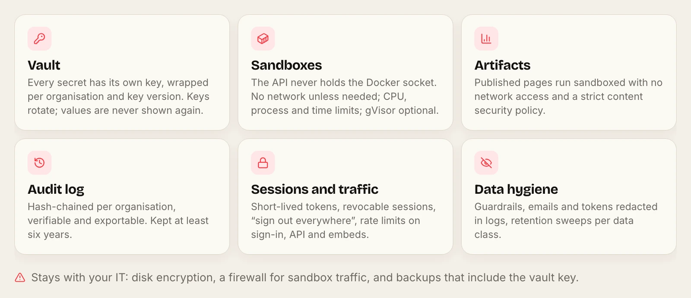
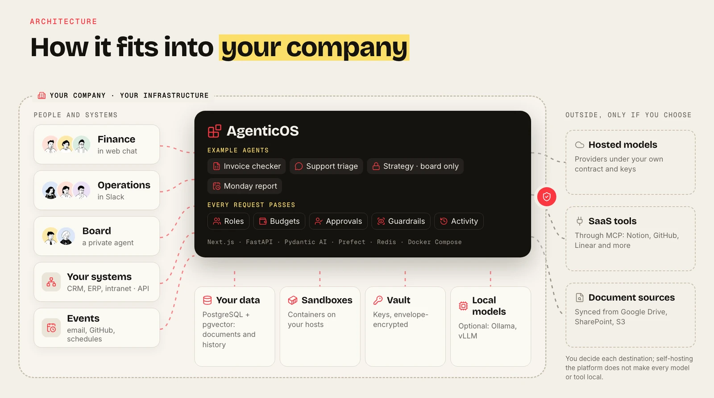
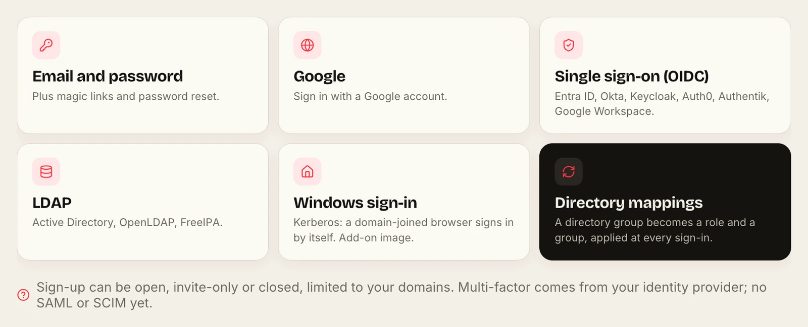
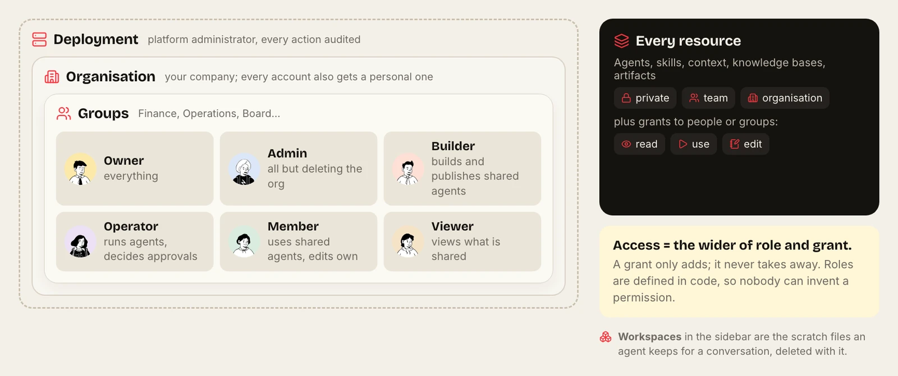
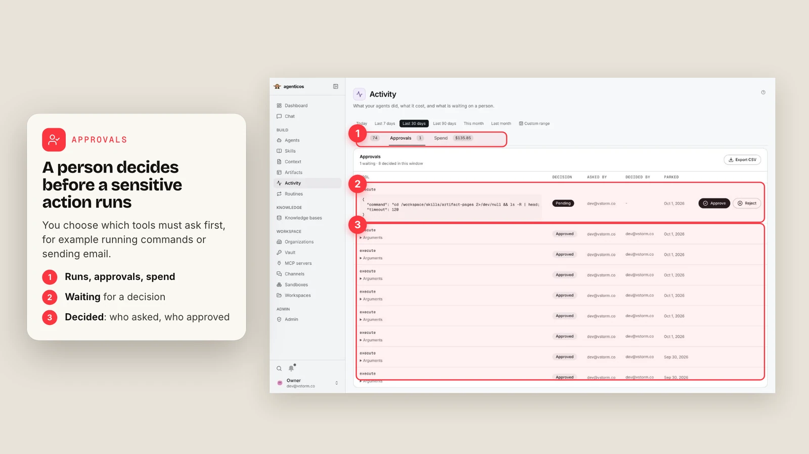

# AgenticOS

**Self-hosted AI agents your security team can review.** Open-source (Apache-2.0) software you can inspect, run on your infrastructure and connect only to the destinations you approve.

[Data flows](#what-leaves-your-infrastructure) · [Identity and access](#identity-and-access) · [Controls while agents run](#controls-while-agents-run) · [Secrets](#secrets-and-isolation) · [What stays with you](#what-stays-with-your-it) · [Reporting a vulnerability](#reporting-a-vulnerability)



## What leaves your infrastructure

Each outbound destination is a configuration choice, made per deployment, organisation or agent. The common ones:

| Destination | When it is used | Local alternative |
|---|---|---|
| Model provider | Every agent run | Ollama, vLLM or LM Studio on your hardware |
| Embedding provider | Indexing documents and searching them | Local Ollama embedding models |
| LlamaParse | Only collections set to that parser | PyMuPDF or LiteParse, both local |
| Web search providers | Only agents with web search enabled | Turn the capability off |
| MCP servers | Only tools you connect and allow | Self-hosted MCP servers |
| Chat channels | Only bots you register | Web chat inside your deployment |
| Logfire tracing | Only when a token is configured | Built-in run history |



[Security and data flows](https://vstorm-co.github.io/agenticos/security/) · [Data protection](https://vstorm-co.github.io/agenticos/data-protection/)

## Identity and access

- **Sign-in:** email and password with magic links, Google, generic OIDC (Entra ID, Okta, Keycloak, Auth0, Authentik, Google Workspace), LDAP (Active Directory, OpenLDAP, FreeIPA) and Kerberos.
- **Sign-up policy:** open, invite-only or closed, optionally limited to your domains; it applies to SSO as well.
- **Sessions:** 30-minute access tokens, 7-day refresh tokens with reuse detection, revocable sessions and "sign out everywhere".
- **Directory mappings:** a directory group becomes an organisation role and a group at every LDAP, Kerberos or OIDC sign-in.





Six built-in roles are defined in code. Effective access is the wider of a person's role and any grant; a grant only adds. [Permissions](https://vstorm-co.github.io/agenticos/permissions/) · [Directory sign-in](https://vstorm-co.github.io/agenticos/directory/)

## Controls while agents run



- **Approvals:** a tool set to require approval parks the run; a person reads the exact arguments and approves or rejects; undecided approvals expire after 72 hours.
- **Budgets:** monthly caps per agent and per organisation, checked before each model request.
- **Guardrails:** optional redaction of secrets, emails, IBANs, card numbers and US social security numbers in prompts, answers and tool results, or a keyword block.
- **Audit log:** a hash-chained log per organisation, verifiable with `audit-verify` and exportable as CSV or JSONL.

## Secrets and isolation

- **Vault:** each secret gets its own data key, wrapped with a key derived from the master key, the owning organisation or member, and the key version. Master keys rotate with a dry run first. Values are never returned, logged or exported.
- **Sandboxes:** the API container holds no Docker socket; `sandboxd` starts containers with no network unless the runtime needs one, CPU and process limits, a time limit per command and a non-root user. gVisor is optional.
- **Published pages:** artifacts run sandboxed with no network access and a strict content security policy; public links can expire, require a password or restrict embedding sites.
- **Logs:** emails, tokens, API keys and passwords are redacted.

[Secrets](https://vstorm-co.github.io/agenticos/secrets/) · [Sandbox](https://vstorm-co.github.io/agenticos/sandbox/) · [Governance](https://vstorm-co.github.io/agenticos/governance/)

## What stays with your IT

These are not provided by the application, by design:

- Encryption at rest for PostgreSQL, the media volume and sandboxes (use disk encryption; S3 storage can use SSE).
- A firewall for sandbox and MCP egress.
- Multi-factor authentication, through your identity provider. There is no native MFA, SAML or SCIM.
- Backups that include the settings file holding the vault master key. Lose the key and stored credentials are gone.
- Mirroring source-system permissions: SharePoint or Drive ACLs are not mirrored into retrieval. Scope each source's credential narrowly.

## Try it

```bash
curl -fsSL https://raw.githubusercontent.com/vstorm-co/agenticos/main/scripts/quickstart.sh | bash -s -- --check
```

`--check` only verifies prerequisites. [Read the installer](../scripts/quickstart.sh) before running it.

## Reporting a vulnerability

See [SECURITY.md](../SECURITY.md). Report privately; high-severity fixes are targeted within seven days.

[Apache License 2.0](../LICENSE) · Built by [Vstorm](https://vstorm.co)
