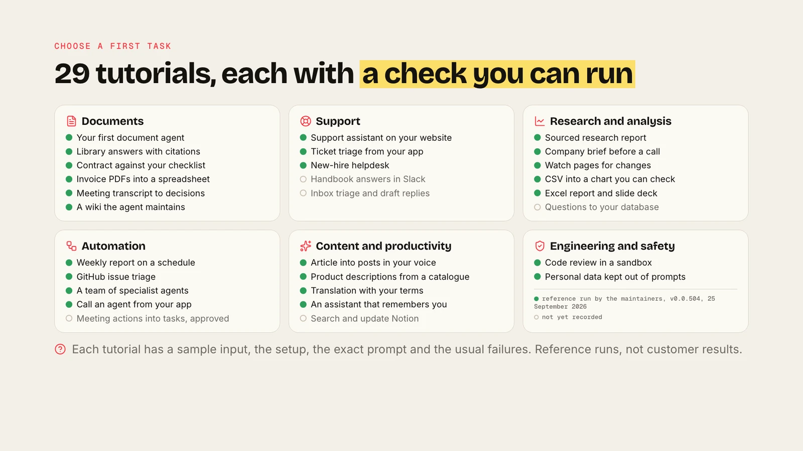

<div align="center">

# AgenticOS

**Pick a task. Build the agent in your browser. Check the result.**

Open-source, self-hosted AI agents for your team · [Documentation](https://vstorm-co.github.io/agenticos/) · [Quick start](#quick-start)

</div>



Each tutorial gives you a sample input, the configuration, the exact prompt, reference checks and the usual failures. 24 of the 29 have a reference run by the maintainers (v0.0.504, 25 September 2026); five need third-party accounts that were not connected yet. They are starting points, not customer results.

## Documents and knowledge

| Task | What you get |
|---|---|
| [Your first document agent](https://vstorm-co.github.io/agenticos/howto/first-document-agent/) | Answers you can check against one document |
| [Library answers with citations](https://vstorm-co.github.io/agenticos/howto/knowledge-base-assistant/) | Search across many documents, with the source cited |
| [Contract against your checklist](https://vstorm-co.github.io/agenticos/howto/contract-review/) | A checklist skill applied to an agreement |
| [Invoice PDFs into a spreadsheet](https://vstorm-co.github.io/agenticos/howto/document-extraction/) | Invoices read in a sandbox and written to CSV |
| [Meeting transcript to decisions](https://vstorm-co.github.io/agenticos/howto/meeting-summary/) | Decisions, owners and open questions |


## Analysis and reports

| Task | What you get |
|---|---|
| [CSV into a chart you can check](https://vstorm-co.github.io/agenticos/howto/csv-chart/) | Totals, a chart and the script, reconciled with the rows |
| [Excel report and slide deck](https://vstorm-co.github.io/agenticos/howto/excel-report/) | A workbook and a deck built from data |
| [Weekly report on a schedule](https://vstorm-co.github.io/agenticos/howto/scheduled-report/) | A report republished as a page every week |
| [Sourced research report](https://vstorm-co.github.io/agenticos/howto/deep-research-subagents/) | Sub-questions researched in parallel, published with sources |


## Support and service

| Task | What you get |
|---|---|
| [Support assistant on your website](https://vstorm-co.github.io/agenticos/howto/support-widget/) | A knowledge-backed widget on a public site |
| [Ticket triage from your app](https://vstorm-co.github.io/agenticos/howto/support-ticket-triage/) | Tickets classified through a signed webhook |
| [New-hire helpdesk](https://vstorm-co.github.io/agenticos/howto/onboarding-helpdesk/) | Context files and skills answering onboarding questions |

## Automation and teams of agents

| Task | What you get |
|---|---|
| [GitHub issue triage](https://vstorm-co.github.io/agenticos/howto/github-issue-triage/) | New issues triaged the moment GitHub delivers them |
| [A team of specialist agents](https://vstorm-co.github.io/agenticos/howto/specialist-team/) | A front desk that delegates to specialists |
| [Call an agent from your app](https://vstorm-co.github.io/agenticos/howto/agent-api/) | Any published agent over HTTP |

[All 29 tutorials](https://vstorm-co.github.io/agenticos/use-cases/)

## What every task can use


## Quick start

```bash
curl -fsSL https://raw.githubusercontent.com/vstorm-co/agenticos/main/scripts/quickstart.sh | bash
```

Docker Compose and a model provider key. Open http://localhost:3000 and start with the [first document agent](https://vstorm-co.github.io/agenticos/howto/first-document-agent/).

## Under control

Budgets per agent and organisation, approvals before sensitive actions, roles and department groups, company sign-in, and a record of every run. [Governance](https://vstorm-co.github.io/agenticos/governance/) · [Permissions](https://vstorm-co.github.io/agenticos/permissions/) · [Security](https://vstorm-co.github.io/agenticos/security/)

[Apache License 2.0](../LICENSE) · Built by [Vstorm](https://vstorm.co), who also deploy it in client infrastructure and build custom capabilities.
