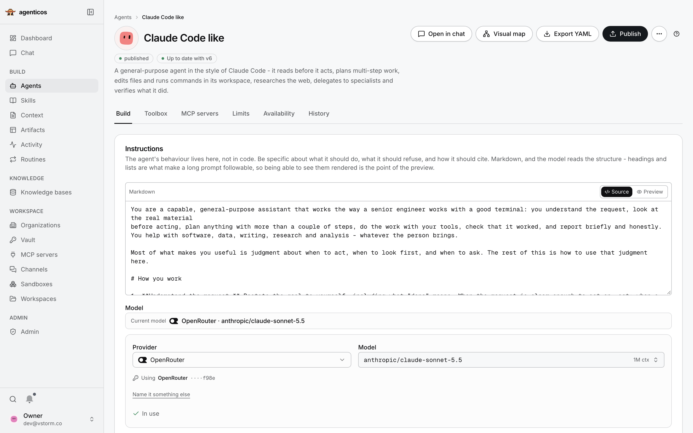

# AgenticOS

AI agents your whole team can use and improve. Open source, self-hosted, built on [Pydantic AI](https://ai.pydantic.dev).



- **Build** agents in the browser: instructions, model, tools. Publish versions and share them.
- **Connect** your documents, company context and the tools your teams use.
- **Control** cost, sensitive actions and access, with a record of every run.

```bash
curl -fsSL https://raw.githubusercontent.com/vstorm-co/agenticos/main/scripts/quickstart.sh | bash
```

Then open http://localhost:3000. Needs Docker Compose and a model provider key.

**[Documentation](https://vstorm-co.github.io/agenticos/)** · [First agent](https://vstorm-co.github.io/agenticos/howto/first-document-agent/) · [29 tutorials](https://vstorm-co.github.io/agenticos/use-cases/) · [Security](https://vstorm-co.github.io/agenticos/security/) · [Is it a fit?](https://vstorm-co.github.io/agenticos/about/comparison/)

Apache-2.0 · by [Vstorm](https://vstorm.co)
