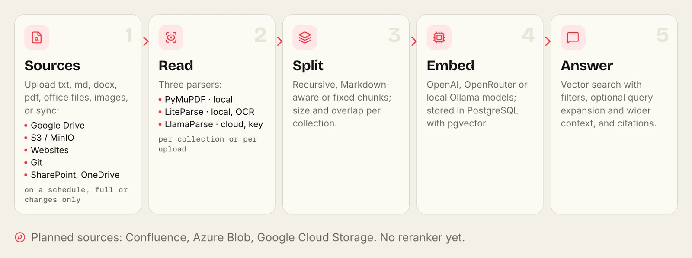
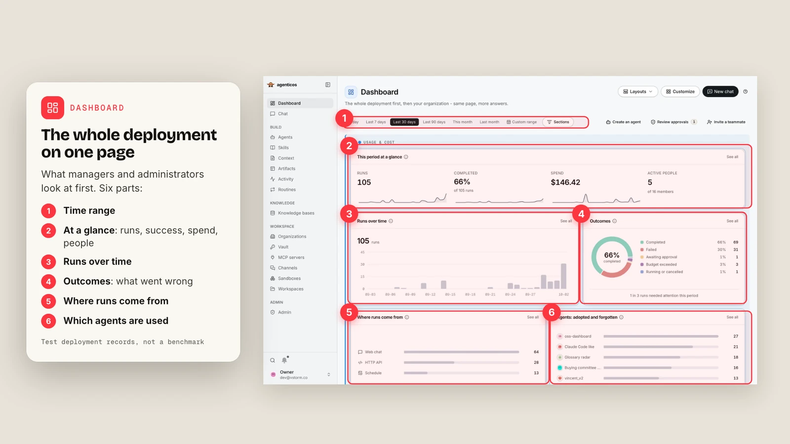

<div align="center">


# AgenticOS

**AI agents your whole team can use and improve.**<br>
Open source · self-hosted · [Documentation](https://vstorm-co.github.io/agenticos/)

</div>

What does it look like when a company actually uses it? Here is one illustrative week. The company and its people are invented; the screens are real captures from a test deployment, some with numbered annotations.

## Monday: someone builds an agent

The finance lead wants month-end questions answered without pinging two colleagues. They open the **agent builder**, write what the agent is for, pick a model and switch on knowledge search.


Nobody sees the draft until **Publish**. Version one goes to the Finance group only.

## Tuesday: the agent learns how the team works

They upload the close checklist as a **skill** and the finance glossary as **context**. The policy PDFs go into a **knowledge base**, synced from SharePoint every six hours.



## Wednesday: real work

A colleague drops a sales export into chat and asks what happened in the first half. The agent runs Python in a sandbox, draws the chart and lists what it checked.


The result is worth sharing, so the agent publishes it as a page with a stable link.


## Thursday: an action needs a person

The operations agent wants to run a shell command. It is set to ask first, so the run waits. A team lead reads the exact command and approves it.


## Friday: the review

The IT lead opens the **dashboard**: runs, success rate, spend against the monthly budget, what failed and which agents people actually use.



## What made the week possible


## Your week one

```bash
curl -fsSL https://raw.githubusercontent.com/vstorm-co/agenticos/main/scripts/quickstart.sh | bash
```

Start with [your first document agent](https://vstorm-co.github.io/agenticos/howto/first-document-agent/), then pick from [29 tutorials](https://vstorm-co.github.io/agenticos/use-cases/).

<details>
<summary>What it is built with</summary>

FastAPI, Pydantic AI, PostgreSQL with pgvector, Redis, Prefect and Next.js. 26 built-in capabilities, 27 model providers, eight places an agent can answer. [Architecture](https://vstorm-co.github.io/agenticos/architecture/) · [Security](https://vstorm-co.github.io/agenticos/security/)

</details>

[Apache License 2.0](../LICENSE) · Built by [Vstorm](https://vstorm.co)
