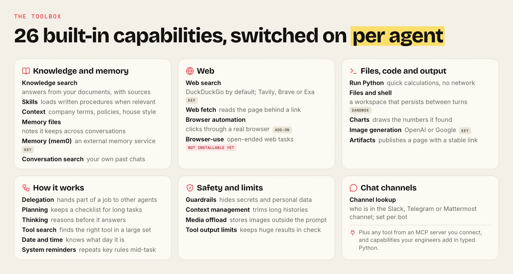
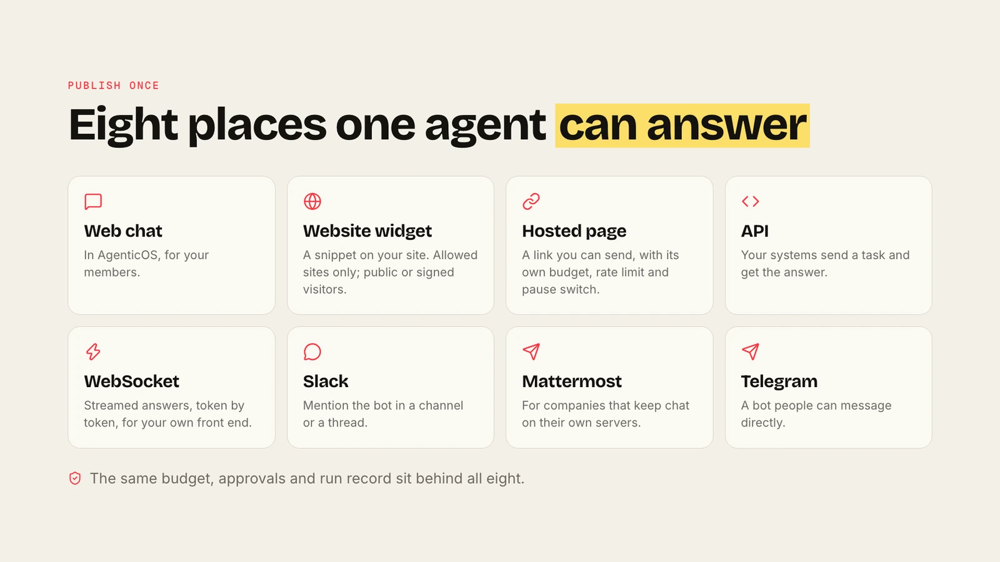
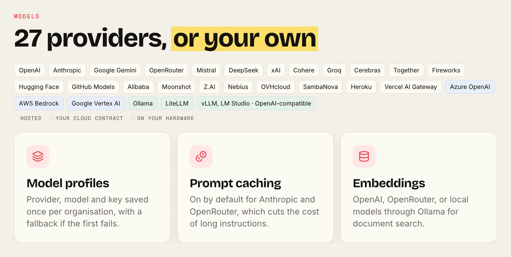
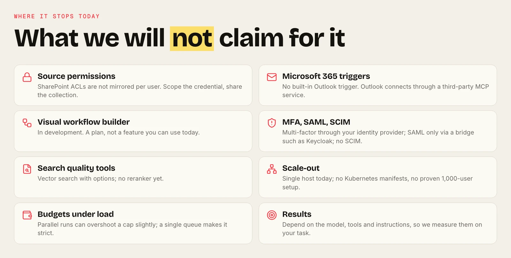

<div align="center">

<h1> AgenticOS</h1>

<b>AI agents your whole team can use and improve.</b><br>
Open source · self-hosted · any model

[Quick start](#quick-start) · [Documentation](https://vstorm-co.github.io/agenticos/) · [Tutorials](https://vstorm-co.github.io/agenticos/use-cases/)

</div>

<video src="https://github.com/user-attachments/assets/1d6bba29-3bfe-4c86-bda3-52ce2b0aa512#t=1" controls playsinline width="100%" poster="../docs/assets/screens/oss-launch-planner-poster.webp">
  
</video>

<p align="center"><sub>A recorded run: a Notion brief, GitHub research, and an interactive page published with a link.</sub></p>

<table>
<tr>
<td width="50%"><a href="../docs/assets/screens/light/agent-builder.png"></a><br><b>Build in the browser.</b> Instructions, model and tools; publish versions.</td>
<td width="50%"><a href="../docs/assets/screens/light/chat.png"></a><br><b>Work with files and code.</b> A CSV in, a chart and findings out.</td>
</tr>
<tr>
<td><a href="../docs/assets/screens/light/skills.png"></a><br><b>Teach how your team works.</b> Skills written once, reused by every agent.</td>
<td><a href="../docs/assets/screens/light/knowledge-collection.png"></a><br><b>Answer from your documents.</b> Upload or sync, then cite.</td>
</tr>
<tr>
<td><a href="../docs/assets/screens/light/artifact-detail.png"></a><br><b>Publish results as pages.</b> Stable links and versions. Demo data.</td>
<td><a href="../docs/assets/screens/light/dashboard.png"></a><br><b>See usage and spend.</b> Runs, outcomes and budgets in one view.</td>
</tr>
<tr>
<td><a href="../docs/assets/screens/light/agents.png"></a><br><b>A catalogue of agents.</b> Private, shared with a group, or company-wide.</td>
<td><a href="../docs/assets/screens/light/groups.png"></a><br><b>Access follows your organisation.</b> Roles, groups and company sign-in.</td>
</tr>
</table>

## How it fits


## Connects to what you use


<p align="center"><sub>Through MCP servers, sync sources and chat channels. Each connection needs its own setup and access review.</sub></p>

## Quick start

```bash
curl -fsSL https://raw.githubusercontent.com/vstorm-co/agenticos/main/scripts/quickstart.sh | bash
```

<details>
<summary><b>What ships</b>: capabilities, surfaces, models, security</summary>







</details>

<p align="center"><a href="../LICENSE">Apache-2.0</a> · Built by <a href="https://vstorm.co">Vstorm</a></p>
