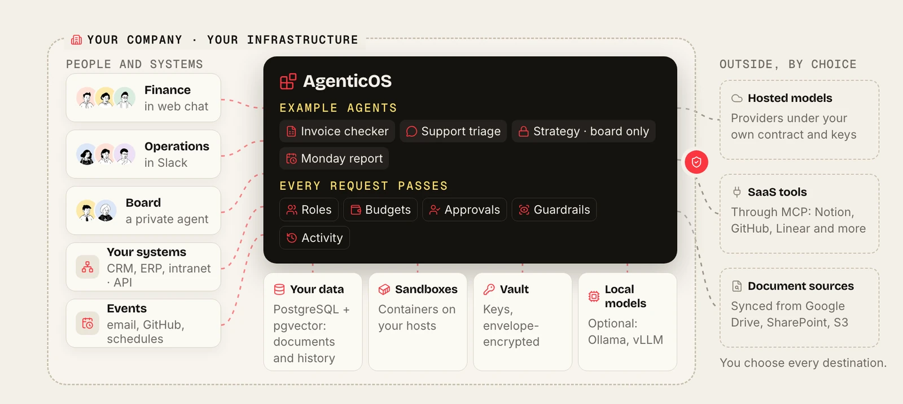
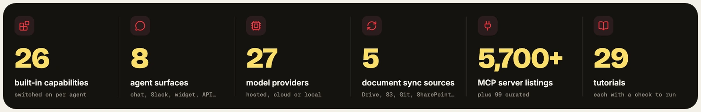

<div align="center">

<h1> AgenticOS</h1>

<p>
  <strong>Sovereign Agentic AI Layer</strong><br>
  <b>AI agents your whole team can use and improve.</b><br>
  Open source. Build shared agents in your browser, on infrastructure you control.
</p>

<p>
  <a href="#-quick-start">Quick start</a> &middot;
  <a href="#-connect-the-apps-your-team-already-uses">Integrations</a> &middot;
  <a href="#-see-it-in-action">See it</a> &middot;
  <a href="#-build-share-and-operate">Product tour</a> &middot;
  <a href="#-find-your-path">Find your path</a> &middot;
  <a href="#-what-ships-today">What ships</a> &middot;
  <a href="https://vstorm-co.github.io/agenticos/">Documentation</a>
</p>

<p>
  <a href="https://github.com/vstorm-co/agenticos/actions/workflows/ci.yml"></a>
  <a href="https://github.com/vstorm-co/agenticos/releases"></a>
  <a href="../LICENSE"></a>
  <a href="https://ai.pydantic.dev"></a>
</p>

<p>
  <b>English</b> &middot;
  <a href="../README.pl.md">Polski</a> &middot;
  <a href="../README.de.md">Deutsch</a> &middot;
  <a href="../README.es.md">Español</a>
</p>

</div>

AgenticOS is a self-hosted workspace where AI agents work with files, run code and use your company's tools and knowledge. Build and publish agents in the browser, share them with colleagues, and manage their access, cost and results in one place.

<a href="assets/company-architecture-diagram.webp"></a>

<p align="center"><sub><b>How it fits into your company.</b> People and systems reach shared agents; every request passes roles, budgets, approvals, guardrails and the run record; data stays inside unless you choose a destination outside.</sub></p>



## ✨ What you can do

| For your team | What AgenticOS provides |
|---|---|
| [Work with files and code](#-work-with-files-and-code) | Analyze CSVs, produce charts and documents, work on repositories |
| [Build reusable agents](#-build-agents-your-team-can-reuse) | Choose models and tools, publish versions, share agents with colleagues |
| [Connect company knowledge](#-teach-agents-how-your-team-works) | Reuse skills, context and searchable documents across agents |
| [Share the results](#-publish-results-as-interactive-pages) | Publish interactive pages with stable links and version history |
| [Run and monitor](#-track-runs-costs-and-approvals) | Customize dashboards, inspect runs, schedule tasks and set budgets |
| [Organize company access](#-organize-teams-with-roles-and-groups) | Combine roles, department groups and company sign-in |

## 🔌 Connect the apps your team already uses

<a href="assets/integrations-hub.webp"></a>

| Connect | How | Read |
|---|---|---|
| **Chat tools** | Publish an agent to Slack, Mattermost or Telegram, a website widget, a hosted page, the API or a WebSocket | [Channels](https://vstorm-co.github.io/agenticos/channels/) |
| **Business tools** | 99 curated MCP servers (Notion, GitHub, Jira, HubSpot, Stripe…) plus **5,700+ registry listings** and your own servers; choose which tools each agent may call | [MCP](https://vstorm-co.github.io/agenticos/mcp/) |
| **Documents** | Sync Google Drive, S3/MinIO, Git repositories, websites, SharePoint and OneDrive into knowledge bases | [Sync sources](https://vstorm-co.github.io/agenticos/howto/configure-sync-sources/) |
| **Events** | Start agents on a schedule, a new GitHub issue, a Gmail message or a signed webhook | [Routines](https://vstorm-co.github.io/agenticos/triggers/) |
| **Models** | 27 providers, your cloud contract (Azure, Bedrock, Vertex) or local models (Ollama, vLLM) | [Models](https://vstorm-co.github.io/agenticos/models/) |

<sub>Registry listings are publisher-provided metadata; each connection needs its own setup and access review. Outlook email and calendar connect through a third-party MCP service. Logos identify connection options and do not imply a partnership.</sub>

## 📸 See it in action

<video src="https://github.com/user-attachments/assets/1d6bba29-3bfe-4c86-bda3-52ce2b0aa512#t=1" controls playsinline width="100%" poster="../docs/assets/screens/oss-launch-planner-poster.webp">
  
</video>

<p align="center"><sub><b>Brief → research → shared result.</b> A recorded run: an agent reads a campaign brief in Notion, researches repositories on GitHub and publishes an interactive planner. <a href="https://github.com/user-attachments/assets/1d6bba29-3bfe-4c86-bda3-52ce2b0aa512">Watch (37 s)</a></sub></p>

<table>
<tr>
<td width="50%"><a href="../docs/assets/screens/light/agent-builder.png"></a><br><b>Build in the browser.</b> Instructions, model and tools; publish versions.</td>
<td width="50%"><a href="../docs/assets/screens/light/chat.png"></a><br><b>Work with files and code.</b> A CSV in, a chart and findings out.</td>
</tr>
<tr>
<td><a href="../docs/assets/screens/light/skills.png"></a><br><b>Teach how your team works.</b> Skills written once, reused by every agent.</td>
<td><a href="../docs/assets/screens/light/knowledge-collection.png"></a><br><b>Answer from your documents.</b> Upload or sync, then cite.</td>
</tr>
<tr>
<td><a href="../docs/assets/screens/light/artifact-detail.png"></a><br><b>Publish results as pages.</b> Stable links and versions. Demo data.</td>
<td><a href="../docs/assets/screens/light/dashboard.png"></a><br><b>See usage and spend.</b> Runs, outcomes and budgets in one view.</td>
</tr>
<tr>
<td><a href="../docs/assets/screens/light/agents.png"></a><br><b>A catalog of agents.</b> Private, shared with a group, or company-wide.</td>
<td><a href="../docs/assets/screens/light/groups.png"></a><br><b>Access follows your organization.</b> Roles, groups and company sign-in.</td>
</tr>
</table>

<p align="center"><sub>Captured from a test deployment. Figures are test records, not benchmarks.</sub></p>

## 🚀 Quick start

Start with Docker Compose and access to a model provider. On macOS or Linux, run:

```bash
curl -fsSL https://raw.githubusercontent.com/vstorm-co/agenticos/main/scripts/quickstart.sh | bash
```

On Windows, run the same command inside WSL2 with Docker Desktop's WSL2 integration switched on. The installer asks for a model provider and key, your login and an organization name, pulls the published images and starts a deployment with a working agent in it. A host with 4 vCPU and 8 GB of RAM runs it.

Open **http://localhost:3000** and sign in with the login you chose during installation.

**Your first agent:** follow the [document-assistant walkthrough](https://vstorm-co.github.io/agenticos/howto/first-document-agent/) to upload a handbook, ask questions and check answers against cited sources. Then pick a next task from [29 tutorials](https://vstorm-co.github.io/agenticos/use-cases/), each with a sample input and a check you can run.

<details>
<summary>Inspect the installer or deploy another way</summary>

Read the [installer](../scripts/quickstart.sh) before running it. To check prerequisites without installing:

```bash
curl -fsSL https://raw.githubusercontent.com/vstorm-co/agenticos/main/scripts/quickstart.sh | bash -s -- --check
```

For manual Docker Compose setup, pinned versions and troubleshooting, follow the [installation guide](https://vstorm-co.github.io/agenticos/install/). For development from source, see [Contributing](https://vstorm-co.github.io/agenticos/help/).

</details>

## 🧩 Build, share and operate

### 🤖 Build agents your team can reuse

Choose an agent's model, instructions and tools in the browser. Publish a version for colleagues to use; inspect earlier versions and roll back when needed. Keep specialized agents for research, reporting, coding or operations in one catalog.


Colleagues can use a published agent in **web chat, Slack, Mattermost or Telegram** when those channels are configured, on a **website widget** or a **hosted page**, or through the **API** and **WebSocket**. [Build an agent](https://vstorm-co.github.io/agenticos/first-agent/) · [Connect a channel](https://vstorm-co.github.io/agenticos/channels/)

### 📂 Work with files and code

Ask an agent to analyze a spreadsheet, produce a chart, prepare a document or work on a repository. With a container-backed sandbox configured and command execution enabled, it can **read and edit files, run shell commands, and execute Python or JavaScript**. The bundled workbench includes data, charting and document tools, including LibreOffice.

If you use [Claude Code](https://code.claude.com/docs/en/overview) or [Codex](https://developers.openai.com/codex/cli/), the file-and-command workflow will feel familiar. AgenticOS brings that kind of work into a shared, self-hosted workspace with company knowledge, reusable agents and organization access controls. What an agent can accomplish depends on its model, enabled tools and instructions. [Sandbox configuration](https://vstorm-co.github.io/agenticos/sandbox/)

### 🧠 Teach agents how your team works

- **Skills** hold reusable procedures: how to review code, write a report or research a market. Maintain them once and reuse them across agents.
- **Context** holds standing knowledge such as a glossary, policy or brand voice. Include it in the prompt or let the agent read it on demand.
- **Knowledge bases (RAG)** make uploaded documents searchable. Choose parsing options, inspect processing status and chunks, or sync sources such as Google Drive, S3, Git, websites, SharePoint and OneDrive.


[Skills](https://vstorm-co.github.io/agenticos/skills/) · [Context](https://vstorm-co.github.io/agenticos/context/) · [Document processing](https://vstorm-co.github.io/agenticos/file-processing/) · [Sync sources](https://vstorm-co.github.io/agenticos/howto/configure-sync-sources/)

### 🎨 Publish results as interactive pages

Agents can publish reports, interactive comparisons and small dashboards as **artifacts**. Choose who can open them; updates keep the same link and earlier versions remain readable. Public links can expire, require a password or restrict which sites may embed them. [Share an artifact](https://vstorm-co.github.io/agenticos/artifacts/)

### 📊 Track runs, costs and approvals


Customize the **dashboard** around your work. **Activity** lets you inspect runs and tool calls, compare agent versions and export records. **Budgets** per agent and organization are checked before each model request. **Approval policies** make sensitive tools wait for a person, and **routines** repeat work on schedules or events such as a new GitHub issue, a Gmail message or a signed webhook. [Run history, budgets and approvals](https://vstorm-co.github.io/agenticos/governance/) · [Routines](https://vstorm-co.github.io/agenticos/triggers/)

### 👥 Organize teams with roles and groups

**Roles define what people may do. Groups define who you share with.** Use roles such as Builder, Operator, Member and Viewer, then create departments or working groups such as Operations, Engineering, Finance and Research. Share an agent, skill, collection, context file or artifact with a group in one step.

Bring existing company accounts through **OIDC single sign-on** (Entra ID, Okta, Keycloak and others), **LDAP directory login** or **Kerberos integrated Windows sign-in**. **Directory mappings** connect directory groups to a role and a group at sign-in. [Roles and permissions](https://vstorm-co.github.io/agenticos/permissions/) · [Directory sign-in](https://vstorm-co.github.io/agenticos/directory/)

## 🧭 Find your path

<details>
<summary><b>Deciding whether to adopt it</b>: the problem it solves, what it takes, how to start</summary>

<br>

| The question your teams cannot answer today | How AgenticOS answers it |
|---|---|
| Who may use which data? | Roles, department groups and per-resource sharing, with company sign-in |
| What does it cost? | Monthly budgets per agent and organization, checked before each model request |
| Who approved that action? | Sensitive tools wait for a person; every decision is recorded |
| Where does our data go? | You run the platform and choose each model, parser and tool it may reach |

**What it takes:** a host (4 vCPU, 8 GB RAM), someone to operate the deployment, and subject experts who maintain instructions and documents. Costs are model usage, infrastructure, external services and people's time; the software is Apache-2.0, commercial use included.

**How to start:** choose one repeated task and the person who will judge the answers, set it up with the model and access rules you choose, and check it against measures agreed beforehand. [Plan a rollout](https://vstorm-co.github.io/agenticos/rollout/) · [Compare approaches](https://vstorm-co.github.io/agenticos/about/comparison/)

</details>

<details>
<summary><b>Reviewing security</b>: data flows, identity, controls, what stays with your IT</summary>

<br>


| Outbound destination | Used when | Local alternative |
|---|---|---|
| Model provider | Every agent run | Ollama, vLLM or LM Studio on your hardware |
| Embedding provider | Indexing and searching documents | Local Ollama embedding models |
| LlamaParse | Collections set to that parser | PyMuPDF or LiteParse, both local |
| Web search | Agents with web search enabled | Turn the capability off |
| MCP servers, chat channels | Only those you connect | Self-hosted servers, web chat |
| Logfire tracing | Only when a token is configured | Built-in run history |

- **Vault:** a data key per secret, wrapped per organization and key version; master keys rotate; values are never shown again.
- **Sandboxes:** the API holds no Docker socket; containers get no network unless needed, with CPU, process and time limits; gVisor optional.
- **Audit log:** hash-chained per organization, verifiable and exportable.
- **Stays with your IT:** disk encryption at rest, egress firewall, MFA through your identity provider (no native MFA, SAML or SCIM), and backups that include the vault key.

[Security and data flows](https://vstorm-co.github.io/agenticos/security/) · [Data protection](https://vstorm-co.github.io/agenticos/data-protection/) · [Secrets](https://vstorm-co.github.io/agenticos/secrets/) · [SECURITY.md](../SECURITY.md)

</details>

<details>
<summary><b>Building on it</b>: architecture, API, extending it</summary>

<br>

| Layer | What runs there |
|---|---|
| Console | Next.js |
| API | FastAPI |
| Agent runtime | Pydantic AI, one runner behind every surface |
| Background work | Prefect workers, Redis or Valkey |
| Data | PostgreSQL with pgvector |
| Code execution | Containers started by `sandboxd` |

Call a published agent with `POST /api/v1/agents/{id}/run` as an authenticated member; stream tokens over the WebSocket. Engineers add capabilities, sync connectors and MCP catalog entries in typed Python. One host with Docker Compose today; there are no Kubernetes manifests.

[Architecture](https://vstorm-co.github.io/agenticos/architecture/) · [API](https://vstorm-co.github.io/agenticos/api/) · [Add a capability](https://vstorm-co.github.io/agenticos/howto/add-capability/) · [Capability reference](https://vstorm-co.github.io/agenticos/reference/capabilities/)

</details>

<details>
<summary><b>Looking for a first task</b>: 29 tutorials, each with a check you can run</summary>

<br>


[All tutorials](https://vstorm-co.github.io/agenticos/use-cases/). 24 have a reference run by the maintainers; they are starting points, not customer results.

</details>

## 📦 What ships today


<details>
<summary>Where agents answer, and which models they use</summary>


</details>

## 🎯 Is AgenticOS the right fit?

Choose it when a team has repeated document or tool-based work, subject experts who can maintain the instructions, and someone responsible for operating a self-hosted deployment. Know where it stops today:


## 🔐 Own your deployment, models and access

**Sovereign means control over deployment, model providers, data flows and agent access.** AgenticOS is Apache-2.0 software you can inspect, modify and operate. Choose hosted providers or local models through Ollama and compatible endpoints such as vLLM. Self-hosting the console does not make every model, parser or tool local: review the destinations you configure. [Configure models](https://vstorm-co.github.io/agenticos/models/)

## 🛠️ For developers and operators

Built with FastAPI, Pydantic AI, PostgreSQL with pgvector, Redis, Prefect and Next.js. Engineers add capabilities in typed Python; teams compose agents from the registered capabilities in the console.

[Architecture](https://vstorm-co.github.io/agenticos/architecture/) · [Capabilities](https://vstorm-co.github.io/agenticos/reference/capabilities/) · [API](https://vstorm-co.github.io/agenticos/api/) · [Contributing](https://vstorm-co.github.io/agenticos/help/)

The [operating-system analogy](https://vstorm-co.github.io/agenticos/about/) explains the architecture. The optional [desktop app](https://vstorm-co.github.io/agenticos/desktop/) adds a dedicated window, a pet and a macOS screenshot shortcut.

## 📄 License

[Apache License 2.0](../LICENSE). See [NOTICE](../NOTICE) and [third-party notices](../THIRD_PARTY_NOTICES.md) for attribution and bundled components.

## 🤝 Need help putting agents into production?

Vstorm deploys AgenticOS in client infrastructure, writes the documentation, defines the processes and builds custom capabilities. Maintenance and support are agreed per engagement.

Built with care by [**Vstorm**](https://vstorm.co) · [Vstorm on GitHub](https://github.com/vstorm-co)
